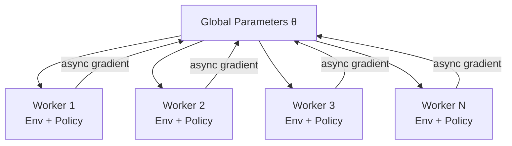
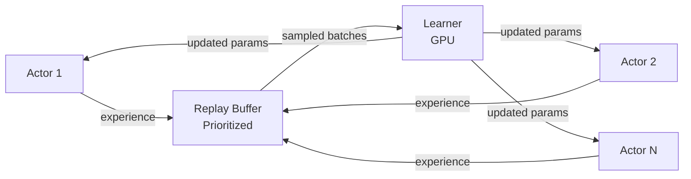
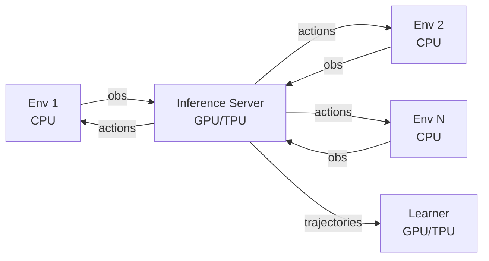
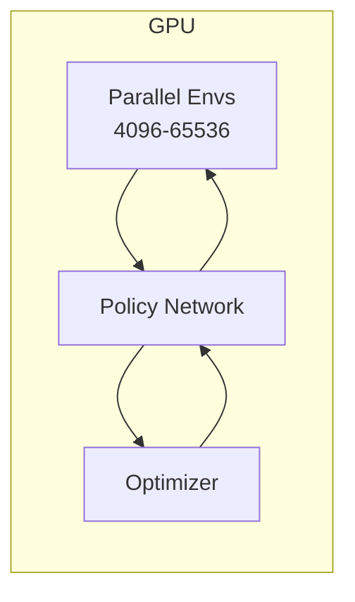

# Architecture Paradigms for Distributed RL

This page covers the major distributed RL architectures, from early asynchronous designs to modern high-throughput systems. Understanding these paradigms helps you choose the right system for your workload and design custom systems when needed.

## A3C: Asynchronous Advantage Actor-Critic

**A3C** (Mnih et al., 2016) was the first widely successful distributed RL architecture.

### Design

Each worker:

1. Copies global parameters $\theta$
2. Runs environment for $n$ steps
3. Computes local gradients
4. Asynchronously updates global parameters (no locking)

### Properties

| Aspect | Detail |
|--------|--------|
| Parallelism | Multiple CPU workers |
| Update | Asynchronous (no synchronization barrier) |
| Data freshness | Workers may use stale parameters |
| Throughput | Moderate (CPU-bound) |
| Algorithm | On-policy (A2C variant) |

### Limitations

- **Stale gradients**: Workers compute gradients with outdated parameters
- **CPU-bound**: Policy inference on CPU is slow
- **No replay**: On-policy, so data is discarded immediately

## Ape-X: Distributed Prioritized Experience Replay

**Ape-X** (Horgan et al., 2018) introduced the **actor-learner** separation with a shared replay buffer.

### Design

- **Actors** (many, CPU): Run environments, generate experience with slightly stale policies
- **Learner** (one, GPU): Samples from replay buffer, performs gradient updates
- **Replay buffer**: Centralized, prioritized by TD error

### Properties

- Massive data throughput (hundreds of actors)
- Off-policy (DQN family) — tolerates stale data naturally
- GPU learner is fully utilized (always training)
- Easily scales actor count

## IMPALA: Importance Weighted Actor-Learner Architecture

**IMPALA** (Espeholt et al., 2018) applies the actor-learner separation to **on-policy** methods using importance sampling correction.

### Design

Similar to Ape-X but for policy gradient methods:

- **Actors**: Collect trajectories with behavior policy $\mu$
- **Learner**: Updates policy $\pi_\theta$ using trajectories from actors
- **V-trace**: Importance sampling correction for off-policy data

### V-Trace

The V-trace target corrects for the policy lag between actors and learner:

$$
v_s = V(s) + \sum_{t=s}^{s+n-1} \gamma^{t-s} \left(\prod_{i=s}^{t-1} c_i\right) \delta_t V
$$

where:

$$
\delta_t V = \rho_t (r_t + \gamma V(s_{t+1}) - V(s_t))
$$

$$
\rho_t = \min\left(\bar{\rho}, \frac{\pi(a_t|s_t)}{\mu(a_t|s_t)}\right), \quad c_i = \min\left(\bar{c}, \frac{\pi(a_i|s_i)}{\mu(a_i|s_i)}\right)
$$

The truncated importance weights $\rho_t$ and $c_i$ bound the variance while correcting for policy lag.

### Properties

- Works with policy gradient algorithms (not just Q-learning)
- Handles moderate policy lag (actors 1-2 updates behind)
- GPU-efficient: single learner fully utilizes accelerator
- Scales to hundreds of actors

## SEED RL: Scalable, Efficient Deep-RL

**SEED RL** (Espeholt et al., 2020) addresses a key bottleneck in IMPALA: policy inference on CPU actors is slow.

### Key Insight

Move policy inference to the **learner** (GPU/TPU):

- **Environment workers** (CPU): Only step the environment, send observations to the inference server
- **Inference server** (GPU/TPU): Batches observations from all workers, runs policy inference
- **Learner** (GPU/TPU): Co-located with inference server, trains the model

### Advantages Over IMPALA

| Aspect | IMPALA | SEED RL |
|--------|--------|---------|
| Policy inference | On CPU (slow) | On GPU/TPU (fast, batched) |
| Network traffic | Parameters → actors | Observations ↔ actions |
| Model copies | N copies (one per actor) | 1 copy (on learner) |
| Parameter staleness | 1-2 updates | Near-zero (same device) |
| Large models | Limited by CPU memory | Only limited by GPU memory |

### Performance

SEED RL achieved 40x speedup over IMPALA on Atari and 80x on Google Football, while using the same hardware budget.

## GPU-Accelerated Environments

A more recent paradigm: run environments **entirely on GPU** alongside the policy network.

### Isaac Gym / Isaac Lab

NVIDIA's GPU-accelerated physics simulation:

- Thousands of parallel environments on a single GPU
- No CPU-GPU data transfer (everything stays on GPU)
- Sub-millisecond per environment step

This eliminates the traditional bottleneck of CPU-based environments and GPU-based policy training:

### Sample Factory

**Sample Factory** (Petrenko et al., 2020) achieves very high throughput on a single machine by:

- Asynchronous vectorized environments
- Careful memory management and batching
- Overlapping environment stepping and policy inference

Achieves 100K+ FPS on Atari on a single GPU machine.

## Summary Comparison

| Architecture | Year | Actors | Learner | Sync | Best For |
|-------------|------|--------|---------|------|----------|
| **A3C** | 2016 | CPU (inference) | CPU (shared) | Async | Simple, small scale |
| **Ape-X** | 2018 | CPU (inference) | GPU | Async | Off-policy (DQN) |
| **IMPALA** | 2018 | CPU (inference) | GPU | Async | On-policy at scale |
| **SEED RL** | 2020 | CPU (env only) | GPU/TPU | Async | Large models, high throughput |
| **GPU envs** | 2021+ | GPU (Isaac Gym) | GPU | Sync | Robotics, continuous control |
| **Sample Factory** | 2020 | CPU (vectorized) | GPU | Async | Single-machine, high FPS |

## Choosing an Architecture

Decision framework:

1. **On-policy (PPO)?** → GPU environments (Isaac Gym) or IMPALA/SEED for complex envs
2. **Off-policy (SAC, DQN)?** → Ape-X style with replay buffer
3. **Simple environments?** → Vectorized on single machine (Sample Factory)
4. **Complex simulation (rendering, physics)?** → Actor-learner split (SEED, IMPALA)
5. **Large policy network?** → SEED RL (inference on GPU)
6. **Robotics/continuous control?** → Isaac Gym + PPO (dominant paradigm)

## Key References

- Mnih, V., et al. (2016). "Asynchronous Methods for Deep Reinforcement Learning." *ICML*.
- Horgan, D., et al. (2018). "Distributed Prioritized Experience Replay." *ICLR*.
- Espeholt, L., et al. (2018). "IMPALA: Scalable Distributed Deep-RL with Importance Weighted Actor-Learner Architectures." *ICML*.
- Espeholt, L., et al. (2020). "SEED RL: Scalable and Efficient Deep-RL with Accelerated Central Inference." *ICLR*.
- Makoviychuk, V., et al. (2021). "Isaac Gym: High Performance GPU-Based Physics Simulation For Robot Learning." *NeurIPS*.
- Petrenko, A., et al. (2020). "Sample Factory: Egocentric 3D Control from Pixels at 100000 FPS with Asynchronous Reinforcement Learning." *ICML*.
