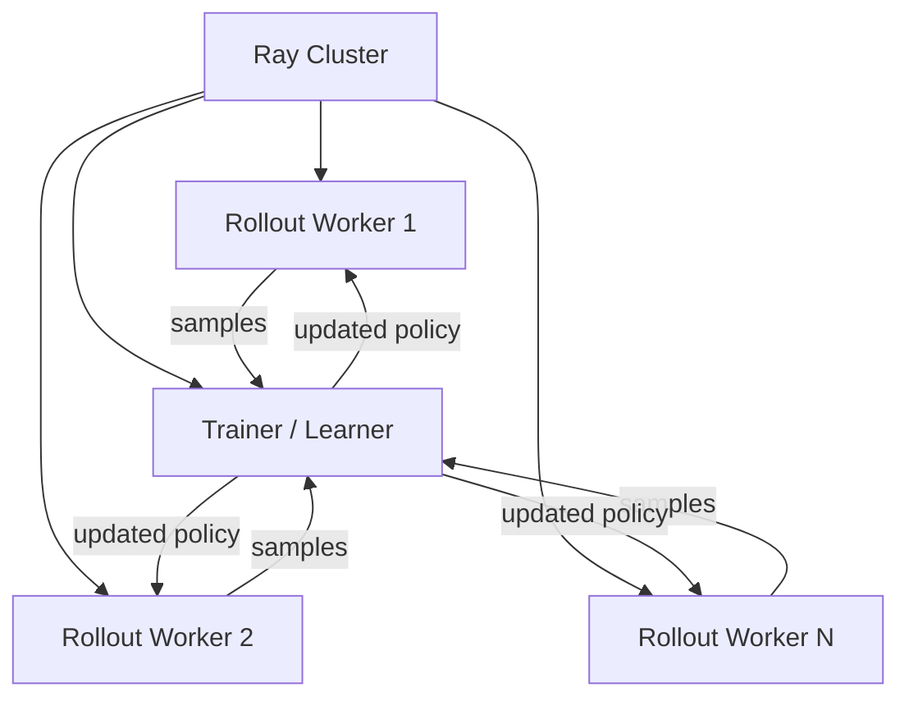
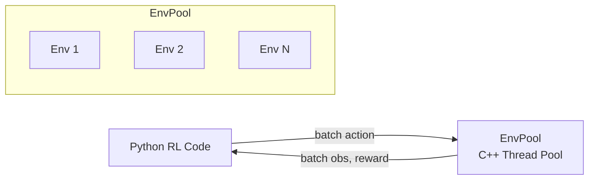
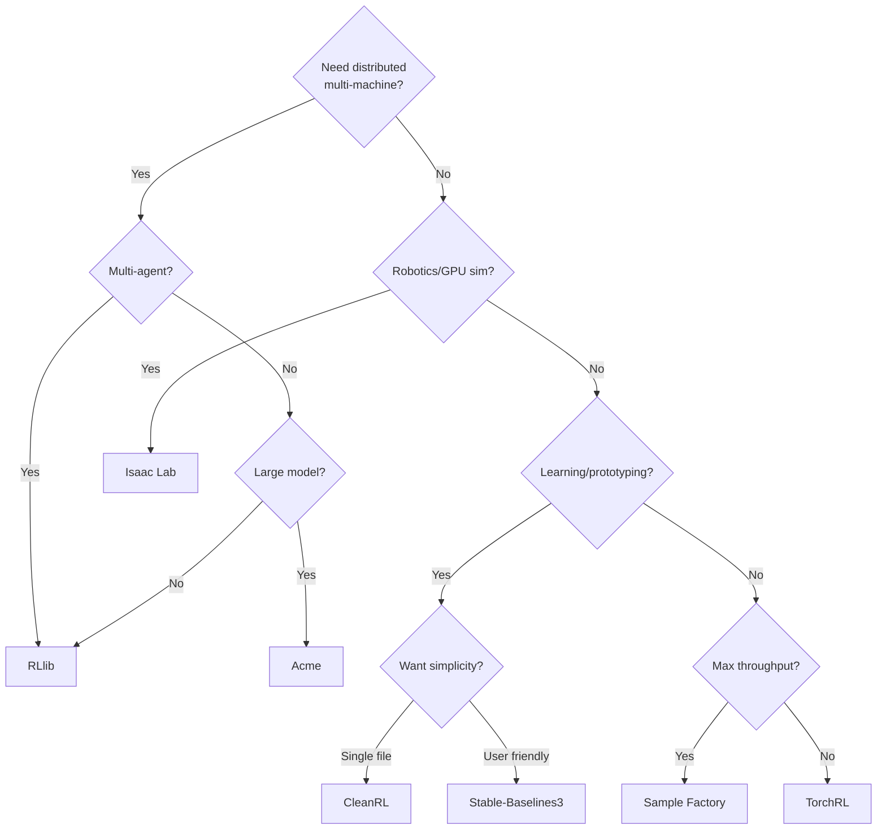

# Frameworks and Systems for Distributed RL

This page surveys the major open-source frameworks for distributed RL, helping you choose the right tool for your research or application.

## Framework Landscape

| Framework | Maintainer | Architecture | Best For |
|-----------|-----------|--------------|----------|
| **RLlib** | Anyscale (Ray) | Ray-based distributed | General purpose, multi-agent |
| **Acme** | Google DeepMind | Actor-learner (Launchpad) | Research, modular components |
| **CleanRL** | Individual | Single-file implementations | Learning, prototyping |
| **Stable-Baselines3** | Community | Vectorized envs | Simple use, benchmarking |
| **Sample Factory** | Individual | Async vectorized | High throughput, single machine |
| **EnvPool** | Sea AI Lab | C++ vectorized envs | Ultra-fast environment stepping |
| **TorchRL** | Meta (PyTorch) | Composable primitives | PyTorch ecosystem |
| **Isaac Lab** | NVIDIA | GPU simulation + RL | Robotics, locomotion |

## RLlib

**RLlib** is the most comprehensive distributed RL framework, built on top of the Ray distributed computing framework.

### Key Features

- Supports most major RL algorithms (PPO, SAC, DQN, IMPALA, etc.)
- Transparent distribution via Ray (scale from laptop to cluster)
- Multi-agent RL support (independent, centralized, parameter sharing)
- Custom models, environments, and algorithms
- Integration with Ray Tune for hyperparameter search

### Architecture

### When to Use

- Multi-agent RL
- Need to scale to many machines
- Want built-in algorithm implementations
- Production deployment

## Acme

**Acme** (Google DeepMind) provides modular, composable RL components with a clean separation between algorithms and distributed infrastructure.

### Design Philosophy

- **Actors**: Interact with environment, collect data
- **Learners**: Update model parameters from data
- **Datasets/Adders**: Move data between actors and learners
- **Networks**: Neural network architectures

These components are connected via **Launchpad**, which handles distribution.

### Key Features

- Clean, modular code (great for understanding algorithms)
- Easy to go from single-process to distributed
- Strong JAX support (alongside TensorFlow)
- Reference implementations of many algorithms

### When to Use

- Research requiring clean, modifiable algorithm implementations
- JAX-based projects
- Studying algorithm internals

## CleanRL

**CleanRL** takes a radically different approach: single-file implementations of RL algorithms with no abstraction layers.

### Philosophy

- Each algorithm in one self-contained Python file
- No inheritance, minimal abstraction
- Extensive logging (Weights & Biases integration)
- Reproducible benchmarks

### When to Use

- **Learning RL**: See exactly how algorithms work
- **Prototyping**: Quick modifications without framework overhead
- **Benchmarking**: Standardized, reproducible implementations
- **Starting point**: Fork a single file and modify

## Stable-Baselines3

The most user-friendly RL library, focusing on ease of use and reliability.

### Key Features

- Clean, well-tested implementations of PPO, SAC, TD3, DQN, A2C
- Consistent API across algorithms
- Built-in vectorized environments
- Extensive documentation and tutorials

### When to Use

- First RL project
- Quick prototyping
- Standard benchmarking
- Need reliable implementations without customization

## Sample Factory

**Sample Factory** maximizes single-machine throughput through careful system design.

### Key Innovations

- Asynchronous actor and learner on the same machine
- Ring buffer for zero-copy data passing
- Batched environment stepping
- Achieves 100K+ FPS on Atari on a single GPU machine

### When to Use

- Maximum throughput on a single machine
- Complex 3D environments (VizDoom, DMLab)
- Don't want to manage a cluster

## EnvPool

**EnvPool** provides blazing-fast environment simulation by implementing environments in C++ with async batching.

### Key Features

- C++ environment implementations (Atari, MuJoCo, classic control)
- Asynchronous environment stepping
- 10-20x faster than Python Gym environments
- Compatible with any RL framework

### Architecture

### When to Use

- Environment stepping is your bottleneck
- Using standard environments (Atari, MuJoCo)
- Want to drop-in replace Gym with minimal code changes

## TorchRL

**TorchRL** (Meta) provides composable RL building blocks in the PyTorch ecosystem.

### Key Features

- `TensorDict` — unified data carrier for RL
- Composable transforms, loss modules, and data collectors
- Integration with torchvision, torchtext
- GPU-accelerated replay buffers

### When to Use

- PyTorch ecosystem (integrating with other PyTorch libraries)
- Custom algorithm development
- Need fine-grained control over RL components

## Isaac Lab (formerly Isaac Gym + Orbit)

**Isaac Lab** is NVIDIA's framework for robot learning, combining GPU-accelerated physics with RL.

### Key Features

- Thousands of parallel environments on a single GPU
- Built-in robot models (quadrupeds, humanoids, arms)
- Terrain generation, domain randomization
- Integration with rl_games, RSL_rl for fast PPO training

### When to Use

- Robot locomotion / manipulation research
- Need massive parallel simulation
- Sim-to-real pipeline

## Choosing a Framework

## Key References

- Liang, E., et al. (2018). "RLlib: Abstractions for Distributed Reinforcement Learning." *ICML*.
- Hoffman, M., et al. (2020). "Acme: A Research Framework for Distributed Reinforcement Learning." *arXiv:2006.00979*.
- Huang, S., et al. (2022). "CleanRL: High-quality Single-file Implementations of Deep Reinforcement Learning Algorithms." *JMLR*.
- Raffin, A., et al. (2021). "Stable-Baselines3: Reliable Reinforcement Learning Implementations." *JMLR*.
- Petrenko, A., et al. (2020). "Sample Factory: Egocentric 3D Control from Pixels at 100000 FPS." *ICML*.
- Weng, J., et al. (2022). "EnvPool: A Highly Parallel Reinforcement Learning Environment Execution Engine." *NeurIPS*.
