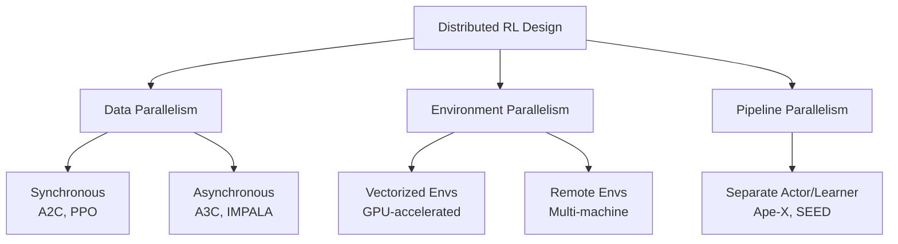

# Part IV: Distributed Reinforcement Learning

Training RL agents at scale requires distributing computation across many machines. This section covers the system architectures, frameworks, and practical considerations for distributed RL — from the foundational designs to modern systems that power large-scale training.

## What You'll Learn

1. **[Architecture Paradigms](architectures.md)** — A3C, Ape-X, IMPALA, SEED RL, and their design trade-offs
2. **[Frameworks & Systems](frameworks.md)** — RLlib, Acme, EnvPool, Sample Factory, and other systems
3. **[Practical Scaling Guide](practice.md)** — How to scale RL training effectively

## Why Distributed RL?

RL training has unique computational characteristics that demand distributed systems:

| Aspect | RL vs. Supervised Learning |
|--------|----|
| **Data generation** | Must interact with environment (on-policy) or replay buffer (off-policy) |
| **Data freshness** | On-policy methods need current-policy data (stale data hurts) |
| **Environment cost** | Simulation can be the bottleneck (complex physics, rendering) |
| **Exploration** | Parallel environments provide diverse experience |
| **Training loop** | Tightly coupled: collect → train → update → collect again |

Single-machine RL hits walls:

- **Sample collection is slow**: One environment generates data in real-time
- **GPU underutilized**: Policy network is small, GPU waits for environment data
- **Training time**: Complex tasks need billions of environment steps

Distributed RL addresses these by parallelizing environment interaction, data collection, and policy training.

## The Design Space

The key design decisions:

1. **Synchronous vs. asynchronous** updates
2. **Where computation happens** (CPU actors, GPU learners)
3. **How data flows** between actors and learners
4. **How fresh the data needs to be** (on-policy vs. off-policy tolerance)

## Connection to Other Parts

- **Part I (RL)**: The algorithms being scaled — [PPO](../rl/trust_region.md), [SAC](../rl/actor_critic.md), etc.
- **Part III (Embodied AI)**: Distributed systems enable massive-scale [locomotion training](../embodied/locomotion.md) (thousands of parallel environments)
