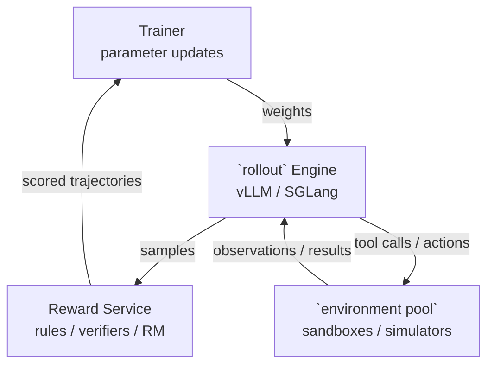
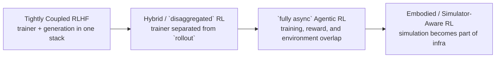
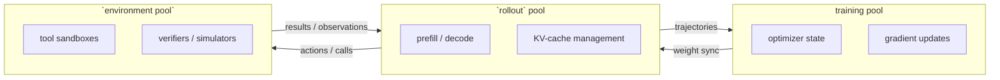

# Large-Model RL Infrastructure

Classical distributed RL systems were designed around actors, learners, replay buffers, and fast environment stepping. Modern RL for large models adds a different set of bottlenecks: long-text generation, heavyweight verifiers, frequent weight synchronization, and, increasingly, tool-using or embodied environments. As a result, the system boundary expands from a simple actor-learner loop to a larger graph that includes the trainer, `rollout` engine, reward service, and sometimes a separate `environment pool`.

This page surveys that transition and highlights the open-source systems that define the current design space.

## Why Modern RL Infra Changed

Large-model RL changes the workload in three ways:

- **Generation dominates runtime**: in RLHF and RLVR, the expensive step is often response generation rather than the backward pass.
- **Long trajectories create stragglers**: long chain-of-thought reasoning and multi-turn agent tasks produce highly variable `rollout` lengths.
- **The environment got heavier**: reward computation may involve unit tests, sandboxed tools, simulators, or judges instead of a scalar reward from a lightweight environment.

That pushes system design away from a single actor-learner pipeline and toward four cooperating roles:

1. **Trainer** updates model parameters.
2. **`rollout` engine** runs fast generation, often with vLLM or SGLang.
3. **Reward service** scores outputs with rules, verifiers, or models.
4. **`environment pool`** hosts tools, sandboxes, or simulators for multi-turn or embodied tasks.

## Evolution of Systems

### 1. Tightly Coupled RLHF

Early RLHF stacks such as DeepSpeed-Chat and TRL were effective for small-to-medium models, but they kept training and generation tightly coupled. That simplicity helped experimentation, yet it also meant that KV cache pressure, model parallelism, and control flow were all handled inside one training-oriented process.

This style remains useful for learning, for small experiments, and for settings where the policy model and reward pipeline still fit comfortably into one cluster layout.

### 2. Hybrid and `disaggregated` Rollout

The next step was to split training from high-throughput generation. Systems such as **OpenRLHF**, **veRL (HybridFlow)**, and **NeMo-RL** made this separation practical by pairing large-model training backends with specialized inference engines.

The key idea is simple: the trainer and the `rollout` engine have different performance goals, so they should not be forced into the same execution model.

- The **trainer** wants sharding efficiency, optimizer state management, and stable gradient throughput.
- The **`rollout` engine** wants fast decoding, efficient KV-cache management, and dynamic batching.

This is the point where `disaggregated` execution became a core systems concept rather than an implementation detail.

### 3. `fully async` Agentic RL

Once the workload shifted toward long reasoning traces and multi-turn tool use, synchronous systems began to leave too much hardware idle. Modern stacks such as **AReaL**, **slime**, **NeMo-RL async GRPO**, and **ROLL / RollArt** move further toward `fully async` execution:

- trainers continue updating while old requests are still finishing,
- `rollout` workers receive periodic weight refreshes,
- reward evaluation overlaps with training,
- and the environment lifecycle is treated as a first-class systems problem.

This is especially important for agentic coding or verifier-heavy tasks, where sandbox startup, test execution, or external tools may dominate end-to-end latency.

## Framework Matrix

| Framework | Training Backend | `rollout` Backend | Sync / Async | Agentic | Multi-Pool Resources | Best Fit |
|---|---|---|---|---|---|---|
| **OpenRLHF** | DeepSpeed ZeRO-3 / FSDP | vLLM | Sync + async option | Yes | Partial | Practical RLHF and RLVR on large LLMs |
| **veRL (HybridFlow)** | FSDP / Megatron-LM | vLLM / SGLang | Mostly sync, async experiments | Yes | Yes | Flexible research on large-model RL pipelines |
| **NeMo-RL** | DTensor / Megatron-Core | vLLM / Megatron Inference | Sync + async GRPO | Yes | Yes | Industrial-scale Megatron-based training |
| **slime** | Megatron-LM | SGLang + router | Sync + `fully async` | Yes | Yes | Large agentic training with explicit `rollout` routing |
| **AReaL** | Megatron / FSDP | SGLang / vLLM | `fully async` | Yes | Yes | Long-CoT and agent-first RL research |
| **ROLL / RollArt** | Megatron / FSDP2 | SGLang / vLLM | `fully async` | Yes | Strong heterogeneity | Agentic RL with hardware-aware scheduling |
| **RLinf** | Megatron + DTensor | SGLang | Sync / async, simulator-aware | Embodied-first | Yes + simulation pool | VLA and embodied RL with simulators |

Three reading heuristics are useful here:

- **OpenRLHF / veRL / NeMo-RL** define the mainstream large-model RL training pattern.
- **AReaL / slime / ROLL** show how systems evolve when long trajectories and agent environments dominate.
- **RLinf** extends the same systems logic into embodied RL, where the simulator becomes part of the infrastructure rather than just a data source.

## How to Choose

### Classical distributed RL

If your workload is still based on vectorized Gym-style environments, replay buffers, or standard control benchmarks, start with the frameworks on [Frameworks & Systems](frameworks.md). They are simpler and better aligned with that problem shape.

### Multi-machine LLM RL

If you need practical RLHF or RLVR on large language models, start with **OpenRLHF**, **veRL**, or **NeMo-RL**. They cover the main design choices around weight sync, inference backends, and large-model parallelism without forcing you into a highly specialized agent stack from day one.

### Long CoT and agentic workloads

If `rollout` length variance, verifier cost, or tool orchestration is the real bottleneck, look at **AReaL**, **slime**, or **ROLL**. Their value is not just higher throughput, but better handling of stale weights, asynchronous pipelines, and heavy environment services.

### Embodied and VLA training

If the policy interacts with simulators or robot-centric environments, the relevant question is no longer just trainer-versus-generator separation. You also need to reason about simulation, rendering, and embodied data services. That is the setting where **RLinf** becomes the most natural bridge from Part IV to [Part III: Embodied AI](../embodied/index.md).

## Future Direction

The emerging pattern is a three-pool design:

1. **training pool** for optimizer-heavy updates,
2. **`rollout` pool** for decode-heavy inference,
3. **`environment pool`** for tools, verifiers, or simulators.

This direction matters because each pool stresses different hardware and different scheduling logic. The main systems challenge is no longer only distributed optimization; it is coordinating parameter movement, trajectory freshness, and heterogeneous execution across those pools.

For large language models, this trend points toward more asynchronous weight updates, lighter synchronization, and better overlap between generation and evaluation. For embodied systems, it points toward tighter coupling between distributed RL and the simulation stack discussed in [Part III](../embodied/index.md).

## References

- OpenRLHF: [OpenRLHF paper](https://arxiv.org/abs/2405.11143)
- veRL / HybridFlow: [HybridFlow paper](https://arxiv.org/abs/2409.19256)
- NeMo-RL: [NeMo-RL documentation](https://docs.nvidia.com/nemo/rl/latest/)
- slime: [slime repository](https://github.com/THUDM/slime)
- AReaL: [AReaL paper](https://arxiv.org/abs/2505.24298)
- ROLL / RollArt: [ROLL paper](https://arxiv.org/abs/2506.06122)
- RLinf: [RLinf-VLA paper](https://arxiv.org/abs/2510.06710)
