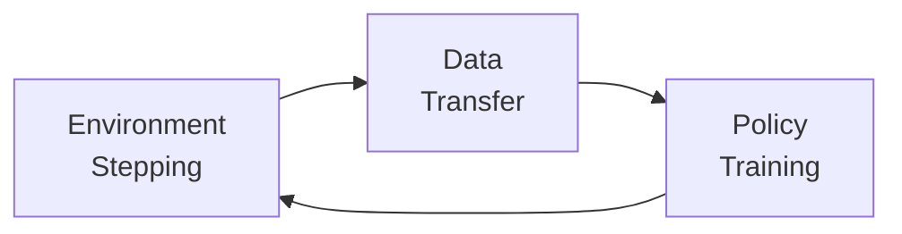

# Practical Scaling Guide

This page provides practical advice for scaling RL training — from single-GPU experiments to multi-machine distributed training. We cover common bottlenecks, optimization strategies, and debugging tips.

## Identifying Your Bottleneck

Before scaling, identify what's limiting throughput:

### The Three Bottlenecks



| Bottleneck | Symptom | Solution |
|------------|---------|----------|
| **Environment** | GPU utilization low, environment steps/sec low | More parallel envs, GPU envs, faster sim |
| **Data transfer** | High CPU-GPU transfer time, network latency | Vectorized envs, shared memory, GPU envs |
| **Training** | GPU at 100%, want faster convergence | Larger batches, mixed precision, model optimization |

### Profiling Checklist

1. **GPU utilization**: `nvidia-smi` — if GPU is idle most of the time, you're environment-bottlenecked
2. **Environment throughput**: Measure steps per second per environment
3. **Data pipeline**: Check for unnecessary copies, serialization overhead
4. **Training throughput**: Measure gradient steps per second

## Scaling On-Policy Methods (PPO)

PPO is the most commonly scaled RL algorithm, especially for robotics.

### Single-GPU Scaling

```
Environments: 4096 - 65536 (GPU-accelerated)
Batch size: environments × horizon_length
Mini-batch size: batch_size / num_mini_batches
PPO epochs: 3-5
```

**Key insight**: With GPU environments (Isaac Gym), a single GPU can run thousands of environments. The bottleneck becomes the policy training step.

### Effective Batch Size

The effective batch size for PPO:

$$
B_{\text{eff}} = N_{\text{envs}} \times T_{\text{horizon}} \times N_{\text{mini\_epochs}}
$$

Larger effective batch size → more stable gradients → can use larger learning rates.

### Multi-GPU Scaling

For PPO across multiple GPUs:

```python
# Data parallel PPO
# Each GPU runs a fraction of the environments
# Gradients are synchronized via AllReduce

# GPU 0: envs 0-1023, GPU 1: envs 1024-2047, ...
# After forward pass: AllReduce gradients
# Synchronized update
```

!!! tip "Scaling Rule of Thumb"
    When doubling the number of environments (and thus batch size), increase the learning rate by ~$\sqrt{2}$ to maintain similar convergence.

## Scaling Off-Policy Methods (SAC, TD3)

Off-policy methods have different scaling characteristics due to the replay buffer.

### Key Considerations

1. **Replay buffer memory**: Can be the limiting factor (millions of transitions × observation size)
2. **Update-to-data ratio**: How many gradient steps per environment step
3. **Data freshness**: Off-policy methods tolerate stale data, but there are limits

### Architecture

```
Actors: N parallel workers collecting experience
Buffer: Centralized or distributed replay buffer
Learner: GPU training from buffer samples
Ratio: update_steps / env_steps = 1-20
```

### Distributed Replay Buffer

For large-scale off-policy training:

- **Prioritized**: Rank transitions by TD error for efficient sampling
- **Distributed**: Shard the buffer across machines for memory
- **Ring buffer**: Fixed-size, overwrites oldest data

## Common Pitfalls

### 1. Learning Rate Scaling

**Problem**: Increasing batch size without adjusting learning rate leads to poor convergence.

**Solution**: Linear scaling rule — multiply LR by the batch size increase factor. For PPO, square-root scaling often works better.

### 2. Observation Normalization

**Problem**: Observation statistics change during training, causing instability.

**Solution**: Running mean/variance normalization:

```python
obs_normalized = (obs - running_mean) / (running_std + 1e-8)
```

In distributed settings, synchronize normalization statistics across workers.

### 3. Reward Scaling

**Problem**: Reward magnitudes vary across tasks or change during training.

**Solution**: Normalize returns or use symmetric reward functions. DreamerV3's symlog transformation:

$$
\text{symlog}(x) = \text{sign}(x) \ln(|x| + 1)
$$

### 4. Seed Variance

**Problem**: RL results vary significantly across random seeds.

**Solution**: Always report results over 3-5 seeds. Use statistical tests for comparisons.

### 5. Gradient Staleness

**Problem**: In async systems, workers train on stale parameters.

**Solution**: V-trace correction (IMPALA), importance sampling, or limit staleness to 1-2 updates.

## Debugging Distributed RL

### Key Metrics to Monitor

| Metric | What to Watch For |
|--------|-------------------|
| **Episode return** | Upward trend, not oscillating wildly |
| **Policy entropy** | Gradual decrease (not collapse) |
| **Value function loss** | Decreasing, not exploding |
| **KL divergence** | Within target range for PPO |
| **Gradient norm** | Stable, no spikes |
| **Environment FPS** | Consistent, no degradation |
| **GPU utilization** | High (>80%) |
| **Data queue length** | Not backing up |

### Common Failure Modes

1. **Reward hacking**: Agent exploits simulation bugs. Fix: review reward function, add constraints.
2. **Policy collapse**: Entropy drops to zero. Fix: increase entropy bonus, check learning rate.
3. **NaN/Inf values**: Numerical instability. Fix: gradient clipping, observation normalization, check reward magnitudes.
4. **Slow convergence**: May be normal for hard tasks. Check: hyperparameters, reward shaping, curriculum.
5. **Memory leak**: Common in long training runs. Profile memory usage over time.

## Hardware Recommendations

### Single-Machine Setup

| Use Case | Hardware | Expected FPS |
|----------|----------|-------------|
| Prototyping | 1x RTX 4090 | 10K-50K (Atari) |
| Locomotion (Isaac Gym) | 1x RTX 4090 | 100K-500K |
| Large-scale single-machine | 1x A100 80GB | 200K-1M |

### Multi-Machine Setup

| Use Case | Hardware | Expected FPS |
|----------|----------|-------------|
| Large-scale on-policy | 8x A100 + 32 CPU workers | 1M+ |
| Massive off-policy | 256 CPU actors + 8 GPU learners | 5M+ |
| Robotics research | 1-4 GPUs (Isaac Gym) | Sufficient for most tasks |

## Key References

- Espeholt, L., et al. (2020). "SEED RL: Scalable and Efficient Deep-RL with Accelerated Central Inference." *ICLR*.
- Petrenko, A., et al. (2020). "Sample Factory: Egocentric 3D Control from Pixels at 100000 FPS." *ICML*.
- Makoviychuk, V., et al. (2021). "Isaac Gym: High Performance GPU-Based Physics Simulation For Robot Learning." *NeurIPS*.
- Weng, J., et al. (2022). "EnvPool: A Highly Parallel Reinforcement Learning Environment Execution Engine." *NeurIPS*.

!!! warning "Work in Progress"
    This section will be expanded with more detailed benchmarks, configuration examples, and case studies.
