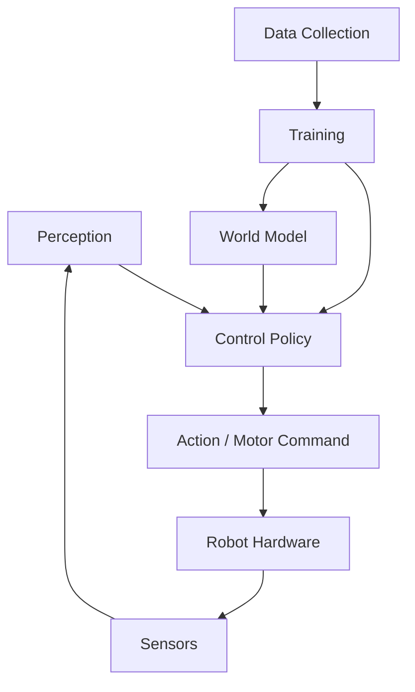

# Part III: Embodied AI

Embodied AI brings reinforcement learning, world models, and perception together in **physical systems** that interact with the real world. This section covers the key capabilities and technologies for building intelligent embodied agents, with a focus on locomotion, manipulation, teleoperation, and data collection.

## What You'll Learn

1. **[Overview](overview.md)** — What is embodied AI, the sim-to-real paradigm, key challenges
2. **[Locomotion](locomotion.md)** — RL-based locomotion control for legged robots
3. **[Loco-Manipulation](loco_manipulation.md)** — Combining locomotion with manipulation
4. **[Teleoperation](teleoperation.md)** — Human-in-the-loop robot control for data collection and beyond
5. **[Data Collection](data_collection.md)** — Strategies for collecting robot learning data at scale

## Why Embodied AI?

Embodied AI is where algorithms meet the physical world. The unique challenges include:

- **Physical constraints**: Torque limits, joint ranges, contact dynamics
- **Partial observability**: Noisy sensors, occlusions, latency
- **Safety**: Real robots can damage themselves and their environment
- **Sim-to-real gap**: Policies trained in simulation must transfer to reality
- **Sample efficiency**: Real-world data is expensive and slow to collect

## The Embodied AI Stack

The full embodied AI system involves perception (processing sensory input), control (deciding what to do), actuation (executing motor commands), and the data pipeline that improves the system over time.

## Connection to Other Parts

- **Part I (RL)**: Provides the learning algorithms, especially [PPO](../rl/trust_region.md) and [SAC](../rl/actor_critic.md) used for policy training
- **Part II (World Models)**: Enables [sim-to-real transfer](../world_models/planning.md) and data-efficient learning
- **Part IV (Distributed RL)**: Scales up the training of embodied policies across many parallel environments
