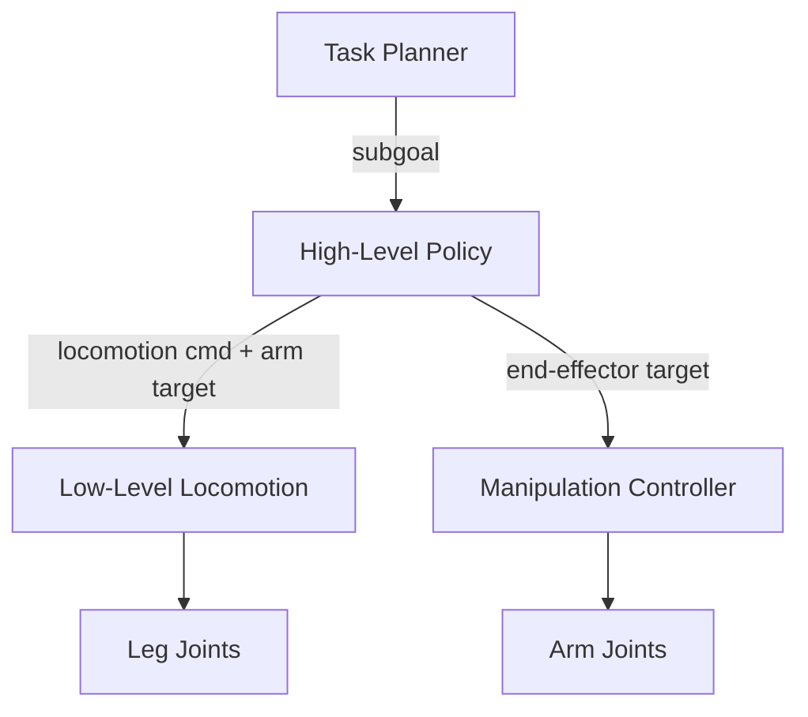

# Loco-Manipulation

Loco-manipulation combines locomotion and manipulation into a unified whole-body control problem. Instead of treating walking and grasping as separate capabilities, loco-manipulation enables robots to move through the environment while interacting with objects — opening doors, carrying items, pushing obstacles, and more.

## Why Loco-Manipulation?

Real-world tasks require **simultaneous mobility and dexterity**:

- A robot carrying a box must walk stably while maintaining its grasp
- Opening a door requires coordinating base movement with arm/hand motion
- Cleaning or organizing a room means constantly moving and manipulating

These tasks cannot be solved by locomotion or manipulation alone — they require **whole-body coordination**.

## Problem Formulation

The loco-manipulation problem extends standard locomotion with manipulation objectives:

**Observation space** (typical):

- Proprioception: base pose, joint states (legs + arm/hand)
- Object state: relative position, orientation, contact info
- Task goal: target position, desired object state

**Action space**:

- Leg joint targets (locomotion)
- Arm joint targets (manipulation)
- Optionally: hand/gripper commands

**Reward**: Multi-objective combining locomotion quality and manipulation success

$$
r = w_1 r_{\text{locomotion}} + w_2 r_{\text{manipulation}} + w_3 r_{\text{task}}
$$

## Approaches

### Hierarchical Control

Decompose the problem into layers:

- **High-level policy**: Decides where to walk and what to grasp
- **Low-level locomotion**: Pre-trained walking controller
- **Manipulation controller**: Pre-trained or RL-based arm controller

**Pros**: Modular, easier to train components separately
**Cons**: Interface between layers can be a bottleneck, limited whole-body coordination

### End-to-End RL

Train a single policy that controls all joints simultaneously:

$$
a_t = \pi_\theta(o_t), \quad a_t \in \mathbb{R}^{n_{\text{legs}} + n_{\text{arm}} + n_{\text{hand}}}
$$

**Pros**: Maximally expressive, can discover emergent whole-body strategies
**Cons**: Harder to train (large action space, multi-objective reward), needs careful curriculum

### Hybrid Approaches

Combine pre-trained components with end-to-end fine-tuning:

1. Pre-train locomotion and manipulation policies separately
2. Initialize the joint policy from these components
3. Fine-tune end-to-end on loco-manipulation tasks

This is increasingly popular as it balances training efficiency with full coordination.

## Key Results

### Mobile Manipulation Platforms

**Spot + Arm (Boston Dynamics)**:

- Quadruped with a 5-DOF arm
- Industrial inspection, object retrieval
- Combination of classical and learned controllers

**Mobile ALOHA (Stanford, 2024)**:

- Mobile base with dual 6-DOF arms
- Learns complex bimanual mobile manipulation from teleoperation data
- Co-training with diverse data for generalization

### Humanoid Loco-Manipulation

**Whole-Body Humanoid Control**:

- Humanoid robots (H1, Atlas, Figure) performing tasks like carrying objects, opening doors
- Particularly challenging due to bipedal balance + dual-arm coordination
- Recent progress with large-scale RL in simulation

### Quadruped Loco-Manipulation

- **Quadruped with arm**: Locomotion + reaching/grasping (Unitree B2 + Z1 arm)
- **Quadruped using legs**: Some approaches use the legs themselves for manipulation (e.g., using a front paw to push buttons)

## Technical Challenges

### 1. Balance Under Manipulation Forces

Manipulation creates forces and torques on the body that disrupt balance:

- Lifting heavy objects shifts center of mass
- Pushing/pulling creates lateral forces
- Contact forces during grasping propagate through the body

Solutions: include manipulation disturbances during locomotion training, use robust reward formulations

### 2. Multi-Objective Reward Design

Balancing locomotion quality and manipulation success:

- Too much locomotion reward → robot walks well but ignores manipulation
- Too much manipulation reward → robot reaches the object but falls over

Approaches: adaptive reward weighting, curriculum, Lagrangian methods for constraint satisfaction

### 3. Contact-Rich Interaction

Manipulation involves complex contact dynamics:

- Making/breaking contact with objects
- Sliding, rolling, pivoting
- Deformable objects

These are hard to simulate accurately, and sim-to-real transfer is particularly challenging.

### 4. Long-Horizon Tasks

Many real-world tasks have long horizons:

- Navigate to object → grasp → carry → place
- Each phase has different dynamics and requirements

Hierarchical approaches or goal-conditioned policies help break down long horizons.

## Current Research Directions

- **Language-conditioned loco-manipulation**: Follow natural language instructions ("pick up the red cup from the kitchen table")
- **Bimanual loco-manipulation**: Coordinate two arms on a mobile base
- **Tool use**: Using tools while walking (e.g., using a stick to reach something)
- **Dynamic loco-manipulation**: Fast, agile manipulation while running or jumping

!!! warning "Work in Progress"
    This section will be expanded with more detailed algorithmic treatments and code examples as the field progresses.

## Key References

- Fu, Z., et al. (2023). "Deep Whole-Body Control: Learning a Unified Policy for Manipulation and Locomotion." *CoRL*.
- Zhao, T.Z., et al. (2024). "Learning Fine-Grained Bimanual Manipulation with Low-Cost Hardware." *RSS*.
- Ha, H., et al. (2024). "UMI on Legs: Making Manipulation Policies Mobile with Manipulation-Centric Whole-body Controllers." *arXiv*.
- Portela, B., et al. (2024). "Learning Force-Based Manipulation of Deformable Objects from Multiple Demonstrations." *ICRA*.
