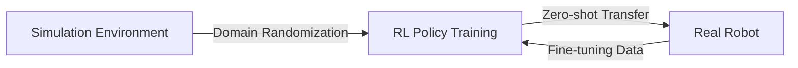

# Overview of Embodied AI

Embodied AI is the study of intelligent agents that learn to perceive, reason, and act in the physical world through embodied interaction. Unlike disembodied AI (language models, recommender systems), embodied agents must deal with continuous physics, real-time constraints, and the consequences of physical actions.

## What Makes Embodied AI Different?

| Challenge | Disembodied AI | Embodied AI |
|-----------|---------------|-------------|
| State space | Structured (text, tabular) | Raw sensory (vision, proprioception, tactile) |
| Action space | Discrete tokens | Continuous torques, velocities |
| Feedback | Immediate (loss) | Delayed, sparse, noisy rewards |
| Safety | Output filtering | Physical damage risk |
| Data | Internet-scale | Limited, expensive |
| Latency | Flexible | Real-time constraint (<50ms) |

## The Sim-to-Real Paradigm

Most modern embodied AI research follows the **sim-to-real** pipeline:

1. **Simulate**: Train policies in physics simulation (Isaac Gym, MuJoCo, PyBullet)
2. **Randomize**: Apply domain randomization to bridge the sim-to-real gap
3. **Transfer**: Deploy the trained policy on real hardware
4. **Fine-tune** (optional): Adapt with small amounts of real-world data

### Why Simulation?

- **Speed**: Thousands of parallel environments, millions of steps per hour
- **Safety**: No risk of hardware damage during exploration
- **Cost**: Much cheaper than real-world experiments
- **Reproducibility**: Deterministic environments, easy to share

### Domain Randomization

To make sim-trained policies robust to real-world variation, randomize simulation parameters:

| Category | Examples |
|----------|---------|
| **Physics** | Friction, mass, damping, motor strength, joint limits |
| **Visual** | Lighting, textures, camera position, backgrounds |
| **Dynamics** | Action delay, observation noise, actuator model |
| **Morphology** | Link lengths, body mass distribution |

The policy learns to be robust to this variation, which covers the real-world distribution.

## Key Simulation Platforms

| Platform | Developer | Strengths |
|----------|-----------|-----------|
| **Isaac Gym / Isaac Lab** | NVIDIA | GPU-accelerated, massive parallelism, robotics focus |
| **MuJoCo** | Google DeepMind | Accurate contact physics, widely used in research |
| **PyBullet** | Erwin Coumans | Open-source, good for manipulation |
| **Gazebo / ROS** | Open Robotics | Full ROS integration, diverse sensor simulation |
| **SAPIEN** | UC San Diego | Articulated object manipulation |
| **Habitat** | Meta | Indoor navigation, photorealistic rendering |

!!! tip "Isaac Gym / Isaac Lab"
    For locomotion and large-scale RL training, Isaac Gym (and its successor Isaac Lab) is currently the most popular choice due to GPU-accelerated physics simulation. It can run thousands of parallel environments on a single GPU.

## Types of Embodied AI Systems

### By Robot Morphology

- **Legged robots**: Quadrupeds (ANYmal, Unitree Go/B), bipeds (humanoids), hexapods
- **Wheeled robots**: Mobile bases, wheeled manipulation platforms
- **Arms**: Fixed-base manipulators (Franka, UR5, xArm)
- **Hands**: Dexterous hands (Allegro, Shadow, LEAP)
- **Mobile manipulators**: Arm on mobile base (Spot + arm, Mobile ALOHA)
- **Humanoids**: Full-body systems (Atlas, Figure, Unitree H1)

### By Capability

| Capability | Description | Key Challenge |
|------------|-------------|---------------|
| **Locomotion** | Walking, running, climbing over diverse terrain | Balance, terrain adaptation, energy efficiency |
| **Manipulation** | Grasping, placing, tool use | Contact-rich physics, dexterity |
| **Loco-manipulation** | Moving + manipulating simultaneously | Whole-body coordination |
| **Navigation** | Moving through environments to reach goals | Mapping, obstacle avoidance |

## The Learning Pipeline

A typical embodied AI training pipeline:

1. **Task design**: Define reward function, success criteria, initial state distribution
2. **Environment setup**: Create simulation with robot URDF/MJCF, terrain, objects
3. **Policy architecture**: Choose observation space, action space, network architecture
4. **Training**: Run RL algorithm (typically PPO) across parallel environments
5. **Evaluation**: Test in simulation, analyze failure modes
6. **Sim-to-real**: Deploy on real hardware, evaluate transfer quality
7. **Iteration**: Refine based on real-world performance

### Observation Spaces

Common observation inputs for embodied agents:

- **Proprioception**: Joint positions, velocities, torques, base orientation (IMU)
- **Exteroception**: Camera images, depth maps, LiDAR, tactile sensors
- **Commands**: Desired velocity, target position, language instruction
- **History**: Stacked past observations for handling latency and partial observability

### Action Spaces

- **Joint position targets**: Specify desired joint angles (PD controller tracks them)
- **Joint velocity targets**: Specify desired joint velocities
- **Joint torques**: Direct torque commands (most flexible, hardest to learn)
- **End-effector poses**: Cartesian space targets (requires IK)

## Key References

- Tan, J., et al. (2018). "Sim-to-Real: Learning Agile Locomotion For Quadruped Robots." *RSS*.
- Tobin, J., et al. (2017). "Domain Randomization for Transferring Deep Neural Networks from Simulation to the Real World." *IROS*.
- Makoviychuk, V., et al. (2021). "Isaac Gym: High Performance GPU-Based Physics Simulation For Robot Learning." *NeurIPS*.
