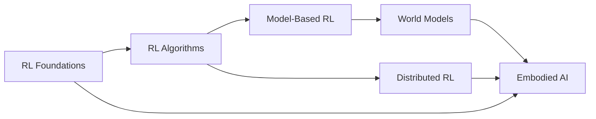

# About This Resource

## Motivation

The field of Embodied AI sits at the intersection of several deep research areas: reinforcement learning, world modeling, robotics, and large-scale systems engineering. For a PhD student entering this space, the challenge is not a lack of material — it's the **fragmentation** of knowledge across these areas and the difficulty of seeing how the pieces connect.

This resource aims to provide a **unified, structured pathway** through these interconnected topics. It is inspired by [Spinning Up in Deep RL](https://spinningup.openai.com/) but significantly broader in scope, covering not just RL algorithms but also the world models, embodied systems, and distributed infrastructure that modern EAI research demands.

## Design Philosophy

### Depth Over Breadth (Where It Matters)

We go deep on foundational concepts — mathematical formulations, derivations, and intuitions — because surface-level understanding is insufficient for research. At the same time, we cover a broad landscape so you know **what exists** and where to look.

### Theory Meets Practice

Every algorithmic section connects to practical considerations: implementation details, common pitfalls, hyperparameter sensitivity, and computational requirements.

### Incremental Updates

This is a **living document**. Sections marked with "Work in Progress" will be filled in over time. The structure is designed to accommodate new topics as the field evolves — new algorithms, new simulation platforms, new foundation models.

### Bilingual Access

All content is available in both English and Chinese (中文). Use the language switcher in the navigation bar.

## Prerequisites

To get the most from this resource, you should be comfortable with:

| Area | Specifics |
|------|-----------|
| **Mathematics** | Linear algebra (matrix operations, eigendecomposition), probability theory (Bayes' rule, expectations, common distributions), multivariable calculus (gradients, chain rule) |
| **Machine Learning** | Supervised/unsupervised learning, gradient descent, overfitting/regularization, neural network architectures (MLP, CNN, RNN, Transformer) |
| **Programming** | Python, NumPy, PyTorch or JAX, basic software engineering (git, debugging, profiling) |
| **Optional** | Convex optimization, control theory basics, ROS/robotics experience |

## How This Resource Is Organized

- **Part I: Reinforcement Learning** builds from first principles (MDPs, Bellman equations) through the full algorithmic landscape (policy gradient, value-based, actor-critic, model-based, offline).

- **Part II: World Models** extends model-based RL into learned world models — representation learning, video prediction, planning, and the emerging foundation world models.

- **Part III: Embodied AI** applies these ideas to physical systems — locomotion, manipulation, teleoperation, and data collection for robot learning.

- **Part IV: Distributed RL** covers the systems engineering side — how to scale RL training across many machines and environments.

- **Resources** includes research methodology guidance, exercises, and curated reading lists.

## Acknowledgments

This project draws inspiration from:

- [Spinning Up in Deep RL](https://spinningup.openai.com/) by OpenAI
- [Lilian Weng's Blog](https://lilianweng.github.io/) for clear technical exposition
- [The RL Course by David Silver](https://www.davidsilver.uk/teaching/) at UCL
- [CS285 at UC Berkeley](http://rail.eecs.berkeley.edu/deeprlcourse/) by Sergey Levine
