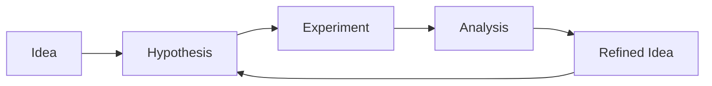

# Becoming a Researcher

*Inspired by "Spinning Up as a Deep RL Researcher" from OpenAI.*

This page offers advice for early-stage PhD students on how to develop research taste, execute projects, and contribute to the embodied AI community. The advice is opinionated — take what resonates and adapt it to your situation.

## Building the Right Background

### Core Skills

| Skill | Why It Matters | How to Build It |
|-------|---------------|-----------------|
| **Math fluency** | RL theory requires probability, optimization, linear algebra | Work through derivations by hand, not just reading |
| **Implementation ability** | Research ideas need working code to validate | Implement papers from scratch (don't just use libraries) |
| **Experiment design** | Bad experiments waste months | Study experimental methodology, learn proper baselines |
| **Writing** | Papers must communicate clearly | Read top papers for style, write early and often |
| **Critical reading** | Need to evaluate others' claims | Practice reading papers critically — what's the real contribution? |

### The Implementation Imperative

**Implement key algorithms yourself.** This is the single most important thing you can do as a new RL researcher. Using a library's PPO implementation does not build understanding.

Suggested progression:

1. **REINFORCE** — get the policy gradient working on CartPole
2. **DQN** — implement experience replay, target networks on Atari Pong
3. **PPO** — full implementation with GAE, clipping, value function
4. **SAC** — off-policy, continuous control, entropy tuning

Each implementation will surface misunderstandings that reading alone cannot reveal.

## Developing Research Taste

### Read Broadly, Then Deeply

**Phase 1: Survey** (first few months)

- Read 2-3 papers per day (abstracts + skim)
- Cover all major subareas in your field
- Build a mental map of the research landscape
- Don't try to understand everything deeply — build breadth first

**Phase 2: Deep dive** (once you've found your area)

- Read seminal papers deeply — line by line, derivation by derivation
- Implement the key methods
- Understand why design choices were made
- Read the related work sections to find connections

### Ask the Right Questions

Good research starts with good questions. When reading a paper, ask:

- What assumption does this make that might not hold?
- What would break if we changed X?
- Why didn't they try Y?
- What's the simplest possible version of this that would still work?
- Where does this fail, and can failures be characterized?

### Find Your Niche

The best research comes from unique combinations of expertise:

- RL + control theory → better policy optimization
- World models + computer vision → better representation learning
- Distributed systems + RL → scalable training
- Robotics + RL + human data → practical embodied AI

Find the intersection that excites you and where you have (or can build) an advantage.

## Executing a Research Project

### The Research Cycle

### Step 1: Idea Generation

Sources of ideas:

- **Failures and limitations** of existing methods (read "Limitations" sections of papers)
- **Combining** ideas from different subfields
- **Scaling up or down** existing approaches
- **Ablation studies** that reveal what actually matters
- **Real-world deployment** challenges (sim-to-real gap, safety, latency)

### Step 2: Feasibility Check

Before committing months to an idea:

- Can you state the hypothesis in one sentence?
- What's the simplest experiment that would test it?
- What baseline would you compare against?
- What result would convince you to stop (positive or negative)?
- Is this achievable with your compute budget?

### Step 3: Experimental Design

Principles:

1. **Start small**: CartPole/simple envs first, then scale to harder problems
2. **One change at a time**: Don't modify three things simultaneously
3. **Strong baselines**: Compare against well-tuned baselines, not strawmen
4. **Ablations**: Show which components of your method matter
5. **Multiple seeds**: Always run 3-5+ random seeds

### Step 4: Analysis and Writing

- **Be honest**: Report failures and negative results — they're informative
- **Understand your results**: Don't just report numbers — explain why things work or don't
- **Write as you go**: Don't wait until experiments are done to start writing

## Practical Advice

### Managing Compute

- Track all experiments in a logging system (W&B, TensorBoard)
- Use config files (Hydra, YAML) — never hardcode hyperparameters
- Write reproducible experiment scripts
- Save checkpoints regularly
- Learn to profile code before scaling up

### Collaborating

- Use git properly (branches, meaningful commits)
- Document your code — your future self will thank you
- Share negative results with your lab — prevents duplicated effort
- Attend reading groups and present papers

### Staying Current

- Follow key researchers on Twitter/X and Google Scholar
- Set up arXiv alerts for relevant keywords
- Attend 1-2 conferences per year (NeurIPS, ICML, ICLR, CoRL, RSS, ICRA)
- Engage with the open-source community (GitHub issues, discussions)

### Mental Health

Research is a marathon, not a sprint:

- Negative results are normal and expected
- Comparison with others' highlight reels is misleading
- Take breaks — some of the best ideas come when you're not at your desk
- Build a support network of peers and mentors

## Recommended Reading

- *How to Read a Paper* — Keshav, 2007
- *An Opinionated Guide to ML Research* — John Schulman, 2020
- *Lessons from My First Two Years of AI Research* — Tom Brown, 2020
- *Spinning Up as a Deep RL Researcher* — OpenAI, 2018
