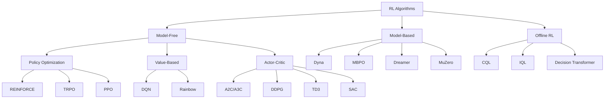

# Taxonomy of RL Algorithms

The RL algorithm landscape is vast. This page provides a structured map to help you navigate it. Understanding the taxonomy helps you choose the right algorithm for a given problem and understand the trade-offs involved.

## The Big Picture

## Key Axes of Classification

### 1. Model-Free vs. Model-Based

| | Model-Free | Model-Based |
|---|---|---|
| **Learns dynamics?** | No | Yes — learns $\hat{P}(s'\|s,a)$ |
| **Sample efficiency** | Low (needs many interactions) | High (can plan with learned model) |
| **Asymptotic performance** | Often better | Can be limited by model accuracy |
| **Examples** | DQN, PPO, SAC | Dyna, MBPO, Dreamer, MuZero |

**Model-free** methods learn a policy or value function directly from experience without explicitly modeling environment dynamics.

**Model-based** methods learn (or are given) a model of the environment and use it for planning or generating synthetic experience.

### 2. On-Policy vs. Off-Policy

| | On-Policy | Off-Policy |
|---|---|---|
| **Data source** | Current policy $\pi$ only | Any policy (replay buffer) |
| **Sample efficiency** | Low (discard data after update) | High (reuse old data) |
| **Stability** | Generally more stable | Can be unstable (deadly triad) |
| **Examples** | REINFORCE, PPO, A2C | DQN, DDPG, TD3, SAC |

**On-policy** algorithms only use data collected by the current policy. After each policy update, old data is discarded.

**Off-policy** algorithms can learn from data collected by any policy, typically stored in a **replay buffer**. This makes them much more sample-efficient.

### 3. Value-Based vs. Policy-Based vs. Actor-Critic

**Value-based** methods learn $Q^*(s,a)$ and derive the policy implicitly:

$$
\pi(s) = \arg\max_a Q^*(s,a)
$$

- Works well for discrete action spaces
- Cannot handle continuous actions directly (argmax is intractable)
- Examples: DQN, Rainbow

**Policy-based** methods directly parameterize and optimize the policy $\pi_\theta(a|s)$:

$$
\theta^* = \arg\max_\theta \mathbb{E}_{\pi_\theta} \left[ \sum_t \gamma^t r_t \right]
$$

- Works for both discrete and continuous actions
- Can represent stochastic policies
- Higher variance gradients
- Examples: REINFORCE, TRPO, PPO

**Actor-Critic** methods combine both:

- **Actor**: policy $\pi_\theta(a|s)$ (decides actions)
- **Critic**: value function $V_\phi(s)$ or $Q_\phi(s,a)$ (evaluates actions)
- The critic reduces the variance of policy gradient estimates
- Examples: A2C, DDPG, TD3, SAC

### 4. Stochastic vs. Deterministic Policy

**Stochastic policies** $\pi_\theta(a|s)$ output a probability distribution over actions:

- Natural exploration through sampling
- Used in: PPO, SAC, A2C

**Deterministic policies** $\mu_\theta(s)$ output a single action:

- Need explicit exploration noise (e.g., Gaussian, OU process)
- Can be more efficient when applicable
- Used in: DDPG, TD3

### 5. Online vs. Offline

**Online RL**: The agent interacts with the environment during training.

**Offline RL** (Batch RL): The agent learns entirely from a fixed dataset with no further interaction. This is critical for:

- Safety-critical domains (healthcare, autonomous driving)
- When real-world interaction is expensive
- Leveraging existing large-scale datasets

## Algorithm Summary Table

| Algorithm | Type | On/Off-Policy | Action Space | Key Idea |
|-----------|------|---------------|--------------|----------|
| REINFORCE | Policy Gradient | On | Discrete/Continuous | Monte Carlo policy gradient |
| DQN | Value-Based | Off | Discrete | Q-learning + neural nets + replay |
| A2C/A3C | Actor-Critic | On | Both | Parallel actors, advantage estimation |
| TRPO | Policy Gradient | On | Both | Trust region constraint |
| PPO | Policy Gradient | On | Both | Clipped surrogate objective |
| DDPG | Actor-Critic | Off | Continuous | Deterministic policy gradient + replay |
| TD3 | Actor-Critic | Off | Continuous | Twin critics, delayed updates |
| SAC | Actor-Critic | Off | Continuous | Maximum entropy framework |
| Dreamer | Model-Based | Off | Both | Learned world model + imagination |
| MuZero | Model-Based | Off | Discrete | Learned model + MCTS |
| CQL | Offline | Off | Both | Conservative Q-learning |
| IQL | Offline | Off | Both | Implicit Q-learning |
| DT | Offline | — | Both | RL as sequence modeling |

## Choosing an Algorithm

For practical guidance:

- **Continuous control** (robotics, locomotion): Start with **PPO** (simple, robust) or **SAC** (better sample efficiency)
- **Discrete actions** (games, combinatorial): Start with **DQN** or **PPO**
- **Sample efficiency matters**: Use off-policy methods (**SAC**, **TD3**) or model-based (**Dreamer**, **MBPO**)
- **Fixed dataset**: Use offline RL (**IQL**, **CQL**)
- **Sim-to-real**: **PPO** with domain randomization is a common starting point

## What's Next

- [Intro to Policy Optimization](intro_policy_optimization.md) — Understand the policy gradient theorem before diving into specific algorithms
- Individual algorithm pages for deep-dives
