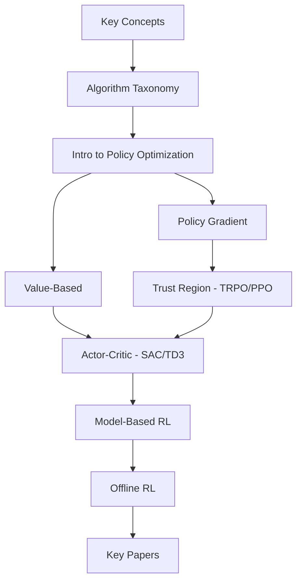

# Part I: Reinforcement Learning

Reinforcement Learning (RL) is the computational framework for learning through interaction. An agent takes actions in an environment, receives feedback in the form of rewards, and learns a policy that maximizes cumulative reward over time. RL provides the algorithmic foundation for much of embodied AI research.

## What You'll Learn

This section covers:

1. **[Key Concepts](key_concepts.md)** — MDPs, policies, value functions, Bellman equations, and the exploration-exploitation tradeoff
2. **[Algorithm Taxonomy](algorithm_taxonomy.md)** — A map of the RL algorithm landscape: model-free vs. model-based, on-policy vs. off-policy, value vs. policy methods
3. **[Intro to Policy Optimization](intro_policy_optimization.md)** — The policy gradient theorem and why it matters
4. **Algorithm Deep-Dives:**
    - [Policy Gradient Methods](policy_gradient.md) — REINFORCE, Vanilla Policy Gradient
    - [Trust Region Methods](trust_region.md) — TRPO, PPO
    - [Value-Based Methods](value_based.md) — DQN, Double DQN, Dueling DQN, Rainbow
    - [Actor-Critic Methods](actor_critic.md) — A2C/A3C, DDPG, TD3, SAC
    - [Model-Based RL](model_based.md) — Dyna, MBPO, Dreamer
    - [Offline RL](offline_rl.md) — BCQ, CQL, IQL, Decision Transformer
5. **[Key Papers](key_papers.md)** — Curated reading list of foundational and recent RL papers

## Recommended Reading Order

If you are new to RL, we suggest:

If you already know the basics, feel free to jump directly to any algorithm page.

## Connection to Other Sections

- **World Models** (Part II) extends the model-based RL concepts from this section
- **Embodied AI** (Part III) applies RL algorithms to physical robot systems (sim-to-real, locomotion policies)
- **Distributed RL** (Part IV) covers how to scale the training of these algorithms
