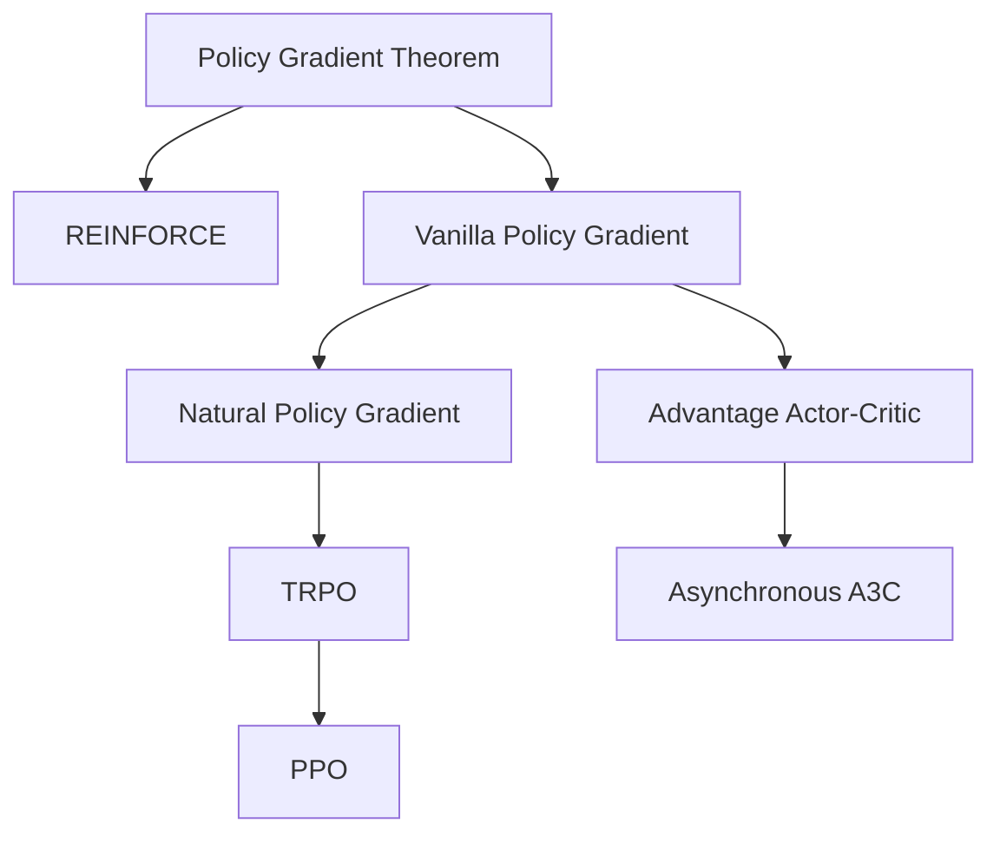

# Introduction to Policy Optimization

Policy optimization is one of the most important families of RL algorithms. Instead of learning a value function and deriving a policy from it, policy optimization methods **directly optimize the policy** to maximize expected return. This page derives the core result — the **Policy Gradient Theorem** — and builds intuition for how and why it works.

## The Policy Optimization Problem

We parameterize a policy $\pi_\theta$ (typically a neural network) and seek to maximize the expected return:

$$
J(\theta) = \mathbb{E}_{\tau \sim \pi_\theta} \left[ \sum_{t=0}^{T} \gamma^t r_t \right] = \mathbb{E}_{\tau \sim \pi_\theta} [R(\tau)]
$$

where $\tau = (s_0, a_0, r_0, \ldots, s_T)$ is a trajectory. We want to compute $\nabla_\theta J(\theta)$ so we can perform gradient ascent:

$$
\theta_{k+1} = \theta_k + \alpha \nabla_\theta J(\theta_k)
$$

## The Policy Gradient Theorem

The central result: we can compute the gradient of $J(\theta)$ without differentiating through the environment dynamics.

$$
\nabla_\theta J(\theta) = \mathbb{E}_{\tau \sim \pi_\theta} \left[ \sum_{t=0}^{T} \nabla_\theta \log \pi_\theta(a_t | s_t) \, \Phi_t \right]
$$

where $\Phi_t$ can be any of:

| Choice of $\Phi_t$ | Name | Variance |
|-----|------|----------|
| $R(\tau)$ | Total trajectory return | Highest |
| $\sum_{t'=t}^{T} \gamma^{t'-t} r_{t'}$ | Reward-to-go | Lower |
| $A^{\pi_\theta}(s_t, a_t)$ | Advantage function | Lowest (with baseline) |

### Derivation Sketch

The key identity (the "log-derivative trick"):

$$
\nabla_\theta \pi_\theta(\tau) = \pi_\theta(\tau) \nabla_\theta \log \pi_\theta(\tau)
$$

Since $\pi_\theta(\tau) = p(s_0) \prod_{t=0}^{T} \pi_\theta(a_t|s_t) P(s_{t+1}|s_t,a_t)$, taking the log:

$$
\log \pi_\theta(\tau) = \log p(s_0) + \sum_{t=0}^{T} \log \pi_\theta(a_t|s_t) + \sum_{t=0}^{T} \log P(s_{t+1}|s_t,a_t)
$$

Only $\log \pi_\theta(a_t|s_t)$ depends on $\theta$, so:

$$
\nabla_\theta \log \pi_\theta(\tau) = \sum_{t=0}^{T} \nabla_\theta \log \pi_\theta(a_t|s_t)
$$

The full gradient becomes:

$$
\nabla_\theta J(\theta) = \mathbb{E}_{\tau \sim \pi_\theta} \left[ \left( \sum_{t=0}^{T} \nabla_\theta \log \pi_\theta(a_t|s_t) \right) R(\tau) \right]
$$

!!! info "Key Insight"
    The environment dynamics $P(s'|s,a)$ cancel out! This means we can estimate policy gradients without knowing or differentiating through the environment model — we only need to be able to **sample** trajectories and **evaluate** $\log \pi_\theta(a|s)$.

## Variance Reduction

The basic policy gradient estimator has **high variance**, making learning slow and unstable. Several techniques reduce variance:

### Reward-to-Go

Actions at time $t$ can only affect future rewards. Replacing $R(\tau)$ with the reward-to-go:

$$
\hat{G}_t = \sum_{t'=t}^{T} \gamma^{t'-t} r_{t'}
$$

### Baselines

Subtracting a state-dependent baseline $b(s_t)$ from $\Phi_t$ reduces variance without introducing bias:

$$
\nabla_\theta J(\theta) = \mathbb{E} \left[ \sum_t \nabla_\theta \log \pi_\theta(a_t|s_t) \left( \hat{G}_t - b(s_t) \right) \right]
$$

The optimal baseline is close to $V^{\pi}(s_t)$, which is why actor-critic methods learn a value function as the baseline.

### Generalized Advantage Estimation (GAE)

GAE (Schulman et al., 2016) provides a smooth interpolation between low-bias/high-variance (Monte Carlo) and high-bias/low-variance (TD) advantage estimates:

$$
\hat{A}_t^{\text{GAE}(\gamma, \lambda)} = \sum_{l=0}^{\infty} (\gamma \lambda)^l \delta_{t+l}
$$

where $\delta_t = r_t + \gamma V(s_{t+1}) - V(s_t)$ is the TD error.

- $\lambda = 0$: pure TD (high bias, low variance)
- $\lambda = 1$: pure Monte Carlo (low bias, high variance)
- Typical: $\lambda = 0.95$

## From Theory to Algorithms

The policy gradient theorem leads to a family of practical algorithms:

Each algorithm adds constraints or techniques to make the basic policy gradient more stable and efficient:

- **REINFORCE**: Direct application with Monte Carlo returns
- **VPG**: Adds a learned baseline (value function)
- **TRPO**: Constrains the KL divergence between old and new policies
- **PPO**: Approximates the trust region with a simpler clipped objective

Continue to the individual algorithm pages for details:

- [Policy Gradient Methods](policy_gradient.md) (REINFORCE, VPG)
- [Trust Region Methods](trust_region.md) (TRPO, PPO)
