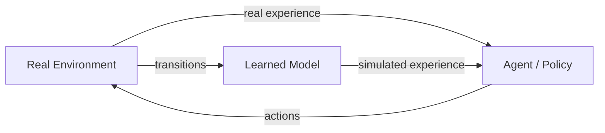

# Model-Based Reinforcement Learning

Model-based RL learns a model of the environment's dynamics and uses it for planning, generating synthetic data, or both. By leveraging a learned model, these methods can be dramatically more **sample-efficient** than model-free approaches — often by 10-100x.

## Why Model-Based?

| Aspect | Model-Free | Model-Based |
|--------|-----------|-------------|
| Sample efficiency | Low (10⁶+ steps) | High (10³-10⁵ steps) |
| Asymptotic performance | Often better | Limited by model accuracy |
| Computation per step | Low | Higher (planning) |
| Generalization | Limited | Can generalize via model |

The core trade-off: model-based methods are more sample-efficient but introduce **model bias** — errors in the learned model can compound during planning.

## The Dyna Architecture

**Dyna** (Sutton, 1991) is the foundational framework for model-based RL. The key idea: supplement real experience with **simulated experience** from a learned model.



The Dyna loop:

1. Act in the real environment, collect $(s, a, r, s')$
2. Update the model $\hat{P}(s'|s,a)$, $\hat{R}(s,a)$ with real data
3. Generate simulated transitions from the model
4. Update the policy/value function with **both** real and simulated data

### Dyna-Q

The simplest Dyna variant applies Q-learning to both real and simulated transitions:

!!! note "Pseudocode: Dyna-Q"
    ```
    Initialize Q(s,a), Model(s,a)
    for each step do
        s ← current state
        a ← ε-greedy from Q(s,·)
        Execute a, observe r, s'
        Q(s,a) ← Q(s,a) + α[r + γ max_a' Q(s',a') - Q(s,a)]
        Model(s,a) ← (r, s')           // update model

        for k = 1, ..., K do             // K planning steps
            s̃, ã ← random previously visited (s,a)
            r̃, s̃' ← Model(s̃, ã)       // simulate
            Q(s̃,ã) ← Q(s̃,ã) + α[r̃ + γ max_a' Q(s̃',a') - Q(s̃,ã)]
        end for
    end for
    ```

## MBPO (Model-Based Policy Optimization)

**MBPO** (Janner et al., 2019) provides theoretical grounding for when and how to use a learned model with policy optimization.

### Key Insight

MBPO shows that monotonic policy improvement is possible under a learned model if rollouts are kept **short** (to limit compounding model error):

$$
\eta[\pi'] \geq \hat{\eta}[\pi'] - C \cdot [\epsilon_m + (1 - (1-\epsilon_m)^k) \cdot \epsilon_\pi]
$$

where $k$ is the rollout length, $\epsilon_m$ is the model error, and $\epsilon_\pi$ is the policy shift.

### Algorithm

1. Train an **ensemble of dynamics models** $\{f_{\theta_i}\}_{i=1}^{N}$ on real data
2. Use the models to generate **short rollouts** (branched from real states)
3. Add synthetic data to a model replay buffer
4. Train the policy with SAC using both real and model data

The model ensemble:

- **Captures epistemic uncertainty** — disagreement between ensemble members indicates uncertain predictions
- **Reduces overfitting** to model errors
- Typical ensemble size: 5--7 models

### Adaptive Rollout Length

MBPO adapts the rollout horizon based on model accuracy:

- Accurate model → longer rollouts (more synthetic data)
- Inaccurate model → shorter rollouts (stay close to real data)

## Dreamer (Dream to Control)

The **Dreamer** family (Hafner et al., 2020, 2021, 2023) learns a world model and trains the policy entirely in "imagination" — latent-space rollouts from the learned model.

### World Model Architecture

Dreamer uses a **Recurrent State-Space Model (RSSM)**:

- **Representation model**: $q(z_t | z_{t-1}, a_{t-1}, o_t)$ — encodes observations into latent states
- **Transition model**: $p(z_t | z_{t-1}, a_{t-1})$ — predicts next latent state (without observation)
- **Observation model**: $p(o_t | z_t)$ — decodes latent states back to observations
- **Reward model**: $p(r_t | z_t)$ — predicts rewards from latent states

### Imagination-Based Training

Once the world model is learned:

1. **Imagine** trajectories by rolling out the transition model in latent space
2. **Predict** rewards and values along imagined trajectories
3. **Backpropagate** through the entire imagined trajectory to update the actor

This is efficient because latent-space rollouts are much cheaper than real environment interactions.

### Dreamer Versions

| Version | Key Improvement |
|---------|-----------------|
| **Dreamer (v1)** | RSSM + imagination-based actor-critic |
| **DreamerV2** | Discrete latent representations (categorical) |
| **DreamerV3** | Symlog predictions, scales across domains without hyperparameter tuning |

**DreamerV3** is notable for training a single set of hyperparameters across very different domains: Atari, DMControl, Minecraft, and more.

## MuZero

**MuZero** (Schrittwieser et al., 2020) combines learned models with Monte Carlo Tree Search (MCTS). Unlike Dreamer, MuZero learns a model that predicts **only what's needed for planning**: reward, value, and policy — not observations.

### Three Learned Functions

1. **Representation**: $h(o_1, \ldots, o_t) \to s^0$ — maps observations to latent state
2. **Dynamics**: $g(s^k, a^{k+1}) \to s^{k+1}, r^{k+1}$ — predicts next latent state and reward
3. **Prediction**: $f(s^k) \to p^k, v^k$ — predicts policy and value from latent state

### Planning with MCTS

At each real step, MuZero performs MCTS using the learned model:

1. Start from current latent state $s^0 = h(o_t)$
2. Simulate forward using dynamics $g$ and select actions via PUCT (like AlphaZero)
3. Use the resulting search policy for action selection

MuZero achieved superhuman performance in Atari, Go, chess, and shogi — all with a **single algorithm**.

## When to Use Model-Based Methods

**Use model-based when:**

- Sample efficiency is critical (real robot, expensive simulation)
- The environment has learnable dynamics (smooth, deterministic-ish)
- You need planning or lookahead capabilities

**Prefer model-free when:**

- Unlimited environment interactions are available
- Dynamics are too complex to model accurately
- You need maximum asymptotic performance

## Connection to World Models

Model-based RL is closely related to [World Models (Part II)](../world_models/index.md). The distinction:

- **Model-based RL**: model is a tool for policy optimization
- **World Models**: model is a core cognitive capability (representation, prediction, imagination)

The Dreamer line of work sits at the intersection, and foundation world models further blur this boundary.

## Key References

- Sutton, R.S. (1991). "Dyna, an Integrated Architecture for Learning, Planning, and Reacting." *SIGART Bulletin*.
- Janner, M., Fu, J., Zhang, M., Levine, S. (2019). "When to Trust Your Model: Model-Based Policy Optimization." *NeurIPS*.
- Hafner, D., Lillicrap, T., Ba, J., Norouzi, M. (2020). "Dream to Control: Learning Behaviors by Latent Imagination." *ICLR*.
- Hafner, D., Lillicrap, T., Norouzi, M., Ba, J. (2021). "Mastering Atari with Discrete World Models." *ICLR*.
- Hafner, D., et al. (2023). "Mastering Diverse Domains through World Models." *arXiv:2301.04104*.
- Schrittwieser, J., et al. (2020). "Mastering Atari, Go, Chess and Shogi by Planning with a Learned Model." *Nature*.
