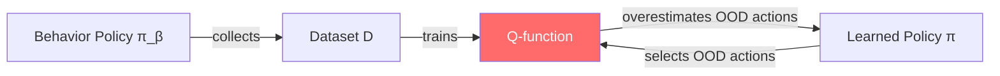

# Offline Reinforcement Learning

Offline RL (also called Batch RL) learns a policy **entirely from a fixed dataset** without any further environment interaction. This paradigm is critical for settings where online exploration is expensive, dangerous, or impractical — such as healthcare, autonomous driving, and robotics.

## The Offline RL Problem

Given a static dataset $\mathcal{D} = \{(s_i, a_i, r_i, s_i')\}_{i=1}^{N}$ collected by one or more behavior policies $\pi_\beta$, learn a policy $\pi$ that maximizes expected return.

### Why Is Offline RL Hard?

The fundamental challenge is **distribution shift** between the learned policy $\pi$ and the behavior policy $\pi_\beta$:

1. The Q-function is trained on state-action pairs from $\pi_\beta$
2. During evaluation (or Bellman backup), we query $Q(s', a')$ where $a' \sim \pi(s')$
3. If $\pi$ selects actions rarely seen in $\mathcal{D}$, the Q-values are unreliable (**extrapolation error**)
4. The $\max$ operator in the Bellman backup **amplifies** overestimation for out-of-distribution actions

This is known as the **distributional shift problem** or **action extrapolation error**.

## Key Approaches

### 1. Policy Constraint Methods

Constrain $\pi$ to stay close to $\pi_\beta$:

**BCQ** (Fujimoto et al., 2019): Uses a generative model of $\pi_\beta$ and only considers actions within its support:

$$
\pi(s) = \arg\max_{a_i + \xi_\phi(s, a_i)} Q_\theta(s, a_i + \xi_\phi(s, a_i))
$$

where $\{a_i\}$ are sampled from a learned VAE of $\pi_\beta$, and $\xi_\phi$ is a small perturbation.

**BEAR** (Kumar et al., 2019): Constrains the learned policy to have support within the data distribution using MMD:

$$
\max_\pi \mathbb{E}_{s \sim \mathcal{D}} \left[ \mathbb{E}_{a \sim \pi} [Q(s,a)] \right] \quad \text{s.t.} \quad \text{MMD}(\pi(\cdot|s), \pi_\beta(\cdot|s)) \leq \epsilon
$$

### 2. Conservative Value Estimation

Learn pessimistic Q-values that underestimate OOD actions:

**CQL** (Kumar et al., 2020): Adds a regularizer that pushes down Q-values for actions not in the dataset:

$$
\min_Q \; \alpha \left( \mathbb{E}_{s \sim \mathcal{D}, a \sim \mu} [Q(s,a)] - \mathbb{E}_{s,a \sim \mathcal{D}} [Q(s,a)] \right) + \frac{1}{2} \mathbb{E}_{s,a,s' \sim \mathcal{D}} \left[ (Q(s,a) - \hat{\mathcal{B}}^{\pi_k} Q(s,a))^2 \right]
$$

The first term penalizes high Q-values for OOD actions (sampled from $\mu$, e.g., the current policy) and boosts Q-values for in-distribution actions.

**Key property**: CQL learns a Q-function that is a **lower bound** on the true Q-value, ensuring conservative policy selection.

### 3. Implicit Methods

**IQL** (Kostrikov et al., 2022): Avoids querying OOD actions entirely by using **expectile regression** on the value function:

$$
\mathcal{L}_V(\psi) = \mathbb{E}_{(s,a) \sim \mathcal{D}} \left[ L_2^\tau (Q_\theta(s,a) - V_\psi(s)) \right]
$$

where $L_2^\tau(u) = |\tau - \mathbb{1}(u < 0)| \cdot u^2$ is the expectile loss.

With $\tau \to 1$, $V_\psi(s) \approx \max_a Q(s,a)$ over the **data distribution** — approximating the optimal value without explicitly maximizing over actions.

**Advantages of IQL:**

- Never queries Q-values for OOD actions
- Simple implementation (just regression)
- Works with both continuous and discrete actions
- Can be combined with advantage-weighted extraction for the policy

### 4. RL as Sequence Modeling

**Decision Transformer** (Chen et al., 2021): Reframes offline RL as a sequence prediction problem. A Transformer model predicts actions conditioned on desired returns:

$$
a_t = \text{Transformer}(\hat{R}_1, s_1, a_1, \hat{R}_2, s_2, a_2, \ldots, \hat{R}_t, s_t)
$$

where $\hat{R}_t$ is the **return-to-go** (desired future return).

At test time, conditioning on high return-to-go values elicits high-return behavior.

**Key insight**: No Bellman equations, no TD learning, no value functions — just supervised learning on sequences. The Transformer implicitly learns which actions lead to high returns.

## Comparison of Approaches

| Method | Approach | Strengths | Weaknesses |
|--------|----------|-----------|------------|
| BCQ | Policy constraint | Conservative, stable | Needs generative model |
| CQL | Conservative Q | Strong theory, versatile | Hyperparameter sensitive ($\alpha$) |
| IQL | Implicit Q | Simple, no OOD queries | Approximate maximization |
| DT | Sequence modeling | Simple (just supervised learning) | Struggles with stitching |

!!! info "Trajectory Stitching"
    A key capability that distinguishes offline RL from imitation learning: the ability to combine parts of different trajectories in the dataset to create a policy better than any single trajectory. CQL and IQL can do this; Decision Transformer struggles with it because it mainly reproduces trajectory-level patterns.

## Practical Considerations

### Dataset Quality Matters

Offline RL performance depends heavily on dataset composition:

- **Expert data**: High quality, but offline RL adds little over imitation learning
- **Mixed data** (expert + suboptimal): Best setting for offline RL — can stitch good parts together
- **Random data**: Challenging — limited coverage of good behaviors

### Evaluation

Standard evaluation protocol:

1. Train on fixed dataset (e.g., D4RL benchmarks)
2. Evaluate the learned policy online in the environment
3. Report normalized scores relative to expert and random baselines

### D4RL Benchmark

**D4RL** (Fu et al., 2020) is the standard benchmark for offline RL, providing datasets of varying quality across environments:

- **MuJoCo**: HalfCheetah, Hopper, Walker2d with random/medium/expert/medium-expert datasets
- **Antmaze**: Navigation with sparse rewards
- **Kitchen**: Multi-task manipulation

## Connection to Other Topics

- **Embodied AI**: Offline RL enables learning from demonstration datasets collected via [teleoperation](../embodied/teleoperation.md) and [data collection](../embodied/data_collection.md) without requiring online robot interaction.
- **World Models**: Offline model-based methods (e.g., COMBO, MOPO) learn world models from offline data and use them for policy optimization.

## Key References

- Fujimoto, S., Meger, D., Precup, D. (2019). "Off-Policy Deep Reinforcement Learning without Exploration." *ICML*.
- Kumar, A., et al. (2019). "Stabilizing Off-Policy Q-Learning via Bootstrapping Error Reduction." *NeurIPS*.
- Kumar, A., Zhou, A., Tucker, G., Levine, S. (2020). "Conservative Q-Learning for Offline Reinforcement Learning." *NeurIPS*.
- Kostrikov, I., Nair, A., Levine, S. (2022). "Offline Reinforcement Learning with Implicit Q-Learning." *ICLR*.
- Chen, L., et al. (2021). "Decision Transformer: Reinforcement Learning via Sequence Modeling." *NeurIPS*.
- Fu, J., Kumar, A., Nachum, O., Tucker, G., Levine, S. (2020). "D4RL: Datasets for Deep Data-Driven Reinforcement Learning." *arXiv:2004.06729*.
- Levine, S., et al. (2020). "Offline Reinforcement Learning: Tutorial, Review, and Perspectives on Open Problems." *arXiv:2005.01643*.
