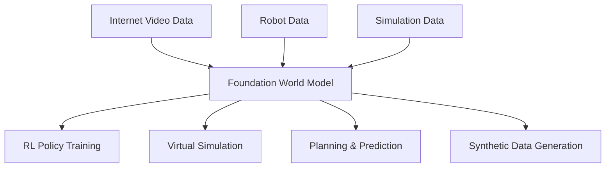

# Foundation World Models

Foundation world models are large-scale models trained on diverse data that learn general-purpose representations of physical dynamics and world structure. They represent the convergence of world models, video generation, and foundation model scaling.

## From Task-Specific to Foundation Models

Traditional world models are trained on data from a single environment. Foundation world models aim for **broad generalization**:

| Aspect | Task-Specific | Foundation |
|--------|--------------|------------|
| Training data | One environment | Diverse videos, games, simulations |
| Generalization | Single task | Novel environments, tasks, embodiments |
| Scale | Small (millions params) | Large (billions params) |
| Interaction | Action-conditioned | Action, text, layout conditioned |

## Key Models

### Genie (Google DeepMind, 2024)

**Genie** (Generative Interactive Environment) learns a controllable world model from unlabeled internet videos.

**Architecture**:

1. **Video Tokenizer**: Spatiotemporal VQ-VAE encodes video into discrete tokens
2. **Latent Action Model**: Infers latent actions between consecutive frames (no action labels needed!)
3. **Dynamics Model**: Transformer predicts next frame tokens given current tokens and latent action

**Key insight**: By learning latent actions from video alone (no action labels), Genie can create playable environments from a single image prompt.

**Capabilities**:

- Generate interactive 2D environments from a single image
- Consistent world dynamics (gravity, collisions, etc.)
- Trained on 200K+ hours of 2D platformer gameplay video

### UniSim (UC Berkeley, 2023)

**UniSim** is a universal simulator trained on diverse real-world data sources.

**Training data**: Combines internet video, robotics data, synthetic 3D data, and more.

**Conditioning**: Supports multiple input types:

- Text descriptions ("a ball rolls down the hill")
- Actions (robot joint commands)
- Camera poses (3D navigation)

**Architecture**: Diffusion-based video generation model.

**Applications**:

- Simulate outcomes of robot actions
- Generate training data for RL policies
- Answer "what if" questions about the physical world

### DIAMOND (2024)

**DIAMOND** (Diffusion for World Modeling) uses a diffusion model as the core dynamics model for RL:

1. World model: a diffusion model that generates the next observation given current observation and action
2. RL agent trained entirely inside the diffusion world model
3. Achieves strong performance on Atari — competitive with DreamerV3

**Significance**: Shows that diffusion models can serve as effective world models for RL, not just for visual quality.

### NVIDIA Cosmos (2025)

**Cosmos** is NVIDIA's foundation world model platform:

- Trained on massive amounts of video data
- Designed for physical AI applications (robotics, autonomous driving, industrial simulation)
- Provides both pre-trained models and fine-tuning tools
- Multiple model sizes for different use cases

### Other Notable Models

- **GAIA-1** (Wayve, 2023): World model for autonomous driving, generates driving scenarios conditioned on text, action, and map inputs
- **Pandora** (2024): GPT-style world model enabling interactive generation across multiple domains
- **GameNGen** (Google, 2024): Generates real-time playable Doom using a diffusion model
- **Oasis** (Decart, 2024): Real-time playable Minecraft generation

## Technical Foundations

### Scaling Laws for World Models

Like language models, world models exhibit scaling behavior:

- More training data → better generalization
- Larger models → more accurate predictions
- Longer context → better temporal coherence

The optimal scaling strategy trades off model size, data size, and compute budget.

### Tokenization for World Models

Converting continuous observations to discrete tokens enables Transformer-based architectures:

| Method | Approach | Used by |
|--------|----------|---------|
| VQ-VAE | Codebook quantization | Genie, IRIS |
| FSQ | Finite Scalar Quantization | Cosmos |
| Patch embedding | ViT-style patches | DiT, Sora |
| Spatial-temporal | 3D tokenization | VideoGPT |

### Conditioning Mechanisms

Foundation world models support rich conditioning:

- **Action conditioning**: Robot commands, game controls, latent actions
- **Text conditioning**: Natural language descriptions of desired outcomes
- **Image conditioning**: Generate dynamics from a single starting frame
- **Layout conditioning**: Spatial arrangement of objects
- **Camera conditioning**: Viewpoint and camera trajectory

## Challenges and Open Problems

### 1. Physical Consistency

Current models often violate physical laws:

- Objects disappear or teleport
- Gravity is inconsistent
- Collisions are not conserved
- Long-horizon dynamics diverge

### 2. Controllability

Precise control over generated dynamics remains difficult:

- How to specify actions in a general-purpose model?
- Latent action discovery is promising but not yet reliable
- Text conditioning is imprecise for physical reasoning

### 3. Evaluation

No consensus on how to evaluate foundation world models:

- Visual quality metrics (FVD, FID) don't capture physical accuracy
- Task performance (RL return) is environment-specific
- Human evaluation is expensive and subjective

### 4. Computational Cost

Foundation world models are expensive:

- Training: thousands of GPU-hours
- Inference: real-time generation is challenging
- Memory: long video contexts require significant memory

## The Big Picture

Foundation world models represent a potential path toward general physical intelligence:

The vision: train a single model that understands how the physical world works, then use it for any downstream task — robotics, autonomous driving, game design, scientific simulation.

## Key References

- Bruce, J., et al. (2024). "Genie: Generative Interactive Environments." *ICML*.
- Yang, M., et al. (2023). "Learning Interactive Real-World Simulators." *arXiv:2310.06114*.
- Alonso, E., et al. (2024). "Diffusion for World Modeling: Visual Details Matter in Atari." *NeurIPS*.
- Hu, A., et al. (2023). "GAIA-1: A Generative World Model for Autonomous Driving." *arXiv:2309.17080*.
- Agarwal, A., et al. (2025). "Cosmos World Foundation Model Platform for Physical AI." *arXiv*.

!!! warning "Work in Progress"
    Foundation world models is a rapidly evolving field. This section will be updated as new models and results emerge.
