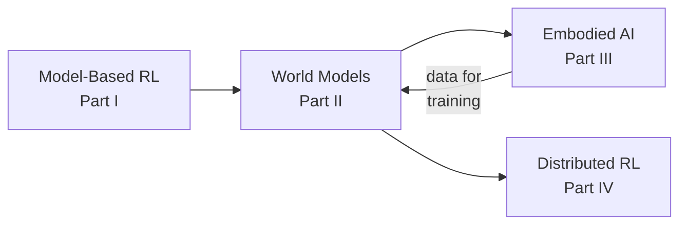

# Part II: World Models

World models are learned representations of how the world works — capturing the dynamics, structure, and regularities of an environment. They enable agents to **predict**, **plan**, and **imagine** without direct interaction, forming a critical component of intelligent embodied systems.

## What You'll Learn

This section covers:

1. **[What Are World Models?](overview.md)** — Definitions, motivations, and the cognitive science perspective
2. **[Representation Learning](representation_learning.md)** — How to learn useful latent spaces for world modeling
3. **[Video Prediction](video_prediction.md)** — Predicting future visual observations
4. **[Planning with World Models](planning.md)** — Using learned models for decision-making
5. **[Foundation World Models](foundation_models.md)** — Large-scale, general-purpose world models
6. **[Key Papers](key_papers.md)** — Essential reading in world models

## Why World Models?

The motivation for world models comes from multiple directions:

- **From RL**: Model-based RL is 10-100x more sample-efficient than model-free approaches
- **From cognitive science**: Humans constantly simulate the world mentally to plan and predict
- **From robotics**: Real-world interaction is expensive; simulation with learned models is cheap
- **From scaling**: Foundation world models are emerging as a path to general-purpose physical reasoning

## Connection to Other Parts

- **Part I (RL)**: World models generalize the dynamics models from [model-based RL](../rl/model_based.md)
- **Part III (Embodied AI)**: World models enable sim-to-real transfer and robot learning from imagination
- **Part IV (Distributed RL)**: Training large world models requires distributed systems
