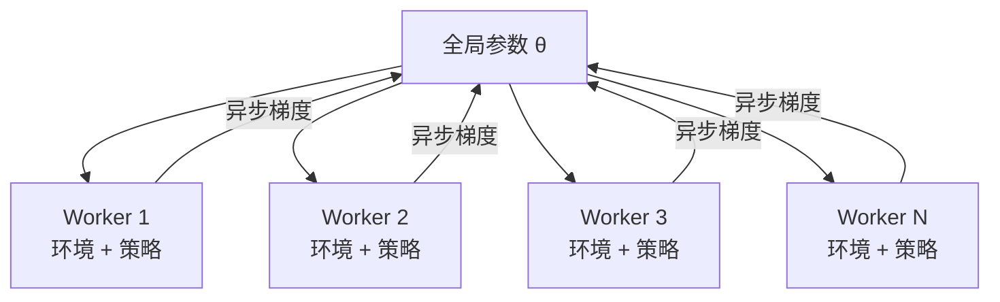
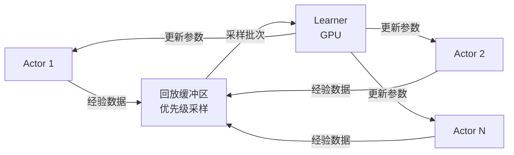
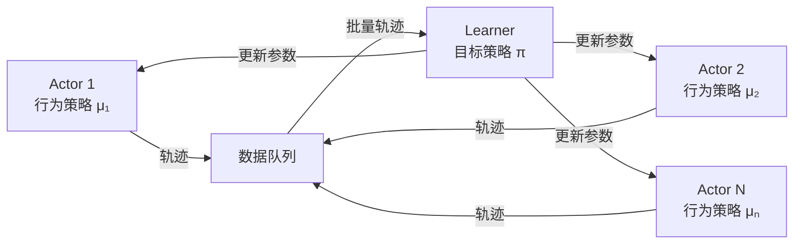
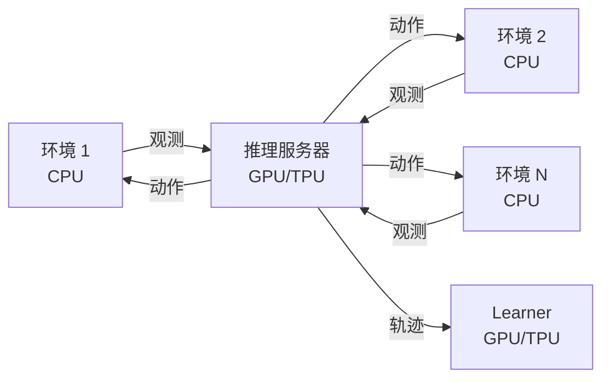
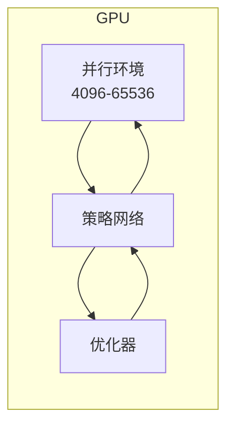
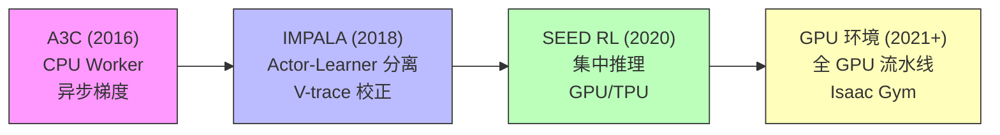

# 分布式 RL 架构范式

本页介绍主要的分布式强化学习架构，从早期的异步设计到现代高吞吐量系统。理解这些范式有助于选择合适的系统架构，并在必要时设计定制化方案。

## A3C：异步优势 Actor-Critic

**A3C**（Mnih et al., 2016）是第一个被广泛验证的分布式 RL 架构。

### 架构设计

每个 Worker 的工作流程：

1. 从全局参数服务器复制参数 $\theta$
2. 在本地环境中运行 $n$ 步
3. 计算本地梯度
4. 异步更新全局参数（无锁）

### 核心特性

| 维度 | 细节 |
|------|------|
| 并行方式 | 多个 CPU Worker |
| 更新模式 | 异步（无同步屏障） |
| 数据新鲜度 | Worker 可能使用过期参数 |
| 吞吐量 | 中等（受 CPU 限制） |
| 算法类型 | On-policy（A2C 变体） |

### 梯度更新公式

每个 Worker 计算如下梯度并异步推送：

$$
\nabla_\theta J \approx \sum_{t=0}^{n-1} \nabla_\theta \log \pi_\theta(a_t | s_t) \, A(s_t, a_t) + \beta \nabla_\theta H(\pi_\theta(\cdot | s_t))
$$

其中 $A(s_t, a_t)$ 为优势函数估计，$H$ 为策略熵，$\beta$ 为熵正则化系数。

### 局限性

- **过期梯度**：Worker 使用过时参数计算梯度，导致更新方向不准确
- **CPU 瓶颈**：策略推理在 CPU 上执行，速度较慢
- **无回放**：On-policy 方法，数据用后即弃

!!! note "历史意义"
    A3C 的核心贡献是证明了异步梯度更新在 RL 中是可行的，并且多个 CPU Worker 可以替代 GPU，降低了硬件门槛。但在现代系统中，A3C 已被更高效的架构取代。

## Ape-X：分布式优先经验回放

**Ape-X**（Horgan et al., 2018）引入了 **Actor-Learner 分离**架构，配合共享回放缓冲区。

### 架构设计

- **Actor**（多个，CPU）：运行环境，使用略微过期的策略生成经验
- **Learner**（一个，GPU）：从回放缓冲区采样，执行梯度更新
- **回放缓冲区**：集中式，按 TD 误差进行优先级排序

### 优先级采样

Ape-X 使用优先级经验回放，采样概率与 TD 误差成正比：

$$
P(i) = \frac{p_i^\alpha}{\sum_k p_k^\alpha}, \quad p_i = |\delta_i| + \epsilon
$$

其中 $\delta_i$ 为 TD 误差，$\alpha$ 控制优先级程度，$\epsilon$ 为小常数防止零概率。配合重要性采样权重校正偏差：

$$
w_i = \left( \frac{1}{N \cdot P(i)} \right)^\beta
$$

### 核心优势

- 海量数据吞吐（数百个 Actor）
- Off-policy（DQN 系列）——天然容忍过期数据
- GPU Learner 始终满载运行
- 轻松扩展 Actor 数量

## IMPALA：重要性加权 Actor-Learner 架构

**IMPALA**（Espeholt et al., 2018）将 Actor-Learner 分离应用于 **on-policy** 方法，通过重要性采样校正解决数据过期问题。

### 架构设计

与 Ape-X 类似，但面向策略梯度方法：

- **Actor**：使用行为策略 $\mu$ 采集轨迹
- **Learner**：使用 Actor 产生的轨迹更新目标策略 $\pi_\theta$
- **V-trace**：重要性采样校正，处理 off-policy 数据

### V-Trace 算法

V-trace 目标值校正了 Actor 和 Learner 之间的策略滞后：

$$
v_s = V(s) + \sum_{t=s}^{s+n-1} \gamma^{t-s} \left(\prod_{i=s}^{t-1} c_i\right) \delta_t V
$$

其中 TD 误差带有截断重要性权重：

$$
\delta_t V = \rho_t (r_t + \gamma V(s_{t+1}) - V(s_t))
$$

$$
\rho_t = \min\left(\bar{\rho}, \frac{\pi(a_t|s_t)}{\mu(a_t|s_t)}\right), \quad c_i = \min\left(\bar{c}, \frac{\pi(a_i|s_i)}{\mu(a_i|s_i)}\right)
$$

!!! info "V-trace 的直觉理解"
    截断重要性权重 $\rho_t$ 和 $c_i$ 发挥两个作用：（1）校正行为策略与目标策略之间的差异；（2）通过截断上界限制方差。当 $\bar{\rho} = \bar{c} = 1$ 时，V-trace 退化为 on-policy 估计；当 $\bar{\rho} = \bar{c} = \infty$ 时，退化为标准的 off-policy 重要性采样。

### 核心特性

- 适用于策略梯度算法（不限于 Q-learning）
- 能处理适度的策略滞后（Actor 落后 1-2 次更新）
- GPU 高效利用：单 Learner 充分发挥加速器性能
- 可扩展至数百个 Actor

## SEED RL：可扩展高效深度 RL

**SEED RL**（Espeholt et al., 2020）解决了 IMPALA 中的关键瓶颈：CPU Actor 上的策略推理速度慢。

### 核心思路

将策略推理移至 **Learner 端**（GPU/TPU）：

- **环境 Worker**（CPU）：仅执行环境步进，将观测发送到推理服务器
- **推理服务器**（GPU/TPU）：批量处理所有 Worker 的观测，运行策略推理
- **Learner**（GPU/TPU）：与推理服务器同机部署，训练模型

### 与 IMPALA 的对比

| 维度 | IMPALA | SEED RL |
|------|--------|---------|
| 策略推理位置 | CPU（慢） | GPU/TPU（快，批处理） |
| 网络传输内容 | 参数 → Actor | 观测 ↔ 动作 |
| 模型副本数 | N 份（每个 Actor 一份） | 1 份（在 Learner 上） |
| 参数过期程度 | 1-2 次更新 | 接近零（同一设备） |
| 大模型支持 | 受 CPU 内存限制 | 仅受 GPU 显存限制 |

### 性能表现

SEED RL 在 Atari 上实现了相比 IMPALA **40 倍**的加速，在 Google Football 上实现了 **80 倍**的加速，硬件预算相同。

!!! tip "设计启示"
    SEED RL 的核心洞察是：当策略网络较大时，将推理集中到 GPU 端并通过网络传输观测和动作（数据量小），远比在每个 CPU Worker 上各自推理（需要传输完整模型参数）更高效。

## GPU 加速环境

更前沿的范式：将环境**完全运行在 GPU 上**，与策略网络共处同一设备。

### Isaac Gym / Isaac Lab

NVIDIA 的 GPU 加速物理仿真平台：

- 单 GPU 上运行数千个并行环境
- 无 CPU-GPU 数据传输（全部驻留 GPU）
- 每个环境步进时间亚毫秒级

这彻底消除了传统方案中 CPU 环境与 GPU 训练之间的数据传输瓶颈：

### Sample Factory

**Sample Factory**（Petrenko et al., 2020）通过精细的系统设计在单机上实现极高吞吐：

- 异步向量化环境
- 精心的内存管理与批处理
- 环境步进与策略推理的时间重叠
- 在单 GPU 机器上 Atari 达到 100K+ FPS

### GPU 环境的局限

| 优势 | 局限 |
|------|------|
| 极高吞吐量 | 仅支持可 GPU 化的仿真 |
| 零数据传输开销 | 环境复杂度受 GPU 显存限制 |
| 天然批处理 | 可视化渲染支持有限 |
| 与训练同设备 | 并非所有物理引擎都支持 |

## 架构综合对比

| 架构 | 年份 | Actor 端 | Learner 端 | 同步模式 | 最佳适用场景 |
|------|------|---------|-----------|---------|------------|
| **A3C** | 2016 | CPU（推理） | CPU（共享） | 异步 | 简单任务、小规模 |
| **Ape-X** | 2018 | CPU（推理） | GPU | 异步 | Off-policy（DQN） |
| **IMPALA** | 2018 | CPU（推理） | GPU | 异步 | On-policy 大规模 |
| **SEED RL** | 2020 | CPU（仅环境） | GPU/TPU | 异步 | 大模型、高吞吐 |
| **GPU 环境** | 2021+ | GPU（Isaac Gym） | GPU | 同步 | 机器人、连续控制 |
| **Sample Factory** | 2020 | CPU（向量化） | GPU | 异步 | 单机高 FPS |

## 架构演进的关键趋势

核心趋势：**将越来越多的计算从 CPU 移至 GPU**，减少数据传输开销，最终实现全 GPU 流水线。

## 如何选择架构

决策框架：

1. **On-policy（PPO）？** → GPU 环境（Isaac Gym）或 IMPALA/SEED（复杂环境）
2. **Off-policy（SAC, DQN）？** → Ape-X 风格 + 回放缓冲区
3. **简单环境？** → 单机向量化（Sample Factory）
4. **复杂仿真（渲染、物理）？** → Actor-Learner 分离（SEED, IMPALA）
5. **大型策略网络？** → SEED RL（推理集中到 GPU）
6. **机器人/连续控制？** → Isaac Gym + PPO（当前主流范式）

## 核心参考文献

- Mnih, V., et al. (2016). "Asynchronous Methods for Deep Reinforcement Learning." *ICML*.
- Horgan, D., et al. (2018). "Distributed Prioritized Experience Replay." *ICLR*.
- Espeholt, L., et al. (2018). "IMPALA: Scalable Distributed Deep-RL with Importance Weighted Actor-Learner Architectures." *ICML*.
- Espeholt, L., et al. (2020). "SEED RL: Scalable and Efficient Deep-RL with Accelerated Central Inference." *ICLR*.
- Makoviychuk, V., et al. (2021). "Isaac Gym: High Performance GPU-Based Physics Simulation For Robot Learning." *NeurIPS*.
- Petrenko, A., et al. (2020). "Sample Factory: Egocentric 3D Control from Pixels at 100000 FPS with Asynchronous Reinforcement Learning." *ICML*.
