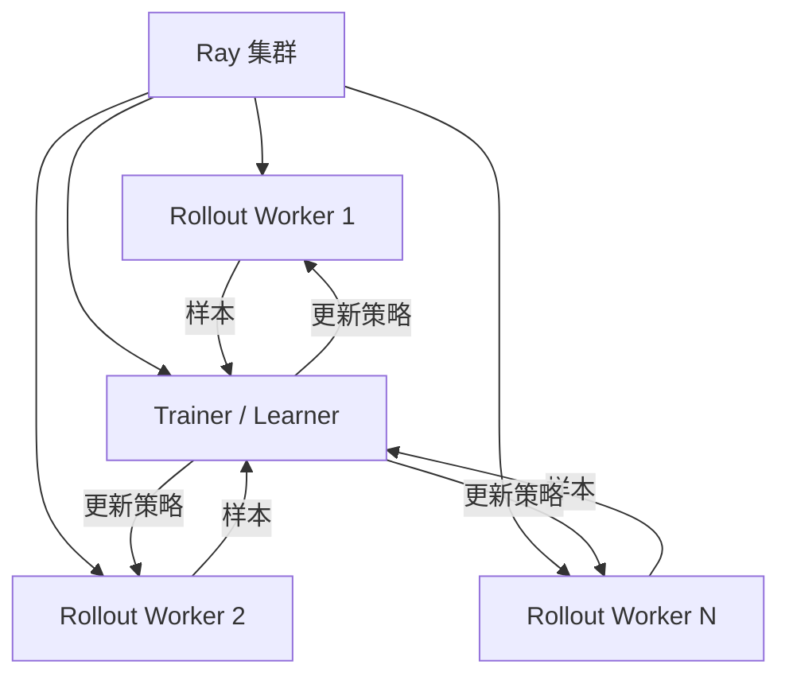
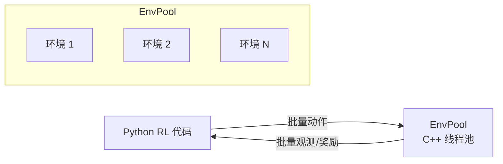
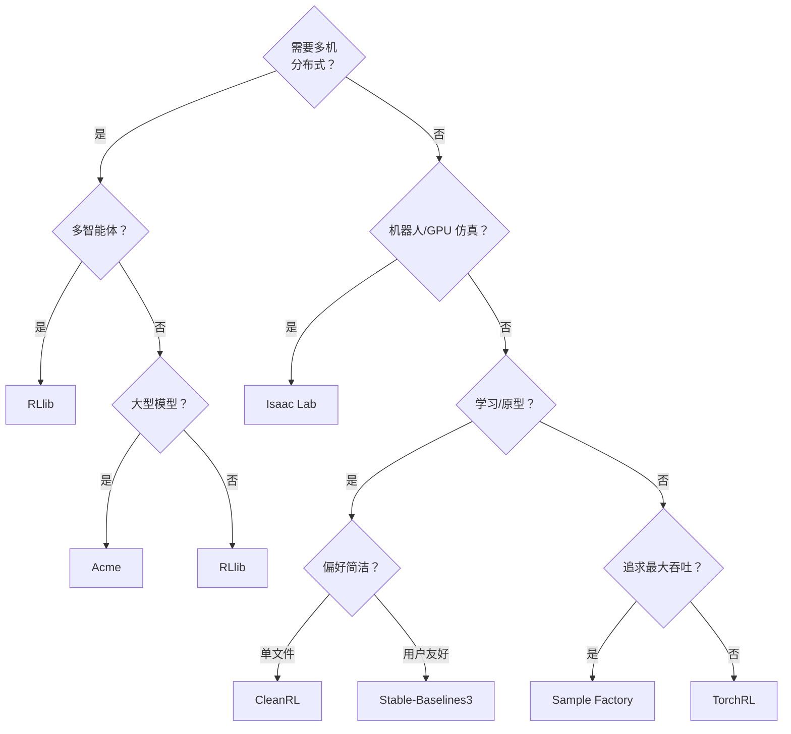

# 分布式 RL 框架与系统

本页梳理主流的开源分布式强化学习框架，帮助你根据研究需求或应用场景选择合适的工具。

## 框架全景

| 框架 | 维护方 | 架构特点 | 最佳适用场景 |
|------|--------|---------|------------|
| **RLlib** | Anyscale（Ray） | 基于 Ray 的分布式架构 | 通用、多智能体 |
| **Acme** | Google DeepMind | Actor-Learner（Launchpad） | 研究、模块化组件 |
| **CleanRL** | 个人开发者 | 单文件实现 | 学习、快速原型 |
| **Stable-Baselines3** | 社区 | 向量化环境 | 简单易用、基准测试 |
| **Sample Factory** | 个人开发者 | 异步向量化 | 高吞吐、单机 |
| **EnvPool** | Sea AI Lab | C++ 向量化环境 | 极速环境步进 |
| **TorchRL** | Meta（PyTorch） | 可组合原语 | PyTorch 生态 |
| **Isaac Lab** | NVIDIA | GPU 仿真 + RL | 机器人、运动控制 |

## RLlib

**RLlib** 是最全面的分布式 RL 框架，构建在 Ray 分布式计算框架之上。

### 核心特性

- 支持大多数主流 RL 算法（PPO、SAC、DQN、IMPALA 等）
- 通过 Ray 实现透明分布（从笔记本电脑到集群无缝扩展）
- 多智能体 RL 支持（独立、集中式、参数共享）
- 自定义模型、环境和算法
- 与 Ray Tune 集成，支持超参数搜索

### 架构

### 适用场景

- 多智能体 RL
- 需要扩展到多台机器
- 需要开箱即用的算法实现
- 生产环境部署

!!! warning "注意事项"
    RLlib 功能丰富但 API 较为复杂，版本迭代间常有接口变动。建议锁定特定版本，并关注官方迁移指南。

## Acme

**Acme**（Google DeepMind）提供模块化、可组合的 RL 组件，算法与分布式基础设施之间有清晰的分离。

### 设计哲学

- **Actor**：与环境交互，采集数据
- **Learner**：从数据中更新模型参数
- **Dataset/Adder**：在 Actor 与 Learner 之间传输数据
- **Network**：神经网络架构

这些组件通过 **Launchpad** 连接，后者处理分布式调度。

### 核心特性

- 代码清晰、模块化（非常适合理解算法内部机制）
- 从单进程到分布式的平滑过渡
- 强大的 JAX 支持（同时支持 TensorFlow）
- 多种算法的参考实现

### 适用场景

- 需要清晰、可修改的算法实现的研究项目
- 基于 JAX 的项目
- 深入学习算法内部机制

## CleanRL

**CleanRL** 采用截然不同的理念：单文件实现 RL 算法，不设抽象层。

### 设计哲学

- 每个算法一个独立的 Python 文件
- 无继承、最少抽象
- 完善的日志记录（集成 Weights & Biases）
- 可复现的基准测试

### 适用场景

- **学习 RL**：清楚看到算法如何运作
- **快速原型**：无需框架开销即可修改
- **基准测试**：标准化、可复现的实现
- **起步项目**：Fork 单个文件即可开始修改

!!! tip "推荐学习路径"
    对于初学者，建议从 CleanRL 的 PPO 实现开始阅读。单文件结构让你能在一个文件中看到从环境交互到梯度更新的完整流程，避免了在多层抽象中迷失。

## Stable-Baselines3

最用户友好的 RL 库，专注于易用性和可靠性。

### 核心特性

- 经过充分测试的 PPO、SAC、TD3、DQN、A2C 实现
- 跨算法一致的 API
- 内置向量化环境
- 详尽的文档和教程

### 适用场景

- 第一个 RL 项目
- 快速原型验证
- 标准基准测试
- 需要可靠实现，无需深度定制

## Sample Factory

**Sample Factory** 通过精细的系统设计，在单机上实现最高吞吐量。

### 核心创新

- 同一机器上 Actor 与 Learner 异步运行
- 环形缓冲区实现零拷贝数据传递
- 批量化环境步进
- 在单 GPU 机器上 Atari 达到 100K+ FPS

### 适用场景

- 单机上追求最大吞吐
- 复杂 3D 环境（VizDoom、DMLab）
- 不想管理集群

## EnvPool

**EnvPool** 通过 C++ 实现环境并结合异步批处理，提供极速的环境仿真。

### 核心特性

- C++ 环境实现（Atari、MuJoCo、经典控制）
- 异步环境步进
- 比 Python Gym 环境快 10-20 倍
- 兼容任意 RL 框架

### 架构

### 适用场景

- 环境步进是你的瓶颈
- 使用标准环境（Atari、MuJoCo）
- 希望以最小代码改动替换 Gym

## TorchRL

**TorchRL**（Meta）在 PyTorch 生态中提供可组合的 RL 构建模块。

### 核心特性

- `TensorDict` — RL 的统一数据载体
- 可组合的变换、损失模块和数据收集器
- 与 torchvision、torchtext 的集成
- GPU 加速回放缓冲区

### 适用场景

- PyTorch 生态整合（与其他 PyTorch 库配合使用）
- 自定义算法开发
- 需要对 RL 组件的精细控制

## Isaac Lab（前身为 Isaac Gym + Orbit）

**Isaac Lab** 是 NVIDIA 的机器人学习框架，结合了 GPU 加速物理仿真与 RL。

### 核心特性

- 单 GPU 上运行数千个并行环境
- 内置机器人模型（四足、人形、机械臂）
- 地形生成、域随机化
- 与 rl_games、RSL_rl 集成，实现快速 PPO 训练

### 适用场景

- 机器人运动控制 / 操作研究
- 需要大规模并行仿真
- Sim-to-Real 流水线

## 框架选择决策流程

## 框架详细对比表

| 维度 | RLlib | Acme | CleanRL | SB3 | Sample Factory | EnvPool | TorchRL | Isaac Lab |
|------|-------|------|---------|-----|---------------|---------|---------|-----------|
| **语言** | Python | Python | Python | Python | Python | C++/Python | Python | Python |
| **后端** | Ray | Launchpad | — | — | 自定义 | C++ | PyTorch | NVIDIA |
| **分布式** | 多机 | 多机 | 单机 | 单机 | 单机 | 单机 | 单机/多机 | 单/多 GPU |
| **算法数** | 20+ | 15+ | 10+ | 5 | 2-3 | — | 10+ | PPO 为主 |
| **代码复杂度** | 高 | 中 | 低 | 低 | 中 | 低 | 中 | 中 |
| **文档质量** | 良好 | 一般 | 优秀 | 优秀 | 良好 | 良好 | 良好 | 良好 |
| **社区活跃度** | 高 | 中 | 高 | 高 | 中 | 中 | 中 | 高 |
| **GPU 利用率** | 中 | 中 | 中 | 低 | 高 | — | 中 | 极高 |

!!! info "选择建议总结"
    没有"最好"的框架——只有最适合当前需求的框架。研究探索阶段优先考虑 CleanRL 或 Acme（代码可读性强）；工程部署阶段考虑 RLlib（功能全面）或 Isaac Lab（机器人场景）；追求单机极致性能时选择 Sample Factory 或 EnvPool。

## 核心参考文献

- Liang, E., et al. (2018). "RLlib: Abstractions for Distributed Reinforcement Learning." *ICML*.
- Hoffman, M., et al. (2020). "Acme: A Research Framework for Distributed Reinforcement Learning." *arXiv:2006.00979*.
- Huang, S., et al. (2022). "CleanRL: High-quality Single-file Implementations of Deep Reinforcement Learning Algorithms." *JMLR*.
- Raffin, A., et al. (2021). "Stable-Baselines3: Reliable Reinforcement Learning Implementations." *JMLR*.
- Petrenko, A., et al. (2020). "Sample Factory: Egocentric 3D Control from Pixels at 100000 FPS." *ICML*.
- Weng, J., et al. (2022). "EnvPool: A Highly Parallel Reinforcement Learning Environment Execution Engine." *NeurIPS*.
