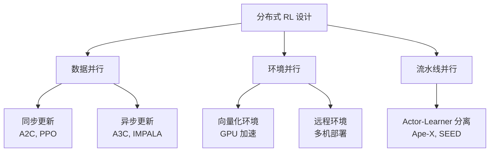

# 第四部分：分布式强化学习

大规模训练强化学习智能体需要将计算分布到多台机器上。本部分涵盖分布式 RL 的系统架构、主流框架和实践考量——从奠基性设计到驱动大规模训练的现代系统。

## 学习内容

1. **[架构范式](architectures.md)** — A3C、Ape-X、IMPALA、SEED RL 及其设计权衡
2. **[框架与系统](frameworks.md)** — RLlib、Acme、EnvPool、Sample Factory 等系统
3. **[大模型 RL 基础设施](large_model_infra.md)** — 面向 RLHF、Agentic RL 与具身训练的现代系统
4. **[实践扩展指南](practice.md)** — 如何高效地扩展 RL 训练

前两页主要讲经典分布式 RL 的设计模式；新增这一页则把这些思想延伸到大模型时代常见的 trainer-`rollout`-reward-`environment pool` 系统。

## 为什么需要分布式 RL？

强化学习的训练具有独特的计算特性，对分布式系统提出了特殊要求：

| 维度 | RL 与监督学习的区别 |
|------|-------------------|
| **数据生成** | 必须与环境交互（on-policy）或从回放缓冲区采样（off-policy） |
| **数据新鲜度** | On-policy 方法需要当前策略的数据（过期数据会损害性能） |
| **环境开销** | 仿真本身可能成为瓶颈（复杂物理、渲染） |
| **探索多样性** | 并行环境提供多样化的经验 |
| **训练循环** | 紧密耦合：采集 → 训练 → 更新 → 再采集 |

单机 RL 训练面临的瓶颈：

- **样本采集缓慢**：单个环境只能实时生成数据
- **GPU 利用率低**：策略网络通常较小，GPU 大量时间在等待环境数据
- **训练时间过长**：复杂任务需要数十亿环境步

分布式 RL 通过并行化环境交互、数据采集和策略训练来解决这些问题。

!!! info "关键洞察"
    监督学习中，数据是预先存在的静态资源，瓶颈通常在模型训练（计算密集型）。而在 RL 中，数据需要实时生成，瓶颈往往在数据采集端。这一根本差异决定了分布式 RL 的独特设计空间。

## 设计空间

核心设计决策包括：

1. **同步 vs. 异步**更新
2. **计算发生在哪里**（CPU Actor、GPU Learner）
3. **数据如何流动**（Actor 与 Learner 之间）
4. **数据新鲜度要求**（on-policy 的严格性 vs. off-policy 的容忍度）

### 同步与异步的权衡

| 维度 | 同步更新 | 异步更新 |
|------|---------|---------|
| **梯度质量** | 精确，无过期参数 | 可能使用过期参数计算 |
| **吞吐量** | 受最慢 Worker 限制 | 不受个别 Worker 阻塞 |
| **实现复杂度** | 较简单 | 需处理数据过期与一致性 |
| **收敛性** | 理论保证更强 | 可能需要额外校正（如 V-trace） |
| **典型算法** | PPO, A2C | A3C, IMPALA |

## 与其他章节的联系

- **第一部分（RL 基础）**：被扩展的算法——[PPO](../rl/trust_region.md)、[SAC](../rl/actor_critic.md) 等
- **第三部分（具身智能）**：分布式系统支撑大规模[运动控制训练](../embodied/locomotion.md)（数千个并行环境）

!!! tip "阅读建议"
    如果你对 RL 基础算法不够熟悉，建议先完成第一部分的学习。分布式 RL 本质上是"如何高效运行已有算法"，理解算法本身是前提条件。
