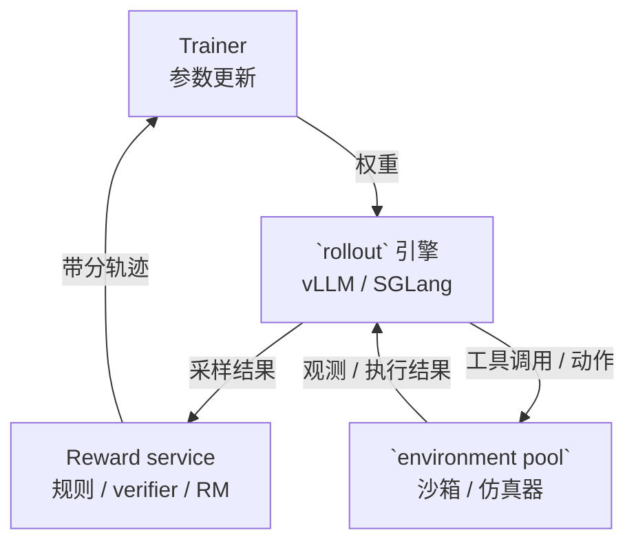
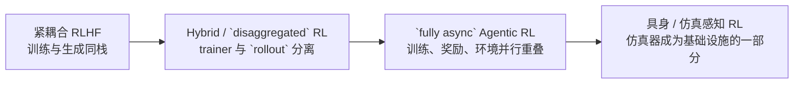
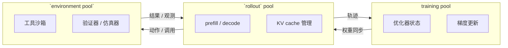

# 大模型 RL 基础设施

经典分布式 RL 系统主要围绕 actor、learner、replay buffer 和高吞吐环境步进来设计。到了大模型时代，工作负载发生了明显变化：长文本生成变贵了，验证器和奖励服务变重了，参数同步更频繁了，而多轮 agent 与具身任务还引入了工具调用、沙箱和仿真器。结果就是，系统边界不再只是 actor-learner 回路，而是扩展成 trainer、`rollout` 引擎、reward service，以及有时独立存在的 `environment pool`。

本页聚焦这一演变，并用几个代表性开源系统来勾勒当前的大模型 RL 基础设施设计空间。

## 为什么现代 RL 基础设施变了

大模型 RL 至少在三个方面改变了系统负载：

- **生成主导总时长**：在 RLHF 和 RLVR 中，真正昂贵的步骤往往不是反向传播，而是回答生成。
- **长轨迹带来严重拖尾**：长 CoT 推理和多轮 agent 任务会让不同样本的 `rollout` 长度差异很大。
- **环境变重了**：奖励计算不再只是轻量环境返回一个标量，而可能涉及单元测试、代码沙箱、工具调用或模型裁判。

因此，系统设计从单一 actor-learner 管线，扩展成四个协作角色：

1. **Trainer** 负责更新模型参数。
2. **`rollout` 引擎** 负责高吞吐生成，通常基于 vLLM 或 SGLang。
3. **Reward service** 负责用规则、验证器或奖励模型对输出打分。
4. **`environment pool`** 负责承载多轮 agent 或具身任务中的工具、沙箱和仿真环境。

## 系统如何演进

### 1. 紧耦合 RLHF

像 DeepSpeed-Chat、TRL 这样的早期 RLHF 栈，在中小模型阶段非常有用，但它们把训练和生成紧耦合在同一套流程里。它们的优点是上手简单、实验成本低；缺点是 KV cache、模型并行和控制流都被塞进了以训练为中心的执行框架中。

这类设计今天仍然有价值，尤其适合教学、小规模实验，以及策略模型和奖励流程都还比较轻的场景。

### 2. Hybrid 与 `disaggregated` `rollout`

下一步演进，是把训练和高吞吐生成明确拆开。**OpenRLHF**、**veRL (HybridFlow)** 和 **NeMo-RL** 代表了这一阶段：它们把大模型训练后端与专门的推理引擎配对起来，让训练和 `rollout` 各自按照最适合自己的方式运行。

核心原因并不复杂：trainer 和 `rollout` 引擎的性能目标不同，不应该被强行绑定在同一个执行模型里。

- **Trainer** 更关心分片训练效率、优化器状态管理和稳定的梯度吞吐。
- **`rollout` 引擎** 更关心解码速度、KV cache 管理和动态批处理。

从这里开始，`disaggregated` 不再只是实现细节，而成为系统设计的核心概念。

### 3. `fully async` Agentic RL

当工作负载进一步转向长推理链和多轮工具调用时，同步系统开始暴露明显的硬件空转问题。**AReaL**、**slime**、**NeMo-RL async GRPO** 和 **ROLL / RollArt** 更进一步，把训练流程推向 `fully async`：

- trainer 在旧请求尚未结束时继续更新，
- `rollout` worker 周期性接收新权重，
- reward 评估与训练并行重叠，
- 环境生命周期本身也被当作一级系统问题来处理。

这在 agentic coding 或 verifier-heavy 任务里尤其关键，因为容器启动、测试执行和工具调用很可能比一次前向生成更耗时。

## 框架矩阵

| 框架 | 训练后端 | `rollout` 后端 | Sync / Async | Agentic | 多资源池 | 最适合场景 |
|---|---|---|---|---|---|---|
| **OpenRLHF** | DeepSpeed ZeRO-3 / FSDP | vLLM | Sync + 可选 async | 是 | 部分支持 | 大模型 RLHF / RLVR 的实用起点 |
| **veRL (HybridFlow)** | FSDP / Megatron-LM | vLLM / SGLang | 以 sync 为主，也探索 async | 是 | 是 | 研究型的大模型 RL 流水线 |
| **NeMo-RL** | DTensor / Megatron-Core | vLLM / Megatron Inference | Sync + async GRPO | 是 | 是 | 工业级 Megatron 训练体系 |
| **slime** | Megatron-LM | SGLang + router | Sync + `fully async` | 是 | 是 | 显式 `rollout` 路由的大规模 agent 训练 |
| **AReaL** | Megatron / FSDP | SGLang / vLLM | `fully async` | 是 | 是 | 长 CoT 与 agent-first RL 研究 |
| **ROLL / RollArt** | Megatron / FSDP2 | SGLang / vLLM | `fully async` | 是 | 强异构支持 | 面向 agentic RL 的硬件感知调度 |
| **RLinf** | Megatron + DTensor | SGLang | Sync / async，支持仿真 | 以具身为主 | 是 + simulator pool | VLA 与具身 RL 训练 |

可以用三个阅读视角来理解这张表：

- **OpenRLHF / veRL / NeMo-RL** 代表了主流的大模型 RL 训练范式。
- **AReaL / slime / ROLL** 展示了当长轨迹和 agent 环境成为瓶颈后，系统会如何继续演化。
- **RLinf** 则把同样的系统思想延伸到具身 RL 中，此时仿真器已经不是简单的数据来源，而是基础设施本身的一部分。

## 如何选择

### 经典分布式 RL

如果你的任务仍然主要基于 Gym 风格环境、回放缓冲区或标准控制基准，那么优先看 [框架与系统](frameworks.md) 这一页。那里的框架更简单，也更贴合传统分布式 RL 的问题形态。

### 多机大模型 RL

如果你要在大语言模型上做实用型 RLHF 或 RLVR，通常应从 **OpenRLHF**、**veRL** 或 **NeMo-RL** 起步。它们已经覆盖了权重同步、推理后端选择和大模型并行训练这些核心工程问题。

### 长 CoT 与 Agentic 任务

如果真正的瓶颈是 `rollout` 长度方差、验证器代价或工具编排，那么更应该关注 **AReaL**、**slime** 或 **ROLL**。它们的价值不只是吞吐更高，更重要的是更好地处理过期权重、异步流水线和重型环境服务。

### 具身与 VLA 训练

如果策略要与仿真器或机器人环境交互，问题就不再只是 trainer 和 generator 的解耦。你还需要同时考虑仿真、渲染和具身数据服务的资源组织。这时，**RLinf** 是从第四部分过渡到[第三部分：具身智能](../embodied/index.md)最自然的一座桥。

## 未来方向

一个越来越清晰的趋势，是把系统拆成三个资源池：

1. **training pool**，负责优化器和参数更新；
2. **`rollout` pool**，负责解码密集型推理；
3. **`environment pool`**，负责工具、验证器或仿真器。

之所以这套设计越来越重要，是因为这三个资源池对应着完全不同的硬件压力和调度逻辑。系统难点不再只是“怎样分布式训练”，而是怎样在这些资源池之间协调参数移动、轨迹新鲜度和异构执行。

对大语言模型来说，这意味着更细粒度的异步权重更新、更轻量的同步方式，以及生成与评估的更深度重叠。对具身系统来说，这意味着分布式 RL 会与第三部分讨论的仿真基础设施进一步耦合。

## 参考资料

- OpenRLHF：[OpenRLHF 论文](https://arxiv.org/abs/2405.11143)
- veRL / HybridFlow：[HybridFlow 论文](https://arxiv.org/abs/2409.19256)
- NeMo-RL：[NeMo-RL 文档](https://docs.nvidia.com/nemo/rl/latest/)
- slime：[slime 仓库](https://github.com/THUDM/slime)
- AReaL：[AReaL 论文](https://arxiv.org/abs/2505.24298)
- ROLL / RollArt：[ROLL 论文](https://arxiv.org/abs/2506.06122)
- RLinf：[RLinf-VLA 论文](https://arxiv.org/abs/2510.06710)
