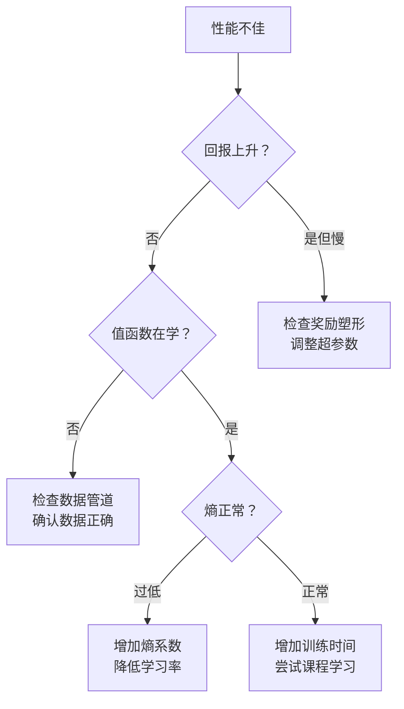

# 实践扩展指南

本页提供扩展 RL 训练的实践建议——从单 GPU 实验到多机分布式训练。涵盖常见瓶颈识别、优化策略和调试技巧。

## 识别瓶颈

在扩展之前，首先明确什么在限制吞吐量：

### 三大瓶颈


| 瓶颈 | 表现症状 | 解决方案 |
|------|---------|---------|
| **环境** | GPU 利用率低，环境步/秒低 | 增加并行环境数、使用 GPU 环境、加速仿真 |
| **数据传输** | CPU-GPU 传输时间长、网络延迟高 | 向量化环境、共享内存、GPU 环境 |
| **训练** | GPU 已满载，希望加快收敛 | 增大批量、混合精度训练、模型优化 |

### 性能分析清单

1. **GPU 利用率**：`nvidia-smi` — 如果 GPU 大部分时间空闲，说明环境端是瓶颈
2. **环境吞吐量**：测量每个环境每秒的步数
3. **数据管道**：检查是否存在不必要的数据拷贝、序列化开销
4. **训练吞吐量**：测量每秒梯度更新步数

!!! tip "快速诊断方法"
    在训练代码的关键节点添加计时器，分别测量环境步进、数据传输和梯度计算的耗时。比值关系直接揭示瓶颈所在：

    ```python
    import time
    t0 = time.time()
    obs, rew, done, info = env.step(action)     # 环境步进
    t_env = time.time() - t0

    t0 = time.time()
    batch = buffer.sample(batch_size)            # 数据传输
    t_data = time.time() - t0

    t0 = time.time()
    loss.backward(); optimizer.step()            # 梯度计算
    t_train = time.time() - t0
    ```

## 扩展 On-Policy 方法（PPO）

PPO 是最常被扩展的 RL 算法，尤其在机器人领域。

### 单 GPU 扩展

```
环境数量：4096 - 65536（GPU 加速）
批量大小：环境数 × 滚动步长
小批量大小：批量大小 / 小批量数
PPO 轮次：3-5
```

**关键洞察**：使用 GPU 环境（Isaac Gym）时，单个 GPU 可运行数千个环境。瓶颈转移到策略训练步骤。

### 有效批量大小

PPO 的有效批量大小：

$$
B_{\text{eff}} = N_{\text{envs}} \times T_{\text{horizon}} \times N_{\text{mini\_epochs}}
$$

更大的有效批量 → 更稳定的梯度 → 可以使用更大的学习率。

### 多 GPU 扩展

跨多 GPU 的 PPO 训练：

```python
# 数据并行 PPO
# 每个 GPU 运行一部分环境
# 梯度通过 AllReduce 同步

# GPU 0: 环境 0-1023
# GPU 1: 环境 1024-2047
# ...
# 前向传播后: AllReduce 梯度
# 同步更新
```

!!! tip "扩展经验法则"
    当环境数量（即批量大小）翻倍时，学习率应增加约 $\sqrt{2}$ 倍以保持相似的收敛行为。这是因为梯度方差随批量大小线性降低，而梯度标准差按 $\sqrt{N}$ 降低。

### PPO 超参数扩展指南

| 参数 | 小规模（64 环境） | 中等规模（4096 环境） | 大规模（65536 环境） |
|------|-------------------|---------------------|---------------------|
| 学习率 | $3 \times 10^{-4}$ | $1 \times 10^{-3}$ | $3 \times 10^{-3}$ |
| 滚动步长 | 128 | 32 | 16-24 |
| 小批量数 | 4 | 4 | 8 |
| PPO 轮次 | 4 | 5 | 5 |
| 折扣因子 $\gamma$ | 0.99 | 0.99 | 0.99 |
| GAE $\lambda$ | 0.95 | 0.95 | 0.95 |

## 扩展 Off-Policy 方法（SAC, TD3）

Off-policy 方法由于回放缓冲区的存在，其扩展特性与 on-policy 不同。

### 关键考量

1. **回放缓冲区内存**：可能成为限制因素（百万级转移 × 观测大小）
2. **更新-数据比（UTD ratio）**：每个环境步对应多少次梯度更新
3. **数据新鲜度**：Off-policy 方法容忍过期数据，但有上限

### 架构配置

```
Actor：N 个并行 Worker 采集经验
缓冲区：集中式或分布式回放缓冲区
Learner：GPU 从缓冲区采样训练
UTD 比：update_steps / env_steps = 1-20
```

### 分布式回放缓冲区

大规模 off-policy 训练中的缓冲区设计：

- **优先级回放**：按 TD 误差排序，高效采样
- **分布式分片**：将缓冲区分布到多台机器以扩展内存
- **环形缓冲区**：固定大小，覆盖最旧数据

### UTD 比的影响

更新-数据比（Update-to-Data ratio）是 off-policy 方法中的关键超参数：

$$
\text{UTD} = \frac{\text{梯度更新次数}}{\text{环境交互步数}}
$$

| UTD 比 | 特点 | 适用场景 |
|--------|------|---------|
| UTD = 1 | 经典设置，每步一次更新 | SAC/TD3 默认 |
| UTD = 4-8 | 更高样本效率，计算成本增加 | 数据昂贵的场景 |
| UTD = 20+ | 极高样本效率（如 REDQ） | 真实机器人学习 |

!!! warning "UTD 过高的风险"
    UTD 比过高可能导致对回放缓冲区的过拟合，表现为 Q 值发散或策略性能突然下降。REDQ 等方法通过集成 Q 网络来缓解此问题。

## 常见陷阱

### 1. 学习率缩放

**问题**：增加批量大小而不调整学习率，导致收敛性变差。

**解决方案**：线性缩放规则——学习率乘以批量大小增长倍数。对于 PPO，平方根缩放通常效果更好。

### 2. 观测归一化

**问题**：训练过程中观测的统计特性会发生变化，导致不稳定。

**解决方案**：运行均值/方差归一化：

```python
obs_normalized = (obs - running_mean) / (running_std + 1e-8)
```

在分布式环境中，需要跨 Worker 同步归一化统计量。

### 3. 奖励缩放

**问题**：奖励的数值范围在不同任务间或训练过程中发生变化。

**解决方案**：归一化回报或使用对称奖励函数。DreamerV3 的 symlog 变换：

$$
\text{symlog}(x) = \text{sign}(x) \ln(|x| + 1)
$$

### 4. 随机种子方差

**问题**：RL 结果在不同随机种子间差异显著。

**解决方案**：始终报告 3-5 个种子的结果。使用统计检验进行方法比较。

!!! note "关于 RL 的可复现性"
    RL 的随机性来源众多：环境初始化、网络初始化、采样随机性、异步执行顺序等。即使固定所有已知种子，异步分布式训练仍可能产生不同结果。因此，多种子评估是必要的科学实践，而非可选步骤。

### 5. 梯度过期

**问题**：在异步系统中，Worker 使用过期参数训练。

**解决方案**：V-trace 校正（IMPALA）、重要性采样，或将过期限制在 1-2 次更新以内。

## 调试分布式 RL

### 关键监控指标

| 指标 | 需要关注的内容 |
|------|--------------|
| **回合回报** | 总体上升趋势，不剧烈震荡 |
| **策略熵** | 逐渐下降（不应坍缩到零） |
| **价值函数损失** | 持续下降，不爆炸 |
| **KL 散度** | 在 PPO 的目标范围内 |
| **梯度范数** | 稳定，无突刺 |
| **环境 FPS** | 一致，无退化 |
| **GPU 利用率** | 高（>80%） |
| **数据队列长度** | 不持续堆积 |

### 常见失败模式

1. **奖励攻击（Reward Hacking）**：智能体利用仿真漏洞。修复：审查奖励函数，添加约束条件。
2. **策略坍缩**：熵降至零。修复：增加熵奖励系数，检查学习率。
3. **NaN/Inf 值**：数值不稳定。修复：梯度裁剪、观测归一化、检查奖励数值范围。
4. **收敛缓慢**：可能是困难任务的正常现象。检查：超参数、奖励塑形、课程学习。
5. **内存泄漏**：在长时间训练中常见。随时间分析内存使用情况。

### 调试策略



## 硬件建议

### 单机配置

| 使用场景 | 硬件 | 预期 FPS |
|---------|------|---------|
| 原型开发 | 1x RTX 4090 | 10K-50K（Atari） |
| 运动控制（Isaac Gym） | 1x RTX 4090 | 100K-500K |
| 大规模单机 | 1x A100 80GB | 200K-1M |

### 多机配置

| 使用场景 | 硬件 | 预期 FPS |
|---------|------|---------|
| 大规模 on-policy | 8x A100 + 32 CPU Worker | 1M+ |
| 大规模 off-policy | 256 CPU Actor + 8 GPU Learner | 5M+ |
| 机器人研究 | 1-4 GPU（Isaac Gym） | 多数任务足够 |

### 云计算 vs. 本地集群

| 维度 | 云计算（AWS/GCP） | 本地集群 |
|------|-----------------|---------|
| **启动成本** | 低（按需付费） | 高（硬件采购） |
| **长期成本** | 高（持续计费） | 低（一次性投入） |
| **弹性** | 高（按需扩缩） | 低（固定容量） |
| **数据隐私** | 需额外措施 | 完全可控 |
| **适合阶段** | 探索、短期项目 | 持续研究、大量实验 |

!!! tip "预算有限时的建议"
    对于大多数具身智能研究项目，1-2 张高端消费级 GPU（如 RTX 4090）配合 Isaac Gym 即可满足需求。关键在于充分利用 GPU 环境并行，而非盲目增加机器数量。

## 核心参考文献

- Espeholt, L., et al. (2020). "SEED RL: Scalable and Efficient Deep-RL with Accelerated Central Inference." *ICLR*.
- Petrenko, A., et al. (2020). "Sample Factory: Egocentric 3D Control from Pixels at 100000 FPS." *ICML*.
- Makoviychuk, V., et al. (2021). "Isaac Gym: High Performance GPU-Based Physics Simulation For Robot Learning." *NeurIPS*.
- Weng, J., et al. (2022). "EnvPool: A Highly Parallel Reinforcement Learning Environment Execution Engine." *NeurIPS*.
- Chen, X., et al. (2021). "Randomized Ensembled Double Q-Learning: Learning Fast Without a Model." *ICLR*.
