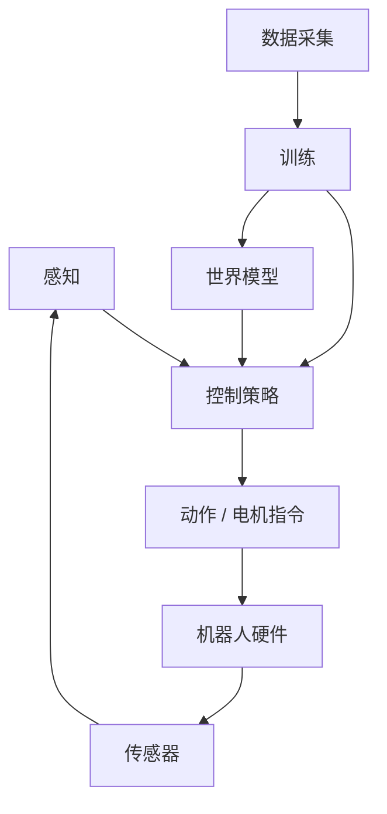

# 第三部分：具身智能

具身智能将强化学习、世界模型和感知技术融合于**物理系统**之中，使其能够与真实世界交互。本部分涵盖构建智能具身智能体所需的核心能力与关键技术，重点聚焦于运动控制、操作、遥操作和数据采集。

## 本部分内容

1. **[概述](overview.md)** — 什么是具身智能、sim-to-real 范式、核心挑战
2. **[运动控制](locomotion.md)** — 基于 RL 的足式机器人运动控制
3. **[移动操作](loco_manipulation.md)** — 运动与操作的结合
4. **[遥操作](teleoperation.md)** — 人在回路中的机器人控制，用于数据采集等
5. **[数据采集](data_collection.md)** — 大规模收集机器人学习数据的策略

## 为什么研究具身智能？

具身智能是算法与物理世界的交汇之处。其独特挑战包括：

- **物理约束**：力矩限制、关节范围、接触动力学
- **部分可观测**：有噪声的传感器、遮挡、延迟
- **安全性**：真实机器人可能损坏自身和周围环境
- **Sim-to-real 差距**：在仿真中训练的策略必须迁移到现实
- **样本效率**：真实世界的数据采集成本高且速度慢

## 具身智能技术栈

完整的具身智能系统包含感知（处理传感器输入）、控制（决定做什么）、执行（发送电机指令）以及持续改进系统的数据流水线。

## 与其他部分的关联

- **第一部分（RL）**：提供学习算法，特别是策略训练中常用的 [PPO](../rl/trust_region.md) 和 [SAC](../rl/actor_critic.md)
- **第二部分（世界模型）**：支撑 [sim-to-real 迁移](../world_models/planning.md)和高样本效率的学习
- **第四部分（分布式 RL）**：将具身策略的训练扩展到大量并行环境中
