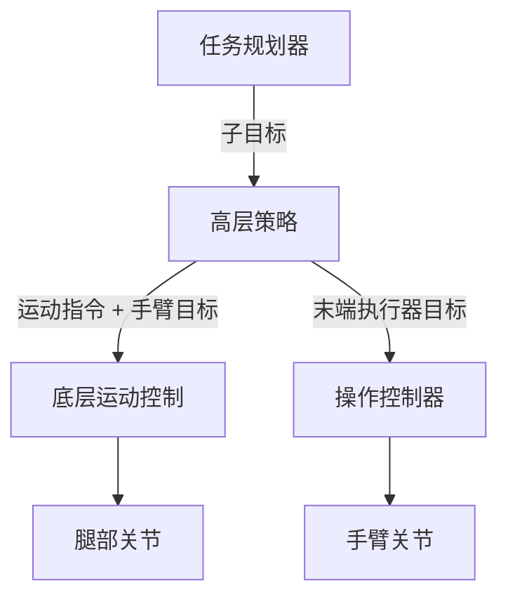

# 移动操作

移动操作（Loco-Manipulation）将运动控制和物体操作统一为一个全身控制问题。它不再将行走和抓取视为独立的能力，而是使机器人能够在环境中移动的同时与物体交互——开门、搬运物品、推开障碍物等。

## 为什么需要移动操作？

现实世界的任务需要**同时具备移动性和灵巧性**：

- 搬运箱子的机器人必须在保持抓取的同时稳定行走
- 开门需要协调底座移动与手臂/手部运动
- 清扫或整理房间意味着需要不断移动和操作物体

这些任务单凭运动控制或操作技能无法解决——它们需要**全身协调**。

## 问题定义

移动操作问题在标准运动控制的基础上扩展了操作目标：

**观测空间**（典型配置）：

- 本体感觉：基座位姿、关节状态（腿部 + 手臂/手部）
- 物体状态：相对位置、姿态、接触信息
- 任务目标：目标位置、期望物体状态

**动作空间**：

- 腿部关节目标（运动控制）
- 手臂关节目标（操作）
- 可选：手部/夹爪指令

**奖励**：结合运动质量和操作成功的多目标优化

$$
r = w_1 r_{\text{locomotion}} + w_2 r_{\text{manipulation}} + w_3 r_{\text{task}}
$$

## 核心方法

### 层次化控制

将问题分解为多个层次：

- **高层策略**：决定去哪里、抓什么
- **底层运动控制**：预训练的行走控制器
- **操作控制器**：预训练或基于 RL 的手臂控制器

**优点**：模块化，各组件可以独立训练

**缺点**：层间接口可能成为瓶颈，全身协调能力有限

### 端到端 RL

训练一个同时控制所有关节的单一策略：

$$
a_t = \pi_\theta(o_t), \quad a_t \in \mathbb{R}^{n_{\text{legs}} + n_{\text{arm}} + n_{\text{hand}}}
$$

**优点**：表达能力最强，能发现涌现式的全身协调策略

**缺点**：训练更困难（动作空间大、多目标奖励），需要精心设计课程

### 混合方法

将预训练组件与端到端微调相结合：

1. 分别预训练运动和操作策略
2. 用这些组件初始化联合策略
3. 在移动操作任务上进行端到端微调

这种方法越来越流行，因为它兼顾了训练效率和完整的协调能力。

## 代表性成果

### 移动操作平台

**Spot + 机械臂（Boston Dynamics）**：

- 四足机器人搭载 5 自由度机械臂
- 工业巡检、物品取回
- 经典控制与学习控制的组合

**Mobile ALOHA（Stanford, 2024）**：

- 移动底座搭载双 6 自由度机械臂
- 从遥操作数据中学习复杂的双臂移动操作
- 通过与多样化数据的协同训练提升泛化能力

### 人形移动操作

**全身人形控制**：

- 人形机器人（H1、Atlas、Figure）执行搬运物体、开门等任务
- 由于需要双足平衡和双臂协调，挑战尤为巨大
- 近期在大规模仿真 RL 训练中取得了显著进展

### 四足移动操作

- **四足 + 机械臂**：运动控制 + 抓取/到达（Unitree B2 + Z1 机械臂）
- **四足使用腿部操作**：某些方法直接使用腿部进行操作（如用前肢按按钮）

## 技术挑战

### 1. 操作力下的平衡维持

操作产生的力和力矩会扰动身体平衡：

- 举起重物改变质心位置
- 推拉产生侧向力
- 抓取时的接触力在全身传播

解决方案：在运动训练中加入操作扰动、使用鲁棒的奖励设计

### 2. 多目标奖励设计

平衡运动质量与操作成功率：

- 运动奖励过高 → 机器人行走良好但忽视操作
- 操作奖励过高 → 机器人够到了物体但摔倒

应对策略：自适应奖励权重、课程学习、拉格朗日方法处理约束满足

### 3. 接触丰富的交互

操作涉及复杂的接触动力学：

- 与物体建立/断开接触
- 滑动、滚动、枢转
- 柔性物体

这些在仿真中难以精确模拟，sim-to-real 迁移尤为困难。

### 4. 长时域任务

许多现实任务具有长时间尺度：

- 导航到物体 → 抓取 → 搬运 → 放置
- 每个阶段具有不同的动力学特征和要求

层次化方法或目标条件策略有助于分解长时域任务。

## 当前研究方向

- **语言条件移动操作**：遵循自然语言指令（"从厨房桌上拿起红色杯子"）
- **双臂移动操作**：在移动底座上协调两只机械臂
- **工具使用**：行走时使用工具（如用棍子去够东西）
- **动态移动操作**：在奔跑或跳跃中进行快速敏捷的操作

!!! warning "持续更新"
    随着该领域的进展，本节将补充更详细的算法分析和代码示例。

## 核心参考文献

- Fu, Z., et al. (2023). "Deep Whole-Body Control: Learning a Unified Policy for Manipulation and Locomotion." *CoRL*.
- Zhao, T.Z., et al. (2024). "Learning Fine-Grained Bimanual Manipulation with Low-Cost Hardware." *RSS*.
- Ha, H., et al. (2024). "UMI on Legs: Making Manipulation Policies Mobile with Manipulation-Centric Whole-body Controllers." *arXiv*.
- Portela, B., et al. (2024). "Learning Force-Based Manipulation of Deformable Objects from Multiple Demonstrations." *ICRA*.
