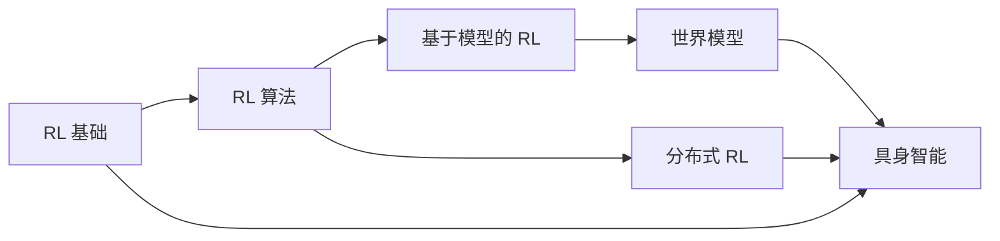

# 关于本资料

## 编写动机

具身人工智能 (Embodied AI) 地处多个深层研究领域的交叉地带：强化学习、世界建模、机器人学和大规模系统工程。对于刚刚踏入这一领域的博士生而言，问题并非缺少学习材料，而是**知识的碎片化**——散落在不同领域的文献中，难以看清各部分之间的内在联系。

本资料旨在提供一条**统一而有结构的学习路径**，贯穿上述各相关主题。它受 [Spinning Up in Deep RL](https://spinningup.openai.com/) 启发，但在范围上有显著拓展——不仅覆盖 RL 算法，还涵盖世界模型、具身系统以及现代 EAI 研究所依赖的分布式基础设施。

## 设计理念

### 重要概念深入讲解

在基础性概念上，我们追求深度——给出数学推导、公式与直觉解释，因为仅停留在表面理解不足以支撑研究工作。同时，我们也保持必要的广度，让读者了解**领域全貌**以及在哪里可以找到更多信息。

### 理论与实践并重

每个算法章节都联系实际考量：实现细节、常见陷阱、超参数敏感度以及计算资源需求。

### 持续迭代

这是一份**活文档**。标注为"编写中"的章节将逐步完善。整体结构已预留扩展空间，以便纳入新算法、新仿真平台和新的基础模型。

### 双语支持

全部内容提供英文和中文两个版本。可通过导航栏上的语言切换器选择。

## 前置知识

为充分利用本资料，读者应熟悉以下内容：

| 领域 | 具体要求 |
|------|----------|
| **数学基础** | 线性代数（矩阵运算、特征分解）、概率论（贝叶斯公式、期望、常见分布）、多元微积分（梯度、链式法则） |
| **机器学习** | 监督/无监督学习、梯度下降、过拟合与正则化、神经网络架构（MLP、CNN、RNN、Transformer） |
| **编程能力** | Python、NumPy、PyTorch 或 JAX、基本软件工程技能（git、调试、性能分析） |
| **可选加分** | 凸优化、控制理论基础、ROS/机器人经验 |

## 内容组织

- **第一部分：强化学习**——从第一性原理出发（MDP、贝尔曼方程），逐步覆盖完整的算法体系（策略梯度、值函数方法、Actor-Critic、基于模型的方法、离线 RL）。

- **第二部分：世界模型**——从基于模型的 RL 自然延伸至学习型世界模型——表示学习、视频预测、规划，以及新兴的基础世界模型。

- **第三部分：具身智能**——将上述思想应用于物理系统——运动控制、操作、遥操作以及面向机器人学习的数据采集。

- **第四部分：分布式 RL**——系统工程视角——如何在多台机器、多个环境上扩展 RL 训练。

- **附加资源**——包括科研方法论指导、练习题和精选论文列表。

## 致谢

本项目受到以下优秀资源的启发：

- [Spinning Up in Deep RL](https://spinningup.openai.com/) — OpenAI
- [Lilian Weng 的博客](https://lilianweng.github.io/) — 清晰的技术写作典范
- [David Silver 的 RL 课程](https://www.davidsilver.uk/teaching/) — UCL
- [CS285 深度强化学习](http://rail.eecs.berkeley.edu/deeprlcourse/) — UC Berkeley, Sergey Levine
