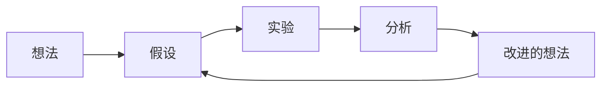

# 成为研究者

*受 OpenAI "Spinning Up as a Deep RL Researcher" 启发*

本页为处于研究早期阶段的博士生提供建议：如何培养研究品味、执行研究项目、以及融入具身智能研究社区。以下建议带有个人色彩——取其精华，结合自身情况灵活运用。

## 打好基础

### 核心技能

| 技能 | 重要性 | 如何培养 |
|------|--------|---------|
| **数学功底** | RL 理论需要概率论、优化、线性代数 | 亲手推导公式，而非只是阅读 |
| **编程实现能力** | 研究想法需要可运行的代码来验证 | 从零实现论文（不要仅使用库） |
| **实验设计** | 糟糕的实验浪费数月时间 | 学习实验方法论，掌握正确的基线设置 |
| **论文写作** | 论文必须清晰传达思想 | 研读顶会论文的写作风格，尽早动笔、反复修改 |
| **批判性阅读** | 需要评估他人的研究声明 | 带着批判性眼光读论文——真正的贡献是什么？ |

### 实现的重要性

**亲手实现关键算法。** 这是新 RL 研究者能做的最重要的一件事。使用库中现成的 PPO 实现并不能建立真正的理解。

建议的学习路径：

1. **REINFORCE** — 在 CartPole 上让策略梯度跑起来
2. **DQN** — 实现经验回放、目标网络，在 Atari Pong 上训练
3. **PPO** — 完整实现 GAE、裁剪目标、价值函数
4. **SAC** — Off-policy、连续控制、熵自动调节

每次实现都会暴露出仅靠阅读无法发现的认知盲区。

!!! note "实现中常见的"顿悟"时刻"
    - 当 REINFORCE 方差太大无法收敛时，你会真正理解基线的价值
    - 当 DQN 的 Q 值发散时，你会深刻体会目标网络的必要性
    - 当 PPO 训练不稳定时，你会明白为什么需要裁剪和价值函数裁剪
    - 当 SAC 在不同任务上表现迥异时，你会理解熵正则化的精妙之处

## 培养研究品味

### 先广后深

**第一阶段：广泛阅览**（入学前几个月）

- 每天阅读 2-3 篇论文（摘要 + 快速浏览）
- 覆盖研究领域的所有主要方向
- 建立研究领域的全景认知图
- 不必追求深入理解每篇论文——先建立广度

**第二阶段：深入钻研**（确定方向后）

- 逐行、逐推导地深读经典论文
- 实现核心方法
- 理解设计选择背后的原因
- 阅读 Related Work 部分以发现关联

### 学会提问

好的研究始于好的问题。阅读论文时，思考：

- 这篇论文做了什么假设？该假设在什么条件下不成立？
- 如果改变 X，结果会如何？
- 为什么他们没有尝试 Y？
- 能奏效的最简版本是什么？
- 方法在哪些情况下失败？能否刻画失败模式？

!!! tip "论文阅读的三遍法"
    **第一遍**（5-10 分钟）：标题、摘要、引言、小标题、结论——判断是否值得深读。
    **第二遍**（1 小时）：仔细阅读全文，忽略证明细节，理解核心思路和实验。
    **第三遍**（数小时）：逐步重现推导，质疑每一个假设，理解每一个设计选择。

### 找到你的独特定位

最好的研究往往来自跨领域知识的独特组合：

- RL + 控制理论 → 更好的策略优化
- 世界模型 + 计算机视觉 → 更好的表征学习
- 分布式系统 + RL → 可扩展训练
- 机器人学 + RL + 人类数据 → 实用的具身智能

找到令你兴奋的交叉点，以及你拥有（或可以建立）优势的领域。

## 执行研究项目

### 研究循环

### 第一步：产生想法

想法的来源：

- **现有方法的失败与局限**（关注论文中的 Limitations 部分）
- **跨领域组合**——将不同子领域的思路结合
- **放大或缩小**已有方法的规模
- **消融实验**揭示真正起作用的因素
- **真实部署挑战**（Sim-to-Real 鸿沟、安全性、延迟）

### 第二步：可行性检验

在投入数月之前：

- 能否用一句话陈述你的假设？
- 最简单的验证实验是什么？
- 与什么基线进行比较？
- 什么结果会让你停下来（无论正面还是负面）？
- 以你的算力预算是否可行？

### 第三步：实验设计

基本原则：

1. **从小处开始**：先在 CartPole 等简单环境验证，再扩展到更难的问题
2. **每次只改一个变量**：不要同时修改三个东西
3. **强基线**：与充分调优的基线比较，而非稻草人
4. **消融实验**：证明方法中哪些组件是必要的
5. **多随机种子**：至少 3-5 个种子

### 第四步：分析与写作

- **保持诚实**：报告失败和负面结果——它们包含重要信息
- **理解你的结果**：不要只报告数字——解释为什么有效或为什么无效
- **边做边写**：不要等实验全部完成才开始写论文

## 实用建议

### 算力管理

- 使用实验日志系统跟踪所有实验（W&B、TensorBoard）
- 使用配置文件（Hydra、YAML）管理超参数——永远不要硬编码
- 编写可复现的实验脚本
- 定期保存检查点
- 在扩大规模之前先学会性能分析

!!! warning "算力使用的常见错误"
    - 在未确认代码正确的情况下就大规模运行实验
    - 不记录实验配置，导致无法复现好的结果
    - GPU 空跑：环境瓶颈导致 GPU 利用率极低
    - 不使用混合精度训练，浪费显存和计算速度

### 协作

- 正确使用 git（分支、有意义的提交信息）
- 为代码写文档——未来的自己会感谢现在的你
- 与实验室分享负面结果——避免重复投入
- 参加论文阅读会并做报告

### 保持前沿

- 在 Twitter/X 和 Google Scholar 上关注关键研究者
- 设置 arXiv 关键词提醒
- 每年参加 1-2 个会议（NeurIPS、ICML、ICLR、CoRL、RSS、ICRA）
- 参与开源社区（GitHub issues、讨论区）

### 心理健康

研究是马拉松，不是短跑：

- 负面结果是正常且常见的
- 不要拿自己的日常与他人的高光时刻比较
- 适时休息——最好的想法往往在离开书桌时浮现
- 建立由同伴和导师组成的支持网络

!!! info "关于"冒名顶替综合征""
    几乎每个研究者（包括非常成功的那些）都经历过"冒名顶替综合征"——觉得自己不够格、会被"揭穿"。认识到这一点本身就是缓解之道。你的困惑和不确定感并不意味着你不适合做研究，而是研究过程的正常组成部分。

## 推荐阅读

- *How to Read a Paper* — Keshav, 2007
- *An Opinionated Guide to ML Research* — John Schulman, 2020
- *Lessons from My First Two Years of AI Research* — Tom Brown, 2020
- *Spinning Up as a Deep RL Researcher* — OpenAI, 2018
- *You and Your Research* — Richard Hamming, 1986
- *The Ph.D. Grind* — Philip Guo, 2012
