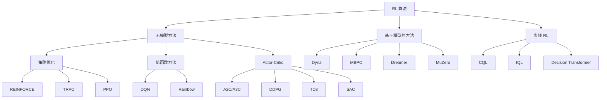

# 强化学习算法分类

RL 算法数量庞大、种类繁多。本页提供一个结构化的分类图谱，帮助你在纷繁的算法中找到方向。理解分类体系有助于为具体问题选择合适的算法，并清楚其中的取舍。

## 全景概览

## 核心分类维度

### 1. 无模型 vs. 基于模型

| | 无模型 (Model-Free) | 基于模型 (Model-Based) |
|---|---|---|
| **是否学习动力学？** | 否 | 是——学习 $\hat{P}(s'\|s,a)$ |
| **样本效率** | 低（需要大量交互） | 高（可利用模型进行规划） |
| **渐近性能** | 通常更好 | 受模型精度限制 |
| **代表算法** | DQN、PPO、SAC | Dyna、MBPO、Dreamer、MuZero |

**无模型方法**直接从经验中学习策略或值函数，不显式建模环境动力学。

**基于模型的方法**学习（或被给予）环境模型，并利用其进行规划或生成合成经验。

### 2. 同策略 vs. 异策略

| | 同策略 (On-Policy) | 异策略 (Off-Policy) |
|---|---|---|
| **数据来源** | 仅来自当前策略 $\pi$ | 来自任意策略（经验回放） |
| **样本效率** | 低（更新后丢弃旧数据） | 高（可复用历史数据） |
| **稳定性** | 通常更稳定 | 可能不稳定（致命三角） |
| **代表算法** | REINFORCE、PPO、A2C | DQN、DDPG、TD3、SAC |

**同策略**算法只使用当前策略采集的数据。每次策略更新后，旧数据即被丢弃。

**异策略**算法可以从任意策略采集的数据中学习，这些数据通常存储在**经验回放缓冲区** (Replay Buffer) 中，因此样本效率显著更高。

### 3. 值函数方法 vs. 策略方法 vs. Actor-Critic

**值函数方法**学习最优动作值函数 $Q^*(s,a)$，并从中隐式导出策略：

$$
\pi(s) = \arg\max_a Q^*(s,a)
$$

- 适用于离散动作空间
- 无法直接处理连续动作（argmax 不可行）
- 代表：DQN、Rainbow

**策略方法**直接参数化并优化策略 $\pi_\theta(a|s)$：

$$
\theta^* = \arg\max_\theta \mathbb{E}_{\pi_\theta} \left[ \sum_t \gamma^t r_t \right]
$$

- 同时适用于离散和连续动作空间
- 可以表示随机策略
- 梯度方差较大
- 代表：REINFORCE、TRPO、PPO

**Actor-Critic 方法**融合了两者的优势：

- **Actor**（演员）：策略 $\pi_\theta(a|s)$，负责决定动作
- **Critic**（评论家）：值函数 $V_\phi(s)$ 或 $Q_\phi(s,a)$，负责评估动作
- Critic 降低了策略梯度估计的方差
- 代表：A2C、DDPG、TD3、SAC

### 4. 随机策略 vs. 确定性策略

**随机策略** $\pi_\theta(a|s)$ 输出动作的概率分布：

- 通过采样自然实现探索
- 使用于：PPO、SAC、A2C

**确定性策略** $\mu_\theta(s)$ 输出单一动作：

- 需要额外的探索噪声（如高斯噪声、OU 过程）
- 在适用场景下可能更高效
- 使用于：DDPG、TD3

### 5. 在线 RL vs. 离线 RL

**在线 RL**：智能体在训练过程中与环境持续交互。

**离线 RL**（批量 RL）：智能体完全从一个固定数据集中学习，不再与环境交互。这在以下场景至关重要：

- 安全关键领域（医疗、自动驾驶）
- 真实环境交互成本高昂时
- 利用已有的大规模数据集

## 算法总结表

| 算法 | 类型 | 同/异策略 | 动作空间 | 核心思想 |
|------|------|-----------|----------|----------|
| REINFORCE | 策略梯度 | 同策略 | 离散/连续 | 蒙特卡洛策略梯度 |
| DQN | 值函数 | 异策略 | 离散 | Q-learning + 神经网络 + 经验回放 |
| A2C/A3C | Actor-Critic | 同策略 | 两者 | 并行 Actor，优势估计 |
| TRPO | 策略梯度 | 同策略 | 两者 | 信赖域约束 |
| PPO | 策略梯度 | 同策略 | 两者 | 截断代理目标 |
| DDPG | Actor-Critic | 异策略 | 连续 | 确定性策略梯度 + 经验回放 |
| TD3 | Actor-Critic | 异策略 | 连续 | 双 Critic，延迟更新 |
| SAC | Actor-Critic | 异策略 | 连续 | 最大熵框架 |
| Dreamer | 基于模型 | 异策略 | 两者 | 学习世界模型 + 想象训练 |
| MuZero | 基于模型 | 异策略 | 离散 | 学习模型 + MCTS |
| CQL | 离线 | 异策略 | 两者 | 保守 Q 学习 |
| IQL | 离线 | 异策略 | 两者 | 隐式 Q 学习 |
| DT | 离线 | — | 两者 | 将 RL 视为序列建模 |

## 如何选择算法

实用建议：

- **连续控制**（机器人、运动控制）：从 **PPO**（简单稳健）或 **SAC**（更高样本效率）开始
- **离散动作**（游戏、组合优化）：从 **DQN** 或 **PPO** 开始
- **样本效率优先**：使用异策略方法（**SAC**、**TD3**）或基于模型的方法（**Dreamer**、**MBPO**）
- **固定数据集**：使用离线 RL（**IQL**、**CQL**）
- **Sim-to-Real**：**PPO** + 域随机化是常见起点

## 接下来

- [策略优化入门](intro_policy_optimization.md) — 先理解策略梯度定理，再深入具体算法
- 各算法详解页面
