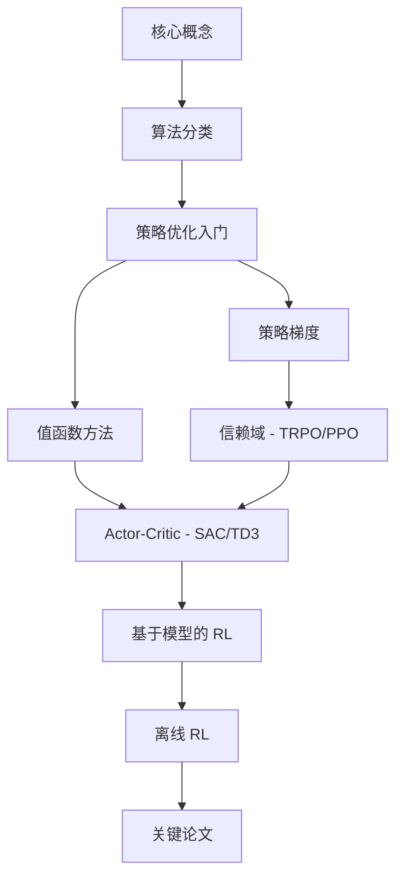

# 第一部分：强化学习

强化学习 (Reinforcement Learning, RL) 是研究"通过交互进行学习"的计算框架。智能体在环境中执行动作，接收奖励信号作为反馈，并学习一个使累积奖励最大化的策略。RL 为具身智能研究提供了核心的算法基础。

## 本部分内容

1. **[核心概念](key_concepts.md)** — MDP、策略、值函数、贝尔曼方程及探索与利用的权衡
2. **[算法分类](algorithm_taxonomy.md)** — RL 算法全景图：无模型 vs. 有模型、同策略 vs. 异策略、值函数方法 vs. 策略方法
3. **[策略优化入门](intro_policy_optimization.md)** — 策略梯度定理及其重要意义
4. **算法详解：**
    - [策略梯度方法](policy_gradient.md) — REINFORCE、Vanilla Policy Gradient
    - [信赖域方法](trust_region.md) — TRPO、PPO
    - [基于值函数的方法](value_based.md) — DQN、Double DQN、Dueling DQN、Rainbow
    - [Actor-Critic 方法](actor_critic.md) — A2C/A3C、DDPG、TD3、SAC
    - [基于模型的 RL](model_based.md) — Dyna、MBPO、Dreamer
    - [离线 RL](offline_rl.md) — BCQ、CQL、IQL、Decision Transformer
5. **[关键论文](key_papers.md)** — 精选的经典与前沿 RL 论文列表

## 建议阅读顺序

如果你是 RL 初学者，推荐按以下路径阅读：

如果你已有一定基础，可以直接跳转到任何算法页面。

## 与其他部分的关联

- **世界模型**（第二部分）是本节基于模型 RL 概念的自然延伸
- **具身智能**（第三部分）将 RL 算法应用于物理机器人系统（Sim-to-Real、运动控制策略等）
- **分布式 RL**（第四部分）讲解如何大规模并行训练本节介绍的算法
