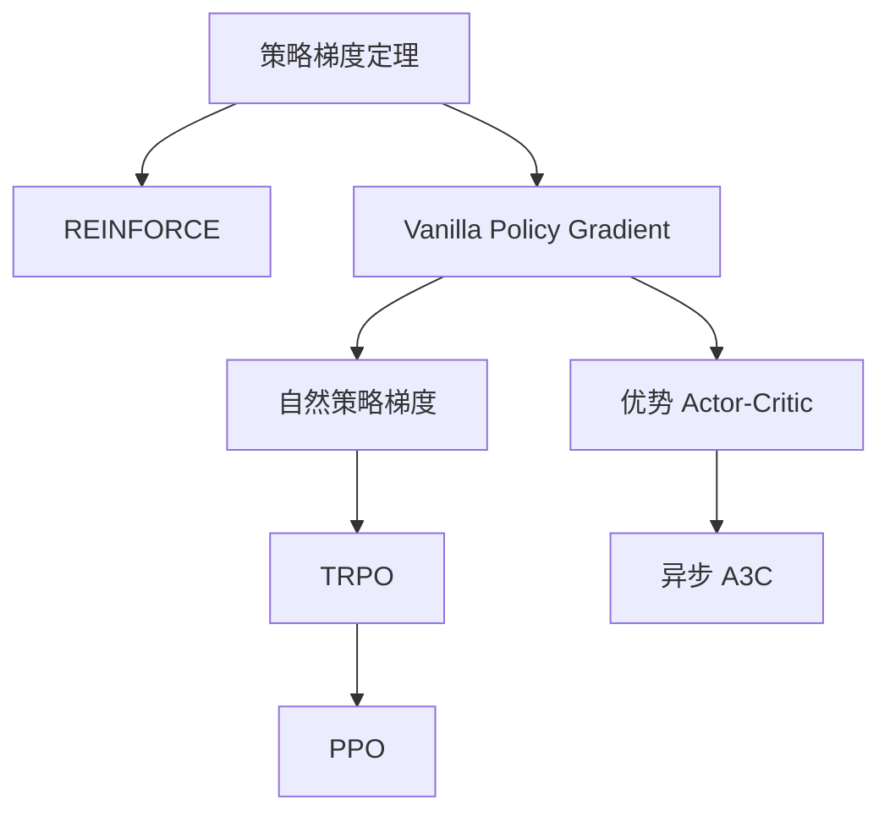

# 策略优化入门

策略优化是 RL 算法中最重要的方法族之一。与先学习值函数再从中推导策略不同，策略优化方法**直接优化策略**以最大化期望回报。本页推导核心结果——**策略梯度定理 (Policy Gradient Theorem)**，并建立关于其工作原理的直觉。

## 策略优化问题

我们用参数 $\theta$（通常是神经网络参数）来表示策略 $\pi_\theta$，并寻求最大化期望回报：

$$
J(\theta) = \mathbb{E}_{\tau \sim \pi_\theta} \left[ \sum_{t=0}^{T} \gamma^t r_t \right] = \mathbb{E}_{\tau \sim \pi_\theta} [R(\tau)]
$$

其中 $\tau = (s_0, a_0, r_0, \ldots, s_T)$ 是一条轨迹。我们需要计算 $\nabla_\theta J(\theta)$ 以执行梯度上升：

$$
\theta_{k+1} = \theta_k + \alpha \nabla_\theta J(\theta_k)
$$

## 策略梯度定理

核心结论：我们可以在**不对环境动力学求导**的情况下计算 $J(\theta)$ 的梯度。

$$
\nabla_\theta J(\theta) = \mathbb{E}_{\tau \sim \pi_\theta} \left[ \sum_{t=0}^{T} \nabla_\theta \log \pi_\theta(a_t | s_t) \, \Phi_t \right]
$$

其中 $\Phi_t$ 可取以下几种形式：

| $\Phi_t$ 的选择 | 名称 | 方差 |
|-----------------|------|------|
| $R(\tau)$ | 全轨迹回报 | 最高 |
| $\sum_{t'=t}^{T} \gamma^{t'-t} r_{t'}$ | 从 $t$ 起的未来回报 (Reward-to-go) | 较低 |
| $A^{\pi_\theta}(s_t, a_t)$ | 优势函数 | 最低（配合基线） |

### 推导概要

关键恒等式（"对数导数技巧"）：

$$
\nabla_\theta \pi_\theta(\tau) = \pi_\theta(\tau) \nabla_\theta \log \pi_\theta(\tau)
$$

由于 $\pi_\theta(\tau) = p(s_0) \prod_{t=0}^{T} \pi_\theta(a_t|s_t) P(s_{t+1}|s_t,a_t)$，取对数后：

$$
\log \pi_\theta(\tau) = \log p(s_0) + \sum_{t=0}^{T} \log \pi_\theta(a_t|s_t) + \sum_{t=0}^{T} \log P(s_{t+1}|s_t,a_t)
$$

只有 $\log \pi_\theta(a_t|s_t)$ 依赖于 $\theta$，因此：

$$
\nabla_\theta \log \pi_\theta(\tau) = \sum_{t=0}^{T} \nabla_\theta \log \pi_\theta(a_t|s_t)
$$

完整梯度为：

$$
\nabla_\theta J(\theta) = \mathbb{E}_{\tau \sim \pi_\theta} \left[ \left( \sum_{t=0}^{T} \nabla_\theta \log \pi_\theta(a_t|s_t) \right) R(\tau) \right]
$$

!!! info "核心洞察"
    环境动力学 $P(s'|s,a)$ 在求导过程中被消去了！这意味着我们可以在不知道或不对环境模型求导的情况下估计策略梯度——只需要能够**采样**轨迹并**计算** $\log \pi_\theta(a|s)$。

## 方差缩减

基本策略梯度估计量具有**很高的方差**，导致学习缓慢且不稳定。以下几种技巧可有效降低方差：

### 从当前时刻起的未来回报 (Reward-to-Go)

时间 $t$ 的动作只能影响未来的奖励。将 $R(\tau)$ 替换为从 $t$ 起的未来回报：

$$
\hat{G}_t = \sum_{t'=t}^{T} \gamma^{t'-t} r_{t'}
$$

### 基线 (Baseline)

从 $\Phi_t$ 中减去一个与状态相关的基线 $b(s_t)$，可以在不引入偏差的情况下降低方差：

$$
\nabla_\theta J(\theta) = \mathbb{E} \left[ \sum_t \nabla_\theta \log \pi_\theta(a_t|s_t) \left( \hat{G}_t - b(s_t) \right) \right]
$$

最优基线接近于 $V^{\pi}(s_t)$，这也是 Actor-Critic 方法学习值函数作为基线的原因。

### 广义优势估计 (GAE)

GAE (Schulman et al., 2016) 提供了在低偏差/高方差（蒙特卡洛）与高偏差/低方差（TD）之间的平滑插值：

$$
\hat{A}_t^{\text{GAE}(\gamma, \lambda)} = \sum_{l=0}^{\infty} (\gamma \lambda)^l \delta_{t+l}
$$

其中 $\delta_t = r_t + \gamma V(s_{t+1}) - V(s_t)$ 是 TD 误差。

- $\lambda = 0$：纯 TD（高偏差，低方差）
- $\lambda = 1$：纯蒙特卡洛（低偏差，高方差）
- 典型值：$\lambda = 0.95$

## 从理论到算法

策略梯度定理催生了一系列实用算法：

每个算法都在基本策略梯度的基础上加入约束或技巧，使其更加稳定和高效：

- **REINFORCE**：直接使用蒙特卡洛回报
- **VPG**：加入学习型基线（值函数）
- **TRPO**：约束新旧策略之间的 KL 散度
- **PPO**：用更简单的截断目标来近似信赖域

继续阅读各算法的详解页面：

- [策略梯度方法](policy_gradient.md)（REINFORCE、VPG）
- [信赖域方法](trust_region.md)（TRPO、PPO）
