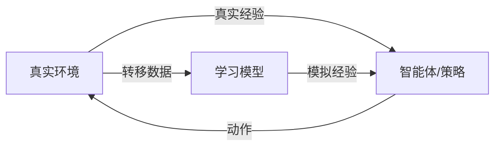

# 基于模型的强化学习

基于模型的 RL 学习环境的动力学模型，并利用它进行规划、生成合成数据，或两者兼用。借助学习到的模型，这类方法的**样本效率**可以比无模型方法高出 10-100 倍。

## 为什么需要模型？

| 方面 | 无模型方法 | 基于模型的方法 |
|------|-----------|---------------|
| 样本效率 | 低（10⁶+ 步） | 高（10³-10⁵ 步） |
| 渐近性能 | 通常更好 | 受模型精度限制 |
| 每步计算量 | 低 | 较高（需要规划） |
| 泛化能力 | 有限 | 可通过模型泛化 |

核心权衡：基于模型的方法样本效率更高，但引入了**模型偏差** (Model Bias)——学习模型中的误差在规划过程中会不断累积。

## Dyna 架构

**Dyna** (Sutton, 1991) 是基于模型 RL 的奠基性框架。核心思想：用学习模型生成的**模拟经验**来补充真实经验。



Dyna 循环：

1. 在真实环境中行动，收集 $(s, a, r, s')$
2. 用真实数据更新模型 $\hat{P}(s'|s,a)$、$\hat{R}(s,a)$
3. 用模型生成模拟转移
4. 同时使用真实和模拟数据更新策略/值函数

### Dyna-Q

最简单的 Dyna 变体，对真实和模拟转移都应用 Q-learning：

!!! note "伪代码：Dyna-Q"
    ```
    初始化 Q(s,a)、Model(s,a)
    for each step do
        s ← 当前状态
        a ← 从 Q(s,·) ε-贪心选择
        执行 a，观测 r, s'
        Q(s,a) ← Q(s,a) + α[r + γ max_a' Q(s',a') - Q(s,a)]
        Model(s,a) ← (r, s')             // 更新模型

        for k = 1, ..., K do               // K 步规划
            s̃, ã ← 随机选取之前访问过的 (s,a)
            r̃, s̃' ← Model(s̃, ã)         // 模拟
            Q(s̃,ã) ← Q(s̃,ã) + α[r̃ + γ max_a' Q(s̃',a') - Q(s̃,ã)]
        end for
    end for
    ```

## MBPO（基于模型的策略优化）

**MBPO** (Janner et al., 2019) 为"何时以及如何使用学习模型进行策略优化"提供了理论依据。

### 核心洞察

MBPO 证明了：只要将模型生成的轨迹保持**足够短**（以限制模型误差的累积），就能在学习模型下实现策略的单调改进：

$$
\eta[\pi'] \geq \hat{\eta}[\pi'] - C \cdot [\epsilon_m + (1 - (1-\epsilon_m)^k) \cdot \epsilon_\pi]
$$

其中 $k$ 是展开步数，$\epsilon_m$ 是模型误差，$\epsilon_\pi$ 是策略偏移量。

### 算法流程

1. 在真实数据上训练一个**动力学模型集成** $\{f_{\theta_i}\}_{i=1}^{N}$
2. 用模型从真实状态开始生成**短轨迹**（分支展开）
3. 将合成数据加入模型回放缓冲区
4. 同时使用真实和模型数据，用 SAC 训练策略

模型集成的优势：

- **捕捉认知不确定性**——集成成员之间的分歧指示预测的不确定区域
- **减少对模型误差的过拟合**
- 典型集成规模：5--7 个模型

### 自适应展开步长

MBPO 根据模型精度动态调整展开长度：

- 模型准确 → 更长展开（更多合成数据）
- 模型不准确 → 更短展开（贴近真实数据）

## Dreamer（梦境控制）

**Dreamer** 系列 (Hafner et al., 2020, 2021, 2023) 学习一个世界模型，并完全在"想象"中训练策略——在学习模型的潜在空间中进行轨迹展开。

### 世界模型架构

Dreamer 使用**循环状态空间模型 (RSSM)**：

- **表示模型** (Representation model)：$q(z_t | z_{t-1}, a_{t-1}, o_t)$ — 将观测编码为潜在状态
- **转移模型** (Transition model)：$p(z_t | z_{t-1}, a_{t-1})$ — 预测下一个潜在状态（不依赖观测）
- **观测模型** (Observation model)：$p(o_t | z_t)$ — 将潜在状态解码回观测
- **奖励模型** (Reward model)：$p(r_t | z_t)$ — 从潜在状态预测奖励

### 想象式训练

一旦世界模型学好：

1. **想象**——在潜在空间中展开转移模型，生成想象轨迹
2. **预测**——沿想象轨迹预测奖励和价值
3. **反向传播**——通过整条想象轨迹反向传播梯度来更新 Actor

这种方式非常高效，因为潜在空间中的展开比真实环境交互开销小得多。

### Dreamer 版本演进

| 版本 | 关键改进 |
|------|---------|
| **Dreamer (v1)** | RSSM + 想象式 Actor-Critic |
| **DreamerV2** | 离散潜在表示（类别分布） |
| **DreamerV3** | Symlog 预测，无需调参即可跨域泛化 |

**DreamerV3** 的突出之处在于：用**同一组超参数**在差异极大的领域上都取得了优秀表现：Atari、DMControl、Minecraft 等。

## MuZero

**MuZero** (Schrittwieser et al., 2020) 将学习模型与蒙特卡洛树搜索 (MCTS) 相结合。与 Dreamer 不同，MuZero 学习的模型只预测**规划所需的信息**：奖励、价值和策略——而非观测。

### 三个学习函数

1. **表示函数** (Representation)：$h(o_1, \ldots, o_t) \to s^0$ — 将观测映射为潜在状态
2. **动力学函数** (Dynamics)：$g(s^k, a^{k+1}) \to s^{k+1}, r^{k+1}$ — 预测下一潜在状态和奖励
3. **预测函数** (Prediction)：$f(s^k) \to p^k, v^k$ — 从潜在状态预测策略和价值

### 用 MCTS 进行规划

在每个真实时间步，MuZero 使用学习模型执行 MCTS：

1. 从当前潜在状态 $s^0 = h(o_t)$ 出发
2. 用动力学函数 $g$ 向前模拟，通过 PUCT（类似 AlphaZero）选择动作
3. 以搜索得到的策略进行动作选择

MuZero 在 Atari、围棋、国际象棋和将棋上均达到了超人水平——全部使用**同一个算法**。

## 何时使用基于模型的方法

**适合使用基于模型方法的场景：**

- 样本效率至关重要（真实机器人、昂贵的仿真）
- 环境动力学可学习（平滑、近似确定性）
- 需要规划或前瞻能力

**优先选择无模型方法的场景：**

- 可以获得无限量的环境交互
- 动力学过于复杂难以准确建模
- 追求极致的渐近性能

## 与世界模型的关联

基于模型的 RL 与[世界模型（第二部分）](../world_models/index.md)密切相关。两者的区别在于：

- **基于模型的 RL**：模型是策略优化的工具
- **世界模型**：模型是一种核心的认知能力（表示、预测、想象）

Dreamer 系列工作恰好处于两者的交汇处，而基础世界模型进一步模糊了这一界限。

## 关键参考文献

- Sutton, R.S. (1991). "Dyna, an Integrated Architecture for Learning, Planning, and Reacting." *SIGART Bulletin*.
- Janner, M., Fu, J., Zhang, M., Levine, S. (2019). "When to Trust Your Model: Model-Based Policy Optimization." *NeurIPS*.
- Hafner, D., Lillicrap, T., Ba, J., Norouzi, M. (2020). "Dream to Control: Learning Behaviors by Latent Imagination." *ICLR*.
- Hafner, D., Lillicrap, T., Norouzi, M., Ba, J. (2021). "Mastering Atari with Discrete World Models." *ICLR*.
- Hafner, D., et al. (2023). "Mastering Diverse Domains through World Models." *arXiv:2301.04104*.
- Schrittwieser, J., et al. (2020). "Mastering Atari, Go, Chess and Shogi by Planning with a Learned Model." *Nature*.
