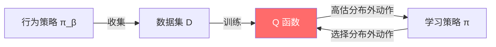

# 离线强化学习

离线强化学习（Offline RL，也称为批量强化学习 Batch RL）是指智能体**完全从一个固定的数据集中学习策略**，在训练过程中不再与环境进行任何交互。这一范式在在线探索成本高、风险大或不可行的场景下至关重要——例如医疗决策、自动驾驶和机器人操控等领域。

## 离线强化学习的问题定义

给定一个由一个或多个行为策略 $\pi_\beta$ 收集的静态数据集 $\mathcal{D} = \{(s_i, a_i, r_i, s_i')\}_{i=1}^{N}$，目标是学习一个最大化期望回报的策略 $\pi$。

### 为什么离线强化学习如此困难？

核心挑战在于学习策略 $\pi$ 与行为策略 $\pi_\beta$ 之间的**分布偏移**（distribution shift）：

1. Q 函数是在 $\pi_\beta$ 产生的状态-动作对上训练的
2. 在评估（或 Bellman 回溯）时，我们查询 $Q(s', a')$，其中 $a' \sim \pi(s')$
3. 如果 $\pi$ 选择了数据集 $\mathcal{D}$ 中很少出现的动作，Q 值就变得不可靠（**外推误差**）
4. Bellman 回溯中的 $\max$ 算子会**放大**对分布外动作的过高估计

这就是所谓的**分布偏移问题**或**动作外推误差**。

## 核心方法

### 1. 策略约束方法

约束学习策略 $\pi$ 使其接近行为策略 $\pi_\beta$：

**BCQ**（Fujimoto et al., 2019）：使用行为策略 $\pi_\beta$ 的生成模型，仅考虑其支撑集内的动作：

$$
\pi(s) = \arg\max_{a_i + \xi_\phi(s, a_i)} Q_\theta(s, a_i + \xi_\phi(s, a_i))
$$

其中 $\{a_i\}$ 从学习到的 $\pi_\beta$ 的 VAE 中采样，$\xi_\phi$ 为一个小扰动。

**BEAR**（Kumar et al., 2019）：利用 MMD（最大均值差异）约束学习策略的支撑集在数据分布之内：

$$
\max_\pi \mathbb{E}_{s \sim \mathcal{D}} \left[ \mathbb{E}_{a \sim \pi} [Q(s,a)] \right] \quad \text{s.t.} \quad \text{MMD}(\pi(\cdot|s), \pi_\beta(\cdot|s)) \leq \epsilon
$$

### 2. 保守值估计

学习悲观的 Q 值，使分布外动作的价值被低估：

**CQL**（Kumar et al., 2020）：添加正则项，压低数据集中不存在的动作的 Q 值：

$$
\min_Q \; \alpha \left( \mathbb{E}_{s \sim \mathcal{D}, a \sim \mu} [Q(s,a)] - \mathbb{E}_{s,a \sim \mathcal{D}} [Q(s,a)] \right) + \frac{1}{2} \mathbb{E}_{s,a,s' \sim \mathcal{D}} \left[ (Q(s,a) - \hat{\mathcal{B}}^{\pi_k} Q(s,a))^2 \right]
$$

第一项惩罚分布外动作（从 $\mu$ 采样，如当前策略）的高 Q 值，同时提升分布内动作的 Q 值。

**核心性质**：CQL 学到的 Q 函数是真实 Q 值的**下界**，从而保证策略选择的保守性。

### 3. 隐式方法

**IQL**（Kostrikov et al., 2022）：通过**期望分位回归**（expectile regression）完全避免查询分布外动作的 Q 值：

$$
\mathcal{L}_V(\psi) = \mathbb{E}_{(s,a) \sim \mathcal{D}} \left[ L_2^\tau (Q_\theta(s,a) - V_\psi(s)) \right]
$$

其中 $L_2^\tau(u) = |\tau - \mathbb{1}(u < 0)| \cdot u^2$ 为期望分位损失。

当 $\tau \to 1$ 时，$V_\psi(s) \approx \max_a Q(s,a)$，但仅在**数据分布**上取最大值——无需显式地对动作空间求最大值，就能近似最优值函数。

**IQL 的优势：**

- 永远不会查询分布外动作的 Q 值
- 实现简单（仅需回归）
- 同时适用于连续和离散动作空间
- 可与优势加权提取结合以输出策略

### 4. 将 RL 重新定义为序列建模

**Decision Transformer**（Chen et al., 2021）：将离线 RL 重新定义为序列预测问题。Transformer 模型根据期望回报预测动作：

$$
a_t = \text{Transformer}(\hat{R}_1, s_1, a_1, \hat{R}_2, s_2, a_2, \ldots, \hat{R}_t, s_t)
$$

其中 $\hat{R}_t$ 为**回报残差**（return-to-go，即期望的未来总回报）。

在测试时，设定较高的回报残差即可引导出高回报行为。

**核心洞察**：无需 Bellman 方程，无需时序差分学习，无需值函数——仅是对序列的监督学习。Transformer 隐式地学会了哪些动作能带来高回报。

## 方法对比

| 方法 | 核心思路 | 优势 | 劣势 |
|------|---------|------|------|
| BCQ | 策略约束 | 保守稳定 | 需要训练生成模型 |
| CQL | 保守 Q 值 | 理论性强、适用面广 | 对超参数 $\alpha$ 敏感 |
| IQL | 隐式 Q 学习 | 实现简单、无分布外查询 | 近似最大化 |
| DT | 序列建模 | 极其简单（纯监督学习） | 轨迹拼接能力弱 |

!!! info "轨迹拼接（Trajectory Stitching）"
    轨迹拼接是离线 RL 区别于模仿学习的关键能力：它能将数据集中不同轨迹的片段组合起来，生成优于任何单条轨迹的策略。CQL 和 IQL 具备此能力；而 Decision Transformer 在这方面表现较弱，因为它主要复现轨迹级别的模式。

## 实践考量

### 数据质量至关重要

离线 RL 的性能高度依赖数据集的组成：

- **专家数据**：质量高，但离线 RL 相比模仿学习优势有限
- **混合数据**（专家 + 次优）：离线 RL 的最佳场景——可以拼接各轨迹中的优质片段
- **随机数据**：非常具有挑战性——对优质行为的覆盖有限

### 评估方法

标准评估流程：

1. 在固定数据集上训练（如 D4RL 基准测试）
2. 在环境中在线评估学到的策略
3. 报告相对于专家和随机基线的标准化得分

### D4RL 基准测试

**D4RL**（Fu et al., 2020）是离线 RL 的标准基准测试，提供了多种环境下不同质量的数据集：

- **MuJoCo**：HalfCheetah、Hopper、Walker2d，包含随机/中等/专家/中等-专家数据集
- **Antmaze**：稀疏奖励下的导航任务
- **Kitchen**：多任务操作环境

## 与其他主题的联系

- **具身智能**：离线 RL 使得从通过[遥操作](../embodied/teleoperation.md)和[数据采集](../embodied/data_collection.md)收集的演示数据集中学习成为可能，无需在线与真实机器人交互。
- **世界模型**：离线的基于模型的方法（如 COMBO、MOPO）可以从离线数据中学习世界模型，并用于策略优化。

## 核心参考文献

- Fujimoto, S., Meger, D., Precup, D. (2019). "Off-Policy Deep Reinforcement Learning without Exploration." *ICML*.
- Kumar, A., et al. (2019). "Stabilizing Off-Policy Q-Learning via Bootstrapping Error Reduction." *NeurIPS*.
- Kumar, A., Zhou, A., Tucker, G., Levine, S. (2020). "Conservative Q-Learning for Offline Reinforcement Learning." *NeurIPS*.
- Kostrikov, I., Nair, A., Levine, S. (2022). "Offline Reinforcement Learning with Implicit Q-Learning." *ICLR*.
- Chen, L., et al. (2021). "Decision Transformer: Reinforcement Learning via Sequence Modeling." *NeurIPS*.
- Fu, J., Kumar, A., Nachum, O., Tucker, G., Levine, S. (2020). "D4RL: Datasets for Deep Data-Driven Reinforcement Learning." *arXiv:2004.06729*.
- Levine, S., et al. (2020). "Offline Reinforcement Learning: Tutorial, Review, and Perspectives on Open Problems." *arXiv:2005.01643*.
