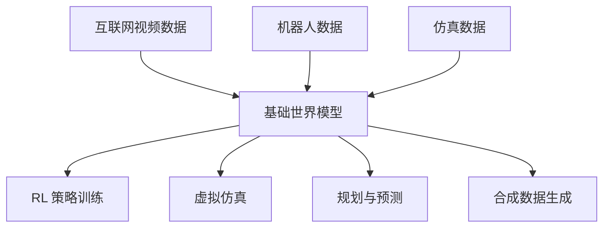

# 基础世界模型

基础世界模型是在多样化数据上大规模训练的模型，旨在学习关于物理动力学和世界结构的通用表征。它们代表了世界模型、视频生成和基础模型扩展三个方向的交汇。

## 从任务特定到基础模型

传统世界模型在单一环境的数据上训练。基础世界模型追求的则是**广泛的泛化能力**：

| 方面 | 任务特定 | 基础模型 |
|------|---------|---------|
| 训练数据 | 单一环境 | 多样化视频、游戏、仿真 |
| 泛化能力 | 单一任务 | 新环境、新任务、新形态 |
| 模型规模 | 小型（百万参数） | 大型（数十亿参数） |
| 交互方式 | 动作条件 | 动作、文本、布局等多种条件 |

## 代表性模型

### Genie（Google DeepMind, 2024）

**Genie**（Generative Interactive Environment，生成式交互环境）从无标签的互联网视频中学习可控的世界模型。

**架构**：

1. **视频标记器**：时空 VQ-VAE 将视频编码为离散 token
2. **潜在动作模型**：从连续帧之间推断潜在动作（无需动作标签！）
3. **动力学模型**：Transformer 根据当前 token 和潜在动作预测下一帧 token

**核心洞察**：仅从视频中学习潜在动作（无需动作标签），Genie 可以从单张图片提示生成可交互的环境。

**能力**：

- 从单张图片生成交互式 2D 环境
- 一致的世界动力学（重力、碰撞等）
- 在 20 万小时以上的 2D 平台游戏视频上训练

### UniSim（UC Berkeley, 2023）

**UniSim** 是在多种真实世界数据源上训练的通用模拟器。

**训练数据**：结合互联网视频、机器人数据、合成 3D 数据等。

**条件输入**：支持多种输入类型：

- 文本描述（"一个球从山坡上滚下来"）
- 动作（机器人关节指令）
- 相机位姿（3D 导航）

**架构**：基于扩散的视频生成模型。

**应用**：

- 模拟机器人动作的结果
- 为 RL 策略生成训练数据
- 回答关于物理世界的"假如"问题

### DIAMOND（2024）

**DIAMOND**（Diffusion for World Modeling）使用扩散模型作为 RL 的核心动力学模型：

1. 世界模型：给定当前观测和动作，用扩散模型生成下一个观测
2. RL 智能体完全在扩散世界模型内部训练
3. 在 Atari 上取得强劲性能——可与 DreamerV3 媲美

**意义**：证明了扩散模型不仅能生成高质量视觉内容，还能作为有效的 RL 世界模型。

### NVIDIA Cosmos（2025）

**Cosmos** 是 NVIDIA 推出的基础世界模型平台：

- 在海量视频数据上训练
- 专为物理 AI 应用设计（机器人、自动驾驶、工业仿真）
- 提供预训练模型和微调工具
- 多种模型尺寸适配不同使用场景

### 其他重要模型

- **GAIA-1**（Wayve, 2023）：面向自动驾驶的世界模型，根据文本、动作和地图输入生成驾驶场景
- **Pandora**（2024）：GPT 风格的世界模型，支持跨多个领域的交互式生成
- **GameNGen**（Google, 2024）：使用扩散模型实时生成可玩的 Doom 游戏
- **Oasis**（Decart, 2024）：实时可玩的 Minecraft 生成

## 技术基础

### 世界模型的扩展定律

与语言模型类似，世界模型也表现出扩展行为：

- 更多训练数据 → 更好的泛化能力
- 更大的模型 → 更精确的预测
- 更长的上下文 → 更好的时间一致性

最优的扩展策略需要在模型大小、数据量和计算预算之间进行权衡。

### 世界模型的标记化

将连续观测转换为离散 token 使得基于 Transformer 的架构成为可能：

| 方法 | 原理 | 应用 |
|------|------|------|
| VQ-VAE | 码本量化 | Genie, IRIS |
| FSQ | 有限标量量化 | Cosmos |
| Patch 嵌入 | ViT 风格的图块 | DiT, Sora |
| 时空标记 | 3D 标记化 | VideoGPT |

### 条件机制

基础世界模型支持丰富的条件输入：

- **动作条件**：机器人指令、游戏控制、潜在动作
- **文本条件**：期望结果的自然语言描述
- **图像条件**：从单张起始帧生成动力学
- **布局条件**：物体的空间排列
- **相机条件**：视角和相机轨迹

## 挑战与开放问题

### 1. 物理一致性

当前模型经常违反物理定律：

- 物体消失或瞬移
- 重力不一致
- 碰撞不守恒
- 长时域动力学发散

### 2. 可控性

对生成动力学的精确控制仍然困难：

- 如何在通用模型中指定动作？
- 潜在动作发现前景光明但尚不可靠
- 文本条件对物理推理而言不够精确

### 3. 评估标准

对于如何评估基础世界模型尚无共识：

- 视觉质量指标（FVD、FID）无法捕捉物理准确性
- 任务性能（RL 回报）是环境特定的
- 人工评估成本高且带有主观性

### 4. 计算成本

基础世界模型的计算开销巨大：

- 训练：需要数千 GPU 小时
- 推理：实时生成仍具挑战
- 内存：长视频上下文需要大量显存

## 全局视角

基础世界模型代表了通向通用物理智能的潜在路径：

愿景：训练一个理解物理世界运行规律的统一模型，然后将其应用于任何下游任务——机器人、自动驾驶、游戏设计、科学模拟。

## 核心参考文献

- Bruce, J., et al. (2024). "Genie: Generative Interactive Environments." *ICML*.
- Yang, M., et al. (2023). "Learning Interactive Real-World Simulators." *arXiv:2310.06114*.
- Alonso, E., et al. (2024). "Diffusion for World Modeling: Visual Details Matter in Atari." *NeurIPS*.
- Hu, A., et al. (2023). "GAIA-1: A Generative World Model for Autonomous Driving." *arXiv:2309.17080*.
- Agarwal, A., et al. (2025). "Cosmos World Foundation Model Platform for Physical AI." *arXiv*.

!!! warning "快速发展的领域"
    基础世界模型是一个快速演进的研究方向。本节内容会随着新模型和新成果的涌现而持续更新。
