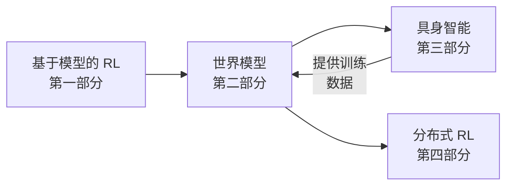

# 第二部分：世界模型

世界模型是对世界运行规律的学习化表征——它捕捉环境的动态特性、结构和规律性。世界模型使智能体能够在不直接与环境交互的情况下进行**预测**、**规划**和**想象**，是构建智能具身系统的关键组件。

## 本部分内容

本部分涵盖以下主题：

1. **[什么是世界模型？](overview.md)** — 定义、动机与认知科学视角
2. **[表征学习](representation_learning.md)** — 如何为世界建模学习有效的潜在空间
3. **[视频预测](video_prediction.md)** — 预测未来的视觉观测
4. **[基于世界模型的规划](planning.md)** — 利用学习到的模型进行决策
5. **[基础世界模型](foundation_models.md)** — 大规模通用世界模型
6. **[关键论文](key_papers.md)** — 世界模型领域的必读文献

## 为什么需要世界模型？

世界模型的研究动机来自多个方向：

- **从 RL 角度**：基于模型的 RL 比无模型方法的样本效率高 10-100 倍
- **从认知科学角度**：人类不断在脑中模拟世界以进行规划和预测
- **从机器人角度**：真实世界的交互成本高昂；用学习到的模型进行仿真则廉价高效
- **从扩展性角度**：基础世界模型正在成为通用物理推理的一条可行路径

## 与其他部分的关联

- **第一部分（RL）**：世界模型是[基于模型的 RL](../rl/model_based.md) 中动力学模型的泛化
- **第三部分（具身智能）**：世界模型支撑 sim-to-real 迁移和基于想象力的机器人学习
- **第四部分（分布式 RL）**：训练大型世界模型需要分布式计算系统的支持
